# 🚀 LG Electronics · Gemini Enterprise & Antigravity 2.0 실무 핸즈온 가이드

> <strong>화면과 100% 일치하는 Step-by-Step 실습 매뉴얼</strong>  
> 슬라이드 원본에 수록된 <strong>27장의 실제 라이브 화면 캡처</strong>와 <strong>실제 입력 프롬프트</strong>를 1:1로 매칭했습니다.  
> 각 단계마다 <strong>① 화면에서 어디를 보는지</strong> ➔ <strong>② 무엇을 복사해 입력하는지</strong> ➔ <strong>③ 어떤 결과 화면이 나오는지</strong> 순서대로 따라오시면 됩니다.
>
> * 🌐 <strong>라이브 웹페이지 버전 (좌측 목차 · 원클릭 복사 · 이미지 클릭 확대)</strong>: <a href="https://gorock-afk.github.io/LG_workshop_ge_agy_a/"><strong>https://gorock-afk.github.io/LG_workshop_ge_agy_a/</strong></a>
> * 📂 <strong>실습 파일 패키지 (Google Drive 폴더)</strong>: <a href="https://drive.google.com/drive/folders/1dxqldyrsQ7oSRi-d1ieRdDVJmTmQ0r2V"><strong>실습 파일 9종 전체 열기</strong></a>
> * 📊 <strong>발표 슬라이드 원본 (Google Slides)</strong>: <a href="https://docs.google.com/presentation/d/1IYXVTVUEw_TKte4I1Ff31scmNEY7ueXCZ2i8AKiZWog/edit"><strong>교안 슬라이드 열기</strong></a>

---

## 🗺️ 0. 오늘 함께 완성할 5단계 누적 빌드업 로드맵 (총 3시간)

오늘 실습은 단발성 예제를 여러 개 만드는 과정이 아닙니다.  
<strong>1부(크롬 GE Web, 1시간)</strong>에서 만든 <strong>LG 프리미엄 가전·OLED 주간 트렌드 보고서(Gmail 드래프트)</strong>를 <strong>2부(Antigravity 2.0, 2시간)</strong>로 가져와 <strong>발표용 웹 슬라이드(`index.html`)</strong>로 변환하고, 여기에 <strong>왼쪽 사이드바 포털(`1. LG 시장 트렌드` ➔ `2. 실시간 시장·뉴스 LIVE` ➔ `3. 가전 실적·구독 분석 NEW`)</strong>을 단계별로 누적 빌드업하여 완성합니다.

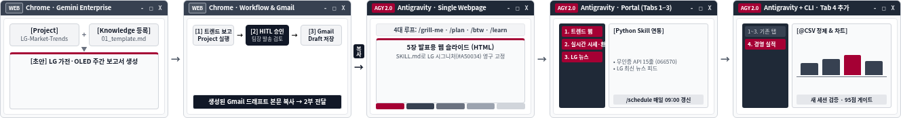

| 파트 (시간) | 실습 환경 | 내가 직접 만드는 누적 산출물 | 핵심 사용 기능 |
| :--- | :---: | :--- | :--- |
| <strong>Part 1 (30분)</strong> | 🌐 크롬 GE Web | <strong>[주간 동향 보고서] LG전자 프리미엄 시장 트렌드 분석 보고서</strong> | `Projects` (`Invite+`) + `Knowledge` (`01_template.md`) |
| <strong>Part 2 (30분)</strong> | 🌐 크롬 GE Web | <strong>내 Gmail 임시보관함(`Drafts`)에 저장된 사내 표준 보고 메일</strong> | `Workflow` 에이전트 연결 + <strong>`Approval (HITL 사람 승인)`</strong> |
| <strong>Part 3 (30분)</strong> | 💻 Antigravity 2.0 | <strong>LG 브랜드 컬러(`#A50034` 레드 + 화이트) 고정 웹 슬라이드(`index.html`)</strong> | 세팅 점검 + `/grill-me` · `Proceed` · `/btw` · `/learn` + `/lg-brand-slides` |
| <strong>Part 4 (30분)</strong> | 💻 Antigravity 2.0 | <strong>좌측 사이드 탭 업무 포털 (`탭 1: 트렌드 슬라이드` + `탭 2: 실시간 시세·뉴스`)</strong> | <strong>15줄 무인증 파이썬 코드</strong> 스킬 등록 + 우측 상단 `Pull` 버튼 & `/schedule` |
| <strong>Part 5 (1시간)</strong> | 💻 Antigravity 2.0 | <strong>`탭 3/4: 가전 실적·구독 분석` 블렌딩 + `/browser` 검증 + `99점 품질 인증`</strong> | `@04_lg_appliance_data.csv`(920행) 진단 + `/browser` + <strong>`+ New Chat` 감사관 루프</strong> |

---

## 📦 실습 전 준비: 실습 파일 8종 바로 열기 (`./files/`)

아래 파일명을 클릭하면 내용을 바로 확인하거나 다운로드할 수 있습니다. 2부 실습 전에 내 PC의 로컬 작업 폴더(예: `lg-work-portal`)에 넣어두세요.

| 번호 | 파일명 (클릭 시 열기) | 사용 파트 | 파일 역할 및 핵심 내용 |
| :---: | :--- | :---: | :--- |
| <strong>01</strong> | [`01_GE_Workflow_lg_weekly_report_template.md`](./files/01_GE_Workflow_lg_weekly_report_template.md) | <strong>Part 1~2</strong> | 크롬 GE `Knowledge`에 업로드할 <strong>사내 주간 트렌드 보고서 표준 서식</strong> |
| <strong>02</strong> | [`02_AG_Webpage_hello_world_slides.html`](./files/02_AG_Webpage_hello_world_slides.html) | <strong>Part 3</strong> | 방향키(`←`/`→`)로 넘기는 <strong>웹 슬라이드 스타터 파일</strong> |
| <strong>03</strong> | [`02_AG_Webpage_lg_brand_slides_SKILL.md`](./files/02_AG_Webpage_lg_brand_slides_SKILL.md) | <strong>Part 3</strong> | 다크 블루 화면을 <strong>LG 시그니처 레드(`#A50034`) + 화이트 배경</strong>으로 고정하는 스킬 |
| <strong>04</strong> | [`03_AG_Dashboard_fetch_lg_live_market.py`](./files/03_AG_Dashboard_fetch_lg_live_market.py) | <strong>Part 4</strong> | <strong>API 키·설치 불필요!</strong> 15줄 무인증 LG전자(`066570`) 현재가·환율·구글 뉴스 수집 코드 |
| <strong>05</strong> | [`03_AG_Dashboard_lg_live_market_SKILL.md`](./files/03_AG_Dashboard_lg_live_market_SKILL.md) | <strong>Part 4</strong> | 15줄 파이썬 코드를 Antigravity 스킬로 등록하는 정의서 |
| <strong>06</strong> | [`04_AG_Analytics_lg_appliance_data.csv`](./files/04_AG_Analytics_lg_appliance_data.csv) | <strong>Part 5</strong> | 5대 가전(`OLED evo`·`워시타워`·`디오스`·`HVAC`·`스탠바이미`) <strong>920행 실적·구독·ThinQ 데이터</strong> |
| <strong>07</strong> | [`04_AG_Analytics_design_guidelines.md`](./files/04_AG_Analytics_design_guidelines.md) | <strong>Part 5</strong> | 대시보드 컬러 및 결측치(23건)·시제품(0원 18건) 처리 가이드라인 |
| <strong>08</strong> | [`05_Instructor_Solution_app.py`](./files/05_Instructor_Solution_app.py) | <strong>참조용</strong> | 전체 대시보드 기능을 한 번에 실행해 볼 수 있는 강사용 통합 레퍼런스 코드 |

---

# 🌐 [1부 · 크롬 브라우저] Part 1. GE - Project & Knowledge (맞춤 지침) (30분)

### 🔹 Step 1-1. 새 프로젝트(`Project`) 생성 및 팀원 공유하기 (슬라이드 4)

> <strong>🎯 왜 하나요?</strong>  
> 개인 채팅창이 아니라 팀 전용 <strong>`Project`</strong>를 만들고 우측 상단 <strong>`Invite+`</strong>로 팀원을 초대(`Editor` 권한)하면, 프로젝트에 등록한 사내 보고서 양식(`Knowledge`)을 팀원 모두가 똑같이 공유받게 됩니다.

1. 크롬에서 <strong>Gemini Enterprise</strong> 접속 ➔ 좌측 메뉴 <strong>`Projects` ➔ `[+ New Project]`</strong> 클릭
2. 프로젝트 이름(예: `LG` 또는 `LG-Market-Trends`)을 입력하고 우측 상단 <strong>`Invite+`</strong> 버튼을 눌러 팀원 이메일 추가 (권한: <strong>`Editor`</strong>)
3. 좌측 사이드바 <strong>`Team`</strong> 메뉴에서 초대된 팀원이 정상 추가되었는지 확인

👉 **화면 확인 포인트:** (`우측 상단 Invite 버튼 & 좌측 Knowledge / Team 메뉴`)
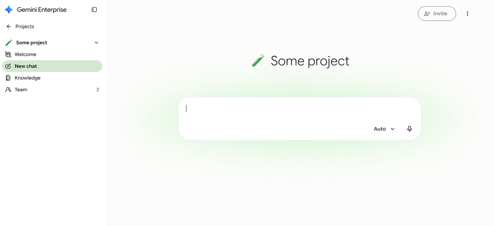

---

### 🔹 Step 1-2. 프로젝트 `Knowledge`(양식 파일) 등록 & 주간 트렌드 보고서 생성 (슬라이드 5)

> <strong>🎯 왜 하나요?</strong>  
> 매번 프롬프트에 긴 보고서 서식을 붙여넣지 않아도, <strong>`Knowledge`</strong>에 [`01_GE_Workflow_lg_weekly_report_template.md`](./files/01_GE_Workflow_lg_weekly_report_template.md) 파일을 한 번만 올려두면 언제든 사내 표준 보고서 포맷(`Executive Summary` + `비교표` + `인라인 출처`)으로 출력됩니다.

1. 좌측 사이드바 <strong>`Knowledge`</strong> 메뉴 클릭 ➔ 실습 파일 <strong>[`01_GE_Workflow_lg_weekly_report_template.md`](./files/01_GE_Workflow_lg_weekly_report_template.md)</strong> 업로드
2. 업로드가 완료되면 <strong>`New chat`</strong>을 눌러 아래 프롬프트를 그대로 복사해 입력합니다:

```text
최근 1개월간 LG 전자 프리미엄 시장 트렌드를 조사해서 템플릿 '01_lg_weekly_report_template.md' 양식으로 출력해줘
```

👉 **실행 결과 화면:** (`01_lg_weekly_report_template.md` 서식이 자동 반영된 보고서)
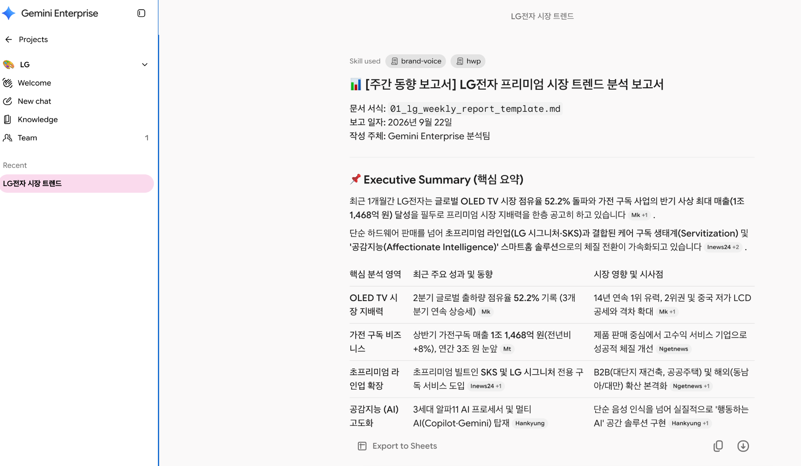

---

### 🔥 [Part 1 심화 미션 · +15분] 내 부서 맞춤 보고서 양식으로 커스텀 개조하기

> <strong>⏱️ 빨리 끝낸 분들을 위한 실무 확장 미션 (15분)</strong>  
> 기본 프롬프트 복붙만으로는 5분 만에 끝날 수 있습니다! 실제 내 현업 업무에 바로 쓸 수 있도록 아래 2가지 미션을 직접 수행해 보세요.

1. <strong>미션 A (`Knowledge` 양식 개조)</strong>: `01_GE_Workflow_lg_weekly_report_template.md` 파일의 2번 표 컬럼에 <strong>`[당사 대응 우선순위 ( 상 / 중 / 하 )]`</strong>와 <strong>`[예상 소요 예산/일정]`</strong> 컬럼을 직접 추가해 재업로드한 뒤 결과가 어떻게 바뀌는지 비교해 보세요.
2. <strong>미션 B (`Instructions` 페르소나 대결)</strong>: 맞춤 지침(`Custom Instructions`)에 <strong>"CFO(재무 최고책임자) 관점에서 수익성·원가 리스크를 최우선으로 비판적으로 서술할 것"</strong>이라는 조건을 추가했을 때 보고서 논조가 어떻게 달라지는지 옆자리 동료와 비교해 보세요.

---

# ⚡ [1부 · 크롬 브라우저] Part 2. GE Workflow & HITL 사람 승인 자동화 (30분)

### 🔹 Step 2-1. 트렌드 조사 + 양식 포맷팅 + 사람 승인(`Approval`)을 Workflow로 연결하기 (슬라이드 7)

> <strong>🎯 왜 하나요?</strong>  
> 매주 반복되는 <strong>`트렌드 수집` ➔ `양식 정리(01_template.md)` ➔ `사람 최종 검토(Approval)` ➔ `Gmail 초안 생성`</strong> 과정을 하나의 정형화된 파이프라인으로 묶어 자동화합니다.

1. 좌측 메뉴 <strong>`New Agent` ➔ `Workflow`</strong> 선택
2. 아래 화면과 같이 노드를 차례대로 연결합니다:
   - <strong>`Manual` (또는 Schedule)</strong> ➔ <strong>`Gemini Agent` (트렌드 뉴스 수집)</strong> ➔ <strong>`Gemini Agent 1` (`01_template.md` 양식 포맷팅, `Step Output` 변수 전달)</strong> ➔ <strong>`Approval` (사람의 개입 HITL)</strong> ➔ <strong>`Gemini Agent 2` (Gmail 드래프트 생성)</strong>

👉 **화면 확인 포인트:** (`Approval` 노드에서 `Approved` / `Rejected` 갈림길이 연결된 워크플로우)
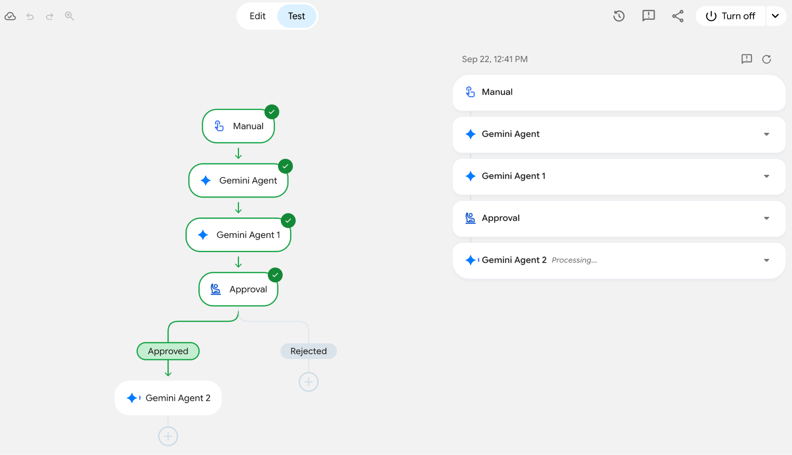

---

### 🔹 Step 2-2. `HITL (Human-in-the-Loop)` — 상사 메일 포워딩 전 사람이 검토·승인하기 (슬라이드 8)

> <strong>🎯 왜 하나요?</strong>  
> AI가 검증되지 않은 수치를 상사에게 바로 발송하는 사고를 막기 위해, <strong>`Approval` 노드에서 실행이 일시 정지</strong>되고 사람이 내용을 검토한 뒤 <strong>`[Approved]`를 눌렀을 때만</strong> Gmail 임시보관함 생성 단계로 넘어갑니다.

1. 상단 <strong>`Test`</strong> 탭에서 워크플로우를 실행하면, 보고서 초안 생성 직후 <strong>`Approval`</strong> 단계에서 자동 대기 상태가 됩니다.
2. 생성된 보고서의 수치 출처와 내용을 검토한 뒤 <strong>`[Approved]`</strong>를 클릭합니다.
3. 우측 패널에 초록색 체크와 함께 <strong>`The AI trends report workflow has completed, and a Gmail draft has been successfully created for you.`</strong> 완료 메시지가 뜨는지 확인합니다.

👉 **화면 확인 포인트:** (`Approval` 통과 후 Gmail Draft 생성 완료 메시지)
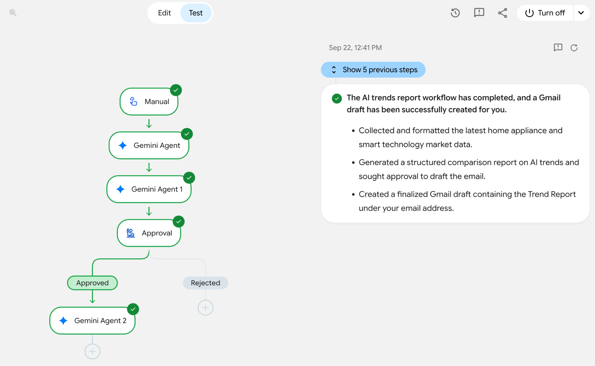

---

### 🔹 Step 2-3. 내 Gmail `[임시보관함(Drafts)]`에서 보고 메일 확인 & 본문 복사하기 (슬라이드 9)

1. 내 <strong>Gmail</strong>을 열고 좌측 <strong>`임시보관함(Drafts)`</strong> 탭을 클릭합니다.
2. 방금 워크플로우가 만들어 놓은 <strong>`[사내 표준] 주간 LG 제품 시장 트렌드 보고서`</strong> 메일을 엽니다.
3. 상단 `📌 [Executive Summary] 금주 핵심 요약 (3줄)`, 중앙 `📊 제품군별 글로벌 시장 트렌드 비교표`, 하단 `🚨 [HITL 검수 게이트] 확인 사항`까지 표 서식이 깔끔하게 들어왔는지 확인하고, <strong>메일 본문 전체를 드래그해 복사(`Ctrl + C`)</strong>합니다. *(이제 이 본문을 2부 Antigravity에 붙여넣어 웹 슬라이드로 변신시킵니다!)*

👉 **화면 확인 포인트:** (내 Gmail 임시보관함에 생성된 `[사내 표준] 주간 LG 제품 시장 트렌드 보고서`)
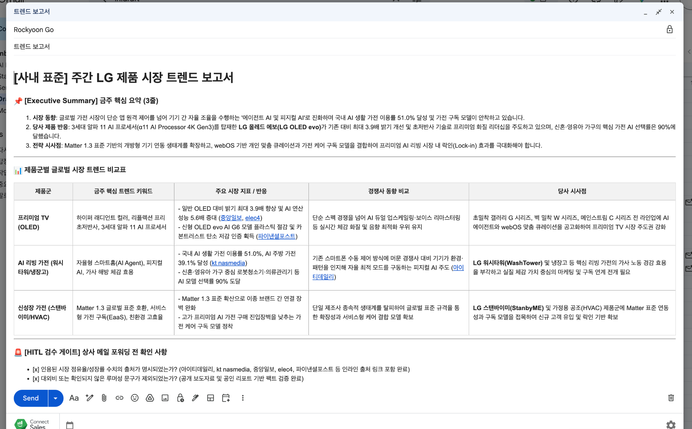

---

### 🔥 [Part 2 심화 미션 · +15분] `Rejected` (반려) 분기 처리 & 다중 수신자 조건부 라우팅

> <strong>⏱️ 빨리 끝낸 분들을 위한 실무 확장 미션 (15분)</strong>  
> `Approved`만 눌러보면 워크플로우의 진가를 절반만 체험한 것입니다!

1. <strong>미션 A (`Rejected` 반려 루프 테스트)</strong>: `Test` 실행 시 일부러 <strong>`[Rejected]`(반려)</strong> 버튼을 눌러보고, 반려 시 <strong>"출처가 불명확한 수치를 제외하고 재작성해 다시 승인을 요청하라"</strong>는 피드백 노드를 `Rejected` 갈림길 아래에 추가해 보세요.
2. <strong>미션 B (임원용 3줄 요약 vs 실무진용 상세본 동시 생성)</strong>: `Approval` 통과 후 노드를 2개로 분기하여, 하나는 <strong>팀장님용 핵심 3줄 요약 메일 초안</strong>, 다른 하나는 <strong>팀원 공유용 전체 비교표 메일 초안</strong>으로 각각 Gmail 임시보관함에 생성되도록 확장해 보세요.

---

# 💻 [2부 · 데스크톱 앱] Part 3. Antigravity 입문 — 4대 루프 & LG 브랜드 웹 슬라이드 (30분)

### 🔹 Step 3-0. [필수] 실습 시작 전 `Settings (⚙️)` 권한 점검하기 (슬라이드 11)

> <strong>⚠️ Antigravity 첫 실행 시 가장 먼저 확인하세요!</strong>  
> 에이전트가 파일을 생성하고 `/browser`로 크롬 화면을 제어하려면, 좌측 하단 <strong>`⚙️ Settings` ➔ `General`</strong>의 권한들이 <strong>`Disabled`(꺼짐)로 되어 있지 않은지</strong> 반드시 확인해야 합니다.

#### 1️⃣ `Settings ➔ General` 상단 확인: `Global Permissions` & `Artifact Review Policy`
* 좌측 하단 <strong>`⚙️ Settings`</strong> 클릭 ➔ <strong>`General`</strong> 탭에서 <strong>`Permission Preset: Default`</strong>, <strong>`Tool Permissions: Open`</strong>, <strong>`Artifact Review Policy: Always Ask`</strong> 상태를 확인합니다.

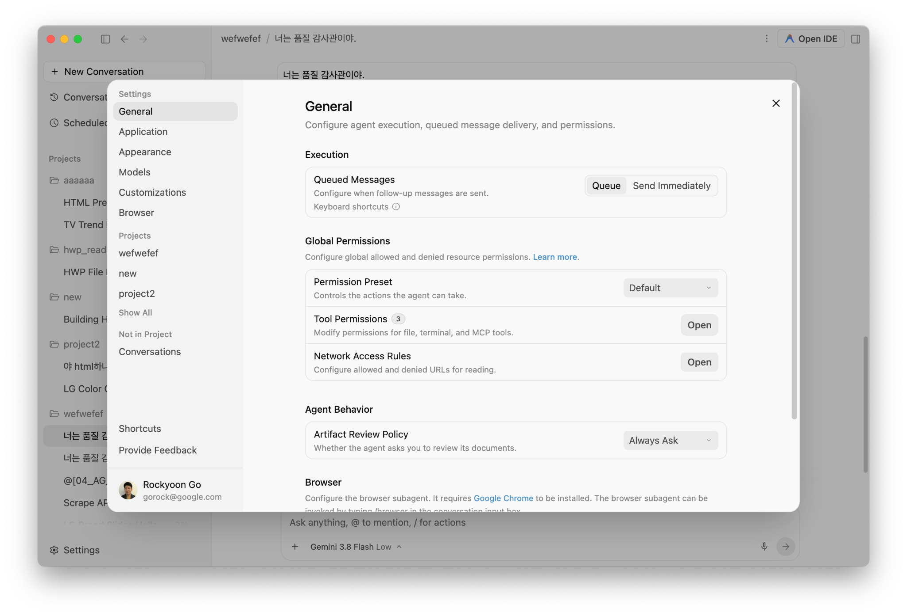

#### 2️⃣ `Settings ➔ General` 아래로 스크롤: `Browser Javascript Execution Policy` 확인
* 같은 창에서 아래로 스크롤하여 <strong>`Browser`</strong> 항목의 <strong>`Browser Javascript Execution Policy`</strong>가 `Disabled`가 아닌 <strong>`Request Review`</strong>로 설정되어 있는지 확인합니다.

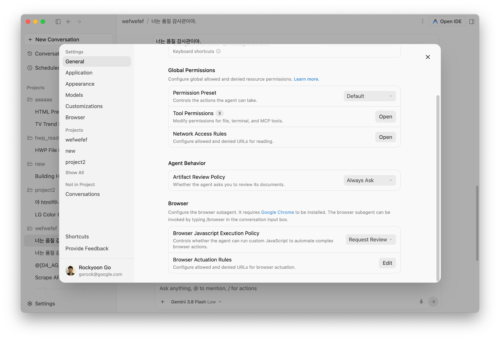

---

### 🔹 Step 3-1. `/grill-me` 역질문 인터뷰 & `Implementation Plan` `[Proceed]` 승인하기 (슬라이드 12)

> <strong>🎯 왜 하나요?</strong>  
> 처음부터 완벽한 프롬프트를 길게 쓰려고 애쓸 필요가 없습니다. <strong>`/grill-me`</strong> 한 줄만 치면 에이전트가 먼저 <strong>객관식 역질문 카드</strong>를 띄워 기획을 구체화해 주고, 깔끔한 <strong>`Implementation Plan`(구현 계획서)</strong>을 만들어 <strong>`[Proceed]`</strong> 버튼 하나로 코딩을 시작합니다.

#### 1️⃣ 작업 폴더 열기 & `/grill-me` 프롬프트 입력
로컬 작업 폴더(예: `C:/Users/abcd/lg-work-portal`)를 열고, 채팅창에 아래 한 줄을 복사해 입력합니다 (Part 2에서 복사한 Gmail 보고서 본문을 함께 붙여넣어도 좋습니다):

```text
/grill-me LG AI 가전 트렌드 보고서를 임원 발표용 Single Webpage 슬라이드로 만들고 싶어.
```

#### 2️⃣ 에이전트가 띄우는 객관식 역질문 카드에 체크 후 `Submit ↵` 클릭
`/grill-me`를 실행하면 아래 화면처럼 에이전트가 <strong>우선순위 기능</strong>과 <strong>발표자 노트 레이아웃 방식</strong>을 객관식 카드로 물어봅니다. 원하는 항목(예: `1번 Recommended`)을 클릭하고 우측 하단 파란색 <strong>`Submit ↵`</strong> 버튼을 누릅니다.

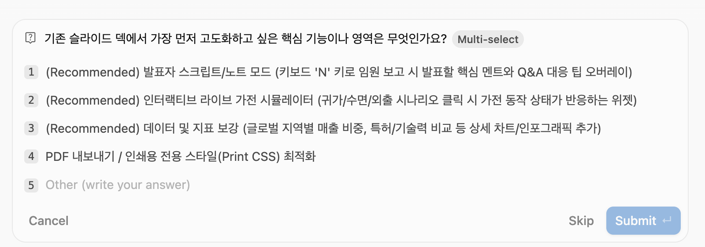

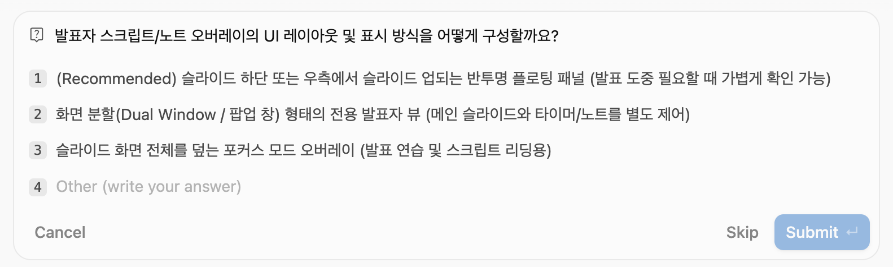

#### 3️⃣ 생성된 `Implementation Plan`(구현 계획서)에서 파란색 `[Proceed ⌘↩]` 버튼 클릭!
질문에 답하고 나면 에이전트가 아래 화면처럼 <strong>구현 계획서(`Implementation Plan`)</strong>를 제시합니다. ⚠️ <strong>반드시 하단의 파란색 `[Proceed ⌘↩]` 버튼을 눌러주셔야 실제 `index.html` 코드 생성이 시작됩니다!</strong>

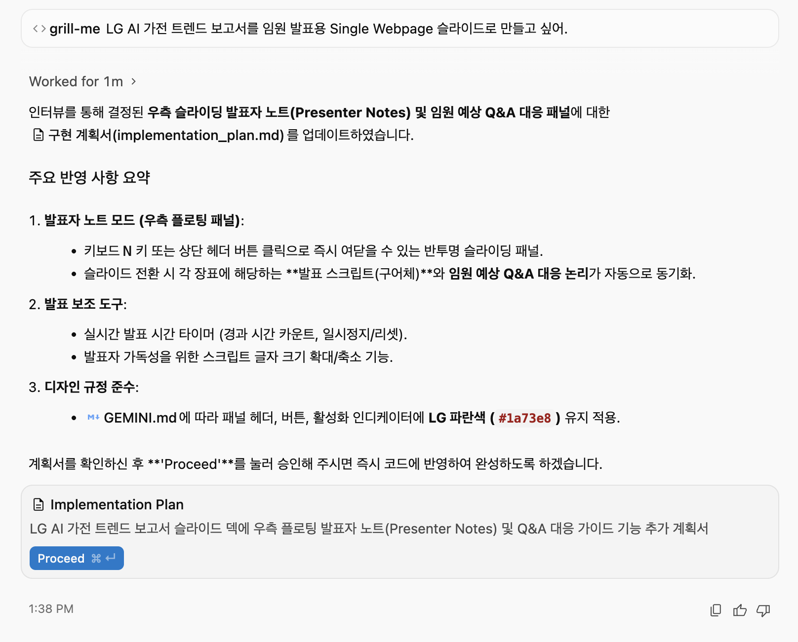

---

### 🔹 Step 3-2. 생성된 발표용 웹 슬라이드(`index.html`) 브라우저 시연 & 방향키(`←`/`→`) 확인 (슬라이드 13)

1. 에이전트가 생성한 `index.html` (또는 스타터 파일 [`02_AG_Webpage_hello_world_slides.html`](./files/02_AG_Webpage_hello_world_slides.html))을 브라우저에서 엽니다.
2. 키보드 <strong>좌우 방향키(`←` / `→`)</strong> 또는 `Space` 키로 슬라이드를 넘겨보고, `N` 키(발표자 노트)와 `F` 키(전체화면)를 눌러봅니다.
3. *(확인 포인트: 아래 두 화면처럼 슬라이드 구조와 차트는 멋지게 나왔지만, <strong>아직 LG 브랜드 컬러 스킬을 입히기 전이라 기본 다크 블루(`#1a73e8`) 색감</strong>으로 만들어진 상태입니다!)*

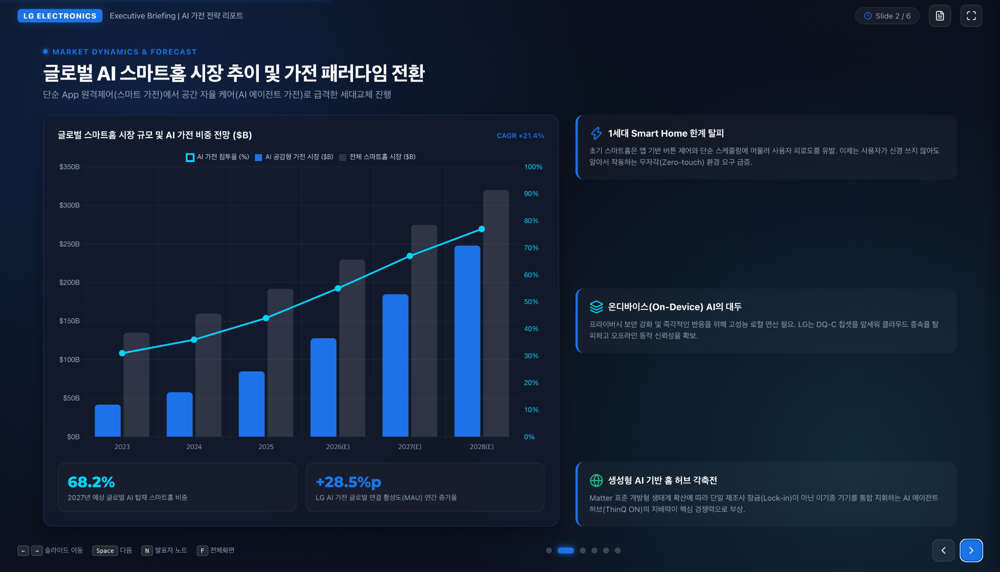

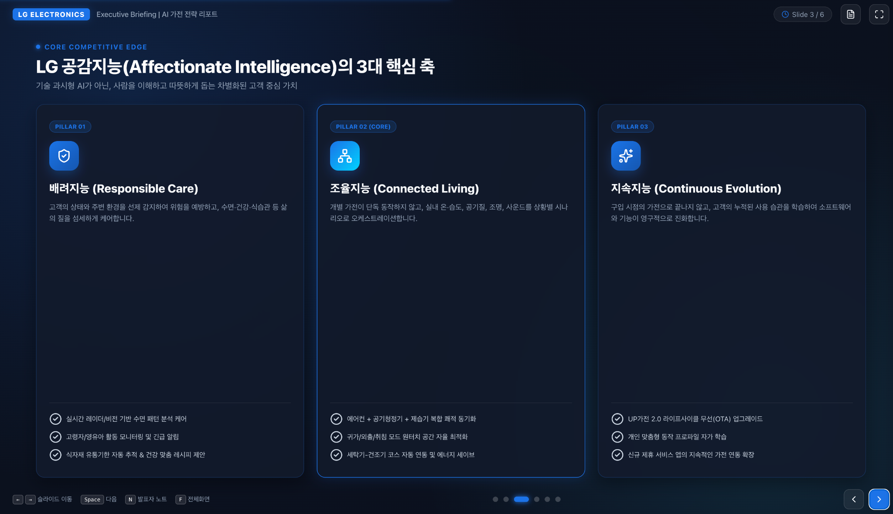

---

### 🔹 Step 3-3. 참여자 자유 구성 추가 & `/btw` · `/learn`으로 내 슬라이드 규칙 저장하기 (슬라이드 14)

#### 1️⃣ 원하는 장표 내용 자유롭게 추가하고 `[Proceed]` 누르기
내가 보고서에 더 넣고 싶은 데이터(예: 주요 국가 구매력 지수 GDP 비교, 당사 vs 경쟁사 스펙 비교표 등)를 채팅창에 자연어로 추가 지시하고, 계획서가 뜨면 <strong>`Proceed`</strong>를 누릅니다. 작업 도중 궁금한 점은 하단 <strong>`/btw` (`Side Question`)</strong>로 흐름을 끊지 않고 물어보고, 마음에 드는 규칙은 <strong>`/learn`</strong>으로 저장합니다:

```text
추가로 지금 현재 세계 주요 나라의 GDP(구매력지수 PPP 기준) 비교 슬라이드를 추가해줘.
```

```text
/learn 발표 슬라이드 하단에는 항상 페이지 번호(1/N)와 단축키 안내(방향키 이동, N 발표자 노트)를 표시하도록 규칙으로 저장해줘.
```

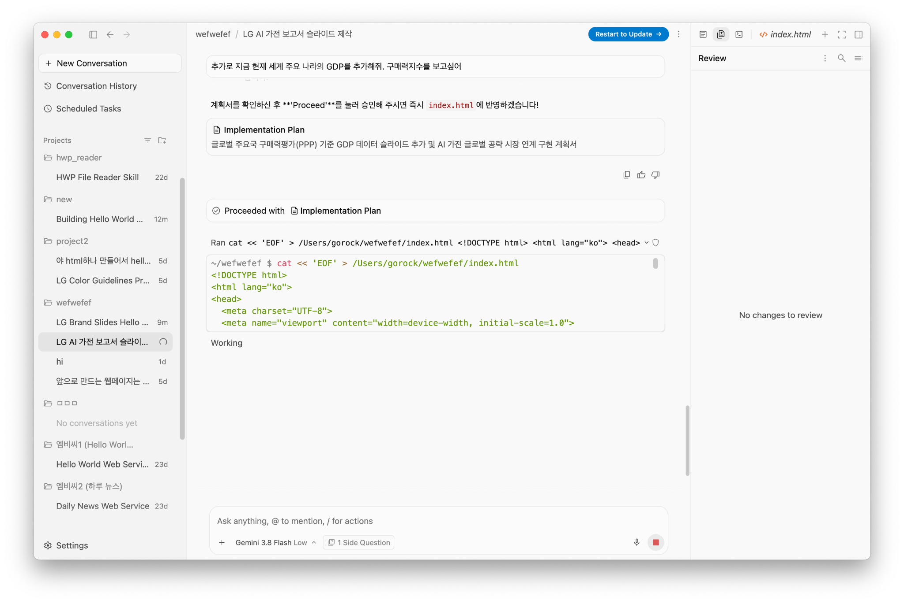

---

### 🔹 Step 3-4. `/lg-brand-slides` 스킬 적용 — LG 브랜드 색감(`Hex #A50034` 레드 & 화이트) 영구 고정! (슬라이드 15)

> <strong>🎯 왜 하나요?</strong>  
> 슬라이드를 수정할 때마다 색상이 파란색·보라색으로 제멋대로 바뀌는 것을 막기 위해, 실습 파일 [`02_AG_Webpage_lg_brand_slides_SKILL.md`](./files/02_AG_Webpage_lg_brand_slides_SKILL.md)를 스킬(`lg-brand-slides`)로 등록하고 호출하여 <strong>모든 슬라이드를 LG 시그니처 레드(`#A50034`) 포인트 + 순백색(`#FFFFFF`) 배경 + 라이트그레이(`#F8F9FA`) 카드</strong>로 단번에 고정합니다!

1. 실습 폴더의 <strong>[`02_AG_Webpage_lg_brand_slides_SKILL.md`](./files/02_AG_Webpage_lg_brand_slides_SKILL.md)</strong> 파일을 프로젝트 스킬(`.agents/skills/lg-brand-slides/SKILL.md`)에 넣거나 `/learn`으로 학습시킵니다. *(스킬이 안 보일 때는 `Ctrl + R` 또는 `View ➔ Reload`)*
2. 채팅창에 아래 프롬프트를 복사해 입력합니다 (슬라이드 15 원문 그대로!):

```text
/lg-brand-slides 스킬을 적용해서 지금 웹 프레젠테이션의 색감(Hex)을 LG 브랜드 컬러(#A50034 포인트 & 화이트/그레이 배경)로 고정하여 다시 제작해줘.
```

👉 **실행 결과 화면:** (다크 블루였던 슬라이드가 화이트 + LG 시그니처 레드 `#A50034`로 100% 변환된 모습!)
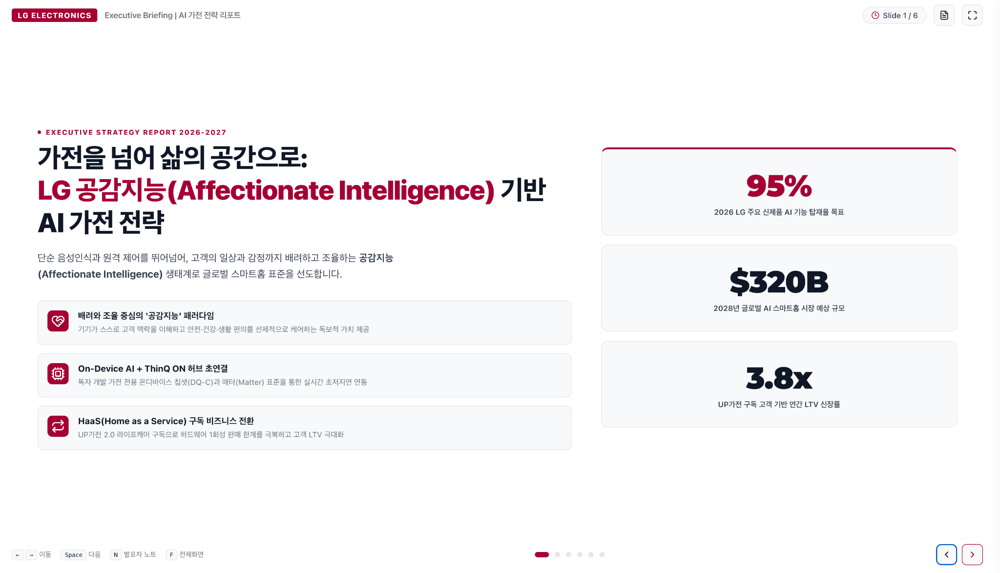

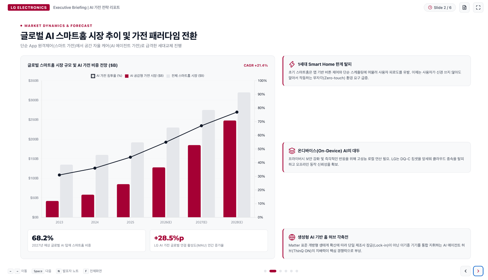

---

### 🔥 [Part 3 심화 미션 · +20분] 인터랙티브 시뮬레이터 위젯 & 발표자 Q&A 패널 직접 탑재하기

> <strong>⏱️ 빨리 끝낸 분들을 위한 실무 확장 미션 (20분)</strong>  
> 정적인 텍스트 슬라이드를 넘어, 웹페이지(`HTML/JS`)만의 무기인 <strong>'클릭하면 움직이는 인터랙티브 위젯'</strong>을 슬라이드 안에 심어보세요!

```text
현재 웹 슬라이드(index.html)의 3번째 장표에 버튼을 클릭하면 [귀가 모드] / [취침 모드] / [외출 절전 모드]에 따라 에어컨·워시타워·조명의 예상 전력 절감량(kWh)과 작동 상태가 실시간 애니메이션으로 바뀌는 인터랙티브 시뮬레이터 위젯을 넣어줘. 그리고 키보드 'N' 키를 누르면 우측에서 임원 예상 송곳 질문 3가지와 모범 답변 스크립트가 슬라이딩 패널로 열리게 해줘.
```

---

# 📊 [2부 · 데스크톱 앱] Part 4. 나만의 사이드 탭 Dashboard & 15줄 무인증 파이썬 스킬 (30분)

### 🔹 Step 4-1. `/grill-me`로 왼쪽 사이드 탭 업무 포털 설계 & `1번 메뉴(LG 시장 트렌드)`에 슬라이드 탑재 (슬라이드 17)

> <strong>🎯 왜 하나요?</strong>  
> Part 3에서 공들여 만든 LG 트렌드 웹 슬라이드를 버리지 않고, <strong>왼쪽 사이드바(`업무 메뉴`)가 있는 통합 업무 포털(`LG 스마트 워크스페이스 대시보드`)의 `1번 메뉴(LG 시장 트렌드)`</strong> 안에 그대로 쏙 집어넣습니다! (외부 프레임워크 설치 없이 `HTML/JS` 단일 구조로 만들어 사내망 어디서나 즉시 열리게 합니다.)

#### 1️⃣ 채팅창에 아래 프롬프트 복사·붙여넣기 (슬라이드 17 원문 그대로!)
```text
/grill-me 평소 자주 쓰는 업무들을 왼쪽 사이드 탭에 차례차례 추가하는 나만의 대시보드를 만들고 싶어. html/js을 사용하는게 좋을것 같아. 사이드바 1번 메뉴를 'LG 시장 트렌드'로 만들고, 방금 만든 웹 슬라이드 페이지를 이 사이드바 메뉴 안에 넣어줘.
```

👉 **실행 결과 화면:** (`업무 메뉴` 좌측 사이드바 `1. LG 시장 트렌드` 탭 안에 웹 슬라이드가 탑재된 포털!)
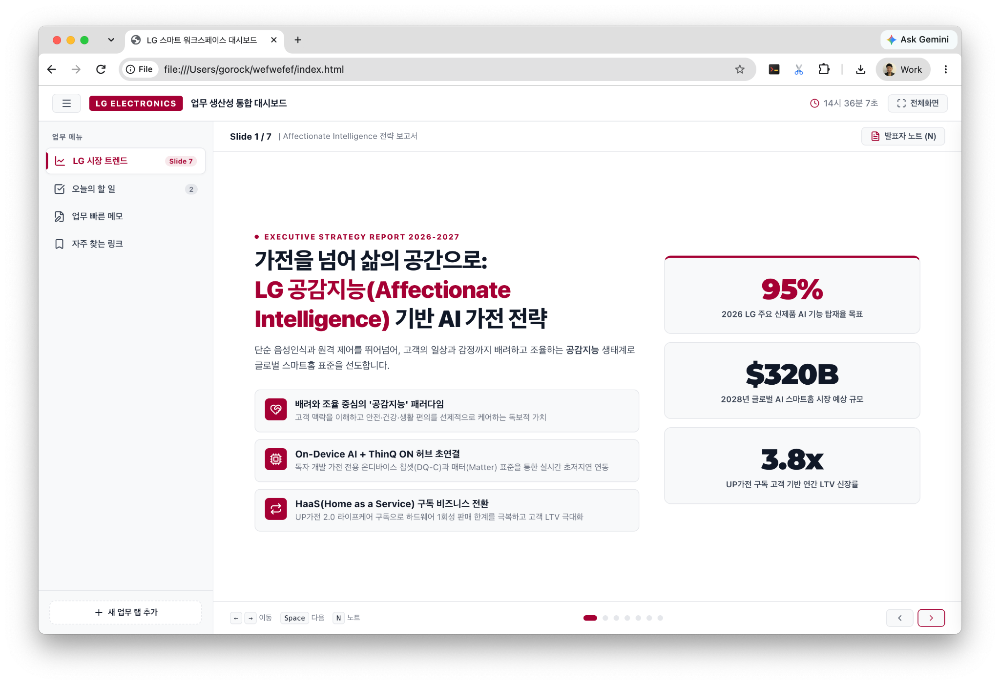

---

### 🔹 Step 4-2. 15줄 무인증 파이썬 코드 ➔ 스킬 등록 & `실시간 시장·뉴스 LIVE` 탭 연동 (슬라이드 18)

> <strong>🎯 왜 하나요?</strong>  
> 복잡한 DART API 키 발급이나 외부 라이브러리(`pip install`) 없이도, 파이썬 기본 내장 `urllib`만 쓰는 <strong>15줄 코드([`03_AG_Dashboard_fetch_lg_live_market.py`](./files/03_AG_Dashboard_fetch_lg_live_market.py))</strong>를 스킬로 등록해 <strong>① 네이버 금융 LG전자(`066570`) 현재가·등락률</strong>, <strong>② 글로벌 환율(`USD/KRW`, `EUR/KRW`)</strong>, <strong>③ 구글 뉴스 RSS 실시간 헤드라인 5건</strong>을 사이드바 <strong>2번 탭(`실시간 시장·뉴스 LIVE`)</strong>에 즉시 꽂아 넣습니다!

#### 🐍 실습 폴더의 15줄 무인증 파이썬 코드 (`03_AG_Dashboard_fetch_lg_live_market.py`)
```python
import urllib.request, urllib.parse, json, xml.etree.ElementTree as ET

def fetch_lg_live_dashboard_data(stock_code="066570", keyword="LG전자 AI 가전"):
    headers = {"User-Agent": "Mozilla/5.0"}
    # 1. [No-Key] 네이버 금융 LG전자(066570) 실시간 주가·등락률 JSON
    req = urllib.request.Request(f"https://m.stock.naver.com/api/stock/{stock_code}/basic", headers=headers)
    stock = json.loads(urllib.request.urlopen(req, timeout=5).read().decode("utf-8"))
    # 2. [No-Key] Frankfurter(ECB) 실시간 USD/KRW · EUR 글로벌 환율 JSON
    fx = json.loads(urllib.request.urlopen("https://api.frankfurter.dev/v1/latest?base=USD&symbols=KRW,EUR,JPY", timeout=5).read().decode("utf-8"))
    # 3. [No-Key] Google News RSS 실시간 'LG전자 AI 가전' 최신 뉴스 5건
    rss_url = f"https://news.google.com/rss/search?q={urllib.parse.quote(keyword)}&hl=ko&gl=KR&ceid=KR:ko"
    root = ET.fromstring(urllib.request.urlopen(rss_url, timeout=5).read())
    news = [{"title": item.findtext("title"), "pubDate": item.findtext("pubDate"), "link": item.findtext("link")} for item in root.findall(".//item")[:5]]
    return {"stock_name": stock.get("stockName", "LG전자"), "close_price": stock.get("closePrice"), "fluctuation_rate": stock.get("fluctuationsRatio"), "usd_krw": fx["rates"]["KRW"], "latest_news": news}
```

#### 1️⃣ 채팅창에 아래 프롬프트 복사·붙여넣기 (슬라이드 18 원문 그대로!)
```text
[1] @03_AG_Dashboard_fetch_lg_live_market.py 해당하는 파이썬 코드를 스킬로 등록시켜줘. (python-api-trend)
[2] /python-api-trend 스킬을 실행해 사이드바 '실시간 시장·뉴스(LIVE)' 탭에 LG전자(066570) 실시간 주가·환율(USD/KRW, EUR/KRW)과 구글 뉴스 헤드라인 5건(클릭 시 원문 이동)을 연결해줘.
```

👉 **실행 결과 화면:** (`실시간 시장·뉴스 LIVE` 탭 — LG전자 `214,500원 +5.93%`, 환율 `1,372.18원`, 실시간 뉴스 5건)
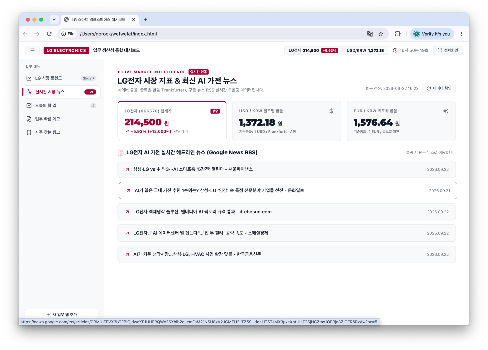

---

### 🔹 Step 4-3. 우측 상단 `[오늘의 LG 트렌드 & 뉴스 Pull]` 버튼 & `/schedule` 매일 아침 9시 자동화 (슬라이드 19)

#### 1️⃣ 채팅창에 아래 프롬프트 복사·붙여넣기 (슬라이드 19 원문 그대로!)
```text
[1] 대시보드 우측 상단에 '[오늘의 LG 트렌드 & 뉴스 Pull]' 버튼을 만들어서 클릭 시 최신 데이터로 갱신되게 해줘.
[2] /schedule 매일 오전 9시에 트렌드 데이터 및 뉴스 데이터를 자동 업데이트해줘.
```

#### 2️⃣ 결과 화면 ①: 우측 상단 헤더에 빨간색 `[📥 오늘의 LG 트렌드 & 뉴스 Pull]` 원클릭 갱신 버튼 장착!
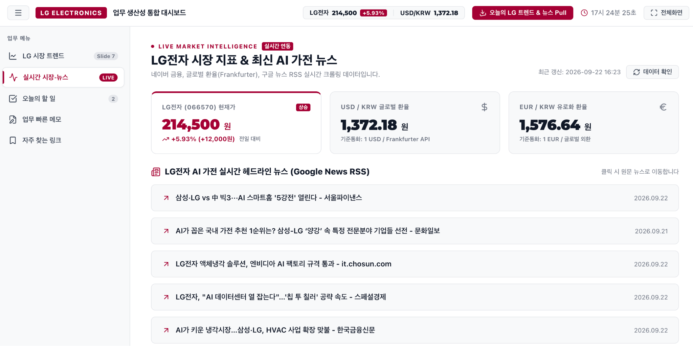

#### 3️⃣ 결과 화면 ②: `/schedule` 명령어로 매일 아침 9시(`0 9 * * *`) 자동 갱신 백그라운드 데몬(`1 task running`) 등록 완료!
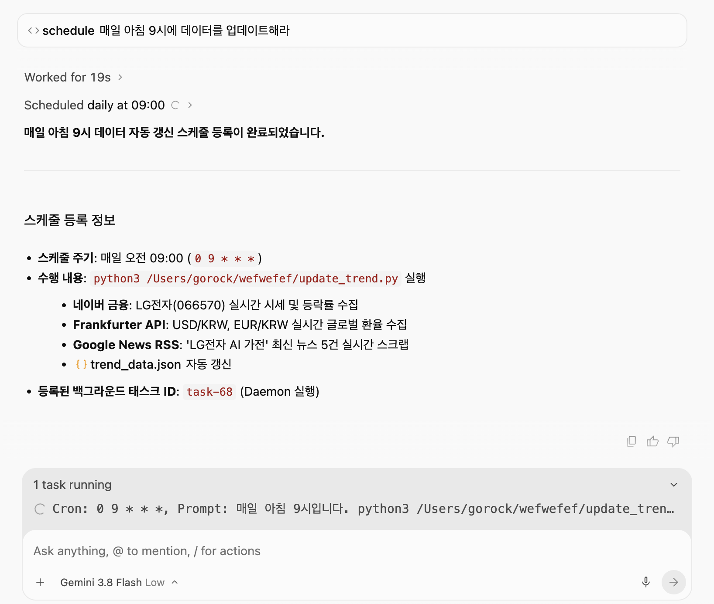

---

### 🔥 [Part 4 심화 미션 · +20분] 경쟁사(삼성·글로벌 가전) 동시 비교 티커 & 나만의 3번째 업무 탭 추가하기

> <strong>⏱️ 빨리 끝낸 분들을 위한 실무 확장 미션 (20분)</strong>  
> 15줄 무인증 파이썬 스크립트(`03_AG_Dashboard_fetch_lg_live_market.py`)의 파라미터를 살짝 바꿔 나만의 실시간 마켓 워치로 개조해 보세요!

```text
[심화 미션] 방금 등록한 /python-api-trend 스킬 스크립트를 확장해서:
1. LG전자(066570)뿐만 아니라 주요 비교 종목(예: LG이노텍 011070, 삼성전자 005930)의 실시간 등락률을 나란히 비교하는 '경쟁사 주가 멀티 티커'를 상단 헤더에 추가해줘.
2. 구글 뉴스 검색 키워드를 버튼 클릭 한 번으로 ['LG전자 AI 가전' / 'OLED TV 점유율' / '유럽 HVAC 히트펌프'] 3가지 토픽으로 즉시 전환해서 볼 수 있게 탭 2 화면을 업그레이드해줘.
```

---

# 📈 [2부 · 데스크톱 앱] Part 5. LG 5대 가전 920행 데이터 Analytics & 95점 품질 게이트 (1시간)

### 🔹 Step 5-0. 데이터셋(`04_AG_Analytics_lg_appliance_data.csv`, 920행) 로딩 및 컬럼 확인 (슬라이드 21)

#### 1️⃣ 로컬 폴더에 `04_AG_Analytics_lg_appliance_data.csv` 넣고 `@멘션`으로 읽어오기
채팅창에 `@04_AG_Analytics_lg_appliance_data.csv 이 데이터 몇개를 읽어봐봐` 라고 입력해 5대 주력 가전(`OLED evo`, `DIOS & Objet`, `WashTower & Tromm`, `Whisen & HVAC`, `StanbyME & Care`) 920행 데이터 구조가 정상 인식되는지 확인합니다.

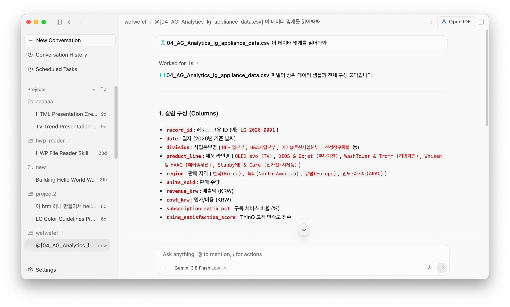

---

### 🔹 Step 5-1. [Step 1: Explore] 코딩 전 `ThinQ 점수 결측치(23건)` & `스탠바이미 시제품 매출 0원(18건)` 먼저 진단하기 (슬라이드 22)

> <strong>🎯 왜 코딩 전에 `Explore`부터 하나요?</strong>  
> 실무 CSV 데이터를 바로 차트로 그리면 <strong>빈 값(`NaN` 결측치 23건)</strong> 때문에 평균이 깨지거나, <strong>시제품 매출 `0원`(18건, 원가는 존재)</strong> 레코드 때문에 마진율 계산 시 `0 나눗셈(ZeroDivision)` 및 마진 왜곡이 발생합니다. 먼저 <strong>데이터 품질 진단만 지시</strong>합니다!

#### 1️⃣ 채팅창에 아래 프롬프트 복사·붙여넣기 (슬라이드 22 원문 그대로!)
```text
@04_AG_Analytics_lg_appliance_data.csv 이 LG 가전·TV 데이터의 제품군별(OLED evo, 워시타워, 디오스, HVAC, 스탠바이미) 결측치(ThinQ 점수 빈 값)와 마진 계산 시 주의할 이상치(스탠바이미 시제품 매출 0원)를 먼저 진단해줘. 아직 코드는 짜지 마.
```

👉 **실행 결과 화면:** (전체 920건 중 `thinq_satisfaction_score` 결측치 <strong>총 23건(2.50%)</strong> 제품군별 정밀 포착!)
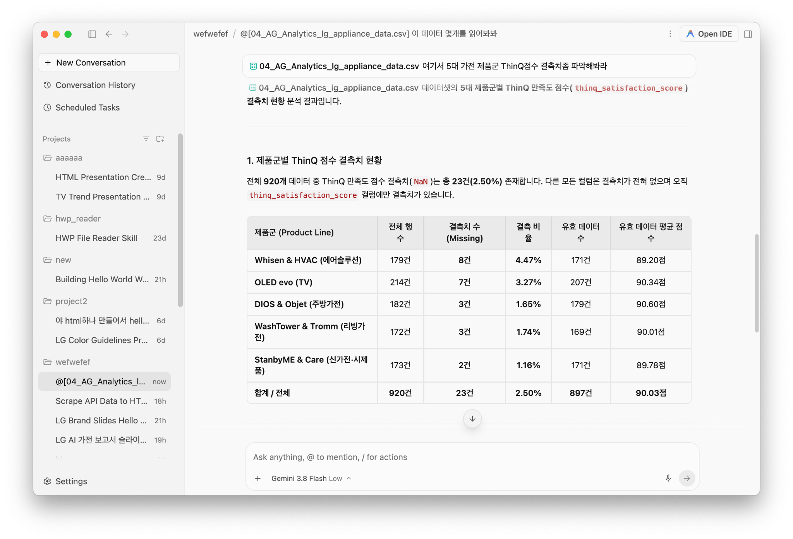

---

### 🔹 Step 5-2. [Step 2: Plan & Execute] 기존 대시보드에 4번째 탭 `[가전 실적·구독 분석 NEW]` 블렌딩하기 (슬라이드 23 & 26)

> <strong>🎯 왜 하나요?</strong>  
> 기존 1~3번 탭(`LG 시장 트렌드`, `실시간 시장·뉴스 LIVE`, `오늘의 할 일`)을 덮어쓰지 않고 <strong>그대로 유지한 채</strong>, 좌측 사이드바에 <strong>4번째 탭(`📊 가전 실적·구독 분석 NEW`)</strong>을 추가하고 <strong>시제품(18건) 포함/제외 토글 필터</strong>와 <strong>ThinQ 결측치(23건) 보정 리포트</strong>를 함께 구현합니다.

#### 1️⃣ 채팅창에 아래 프롬프트 복사·붙여넣기 (슬라이드 23 원문 그대로!)
```text
[1] 기존 대시보드 탭은 그대로 유지하고, 4번째 사이드 탭으로 @04_AG_Analytics_lg_appliance_data.csv 기반 'LG 가전 제품군 실적·구독 Analytics'를 추가하고 싶어.
[2] 스탠바이미 시제품(매출 0원, 18건) 분리 처리(포함/제외 토글 필터)와 워시타워 ThinQ 결측치(23건) 스마트 보정 리포트, 제품군별 매출·마진율 차트 및 권역별 HaaS 구독 전환율 차트도 넣어줘.
```

👉 **실행 결과 화면:** (상단 4대 KPI 카드 + `시제품 18건 포함/제외` 필터 + 이상치·결측치 리포트 + 차트 2종 완성!)
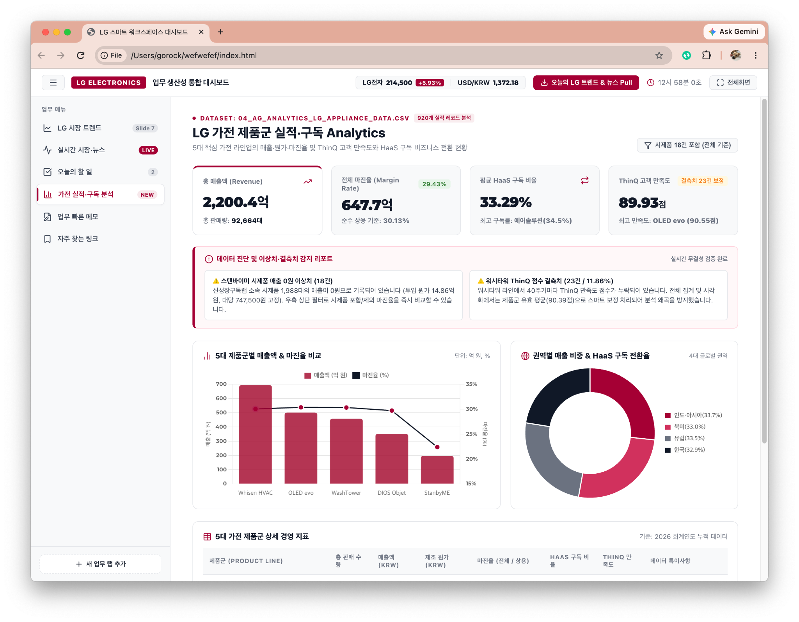

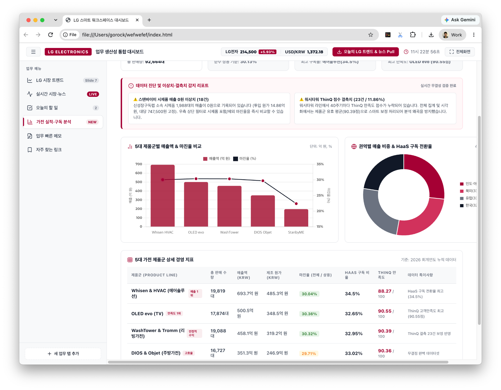

---

### 🔹 Step 5-3. [Step 3: Verify] `/browser`로 에이전트가 직접 크롬을 띄워 탭 전환·필터 검증하기 (슬라이드 24)

> <strong>🎯 왜 하나요?</strong>  
> 사람이 일일이 탭과 필터를 눌러보는 대신, <strong>`/browser`</strong> 커맨드(또는 직접 실행 지시)로 에이전트가 스스로 브라우저를 띄워 <strong>Tab 1 ~ Tab 4 화면 렌더링 상태와 시제품 `0원` 필터 클릭 시 에러 여부를 자율 점검</strong>하게 합니다.

#### 1️⃣ 채팅창에 아래 프롬프트 복사·붙여넣기 (슬라이드 24 원문 그대로!)
```text
/browser 로컬 대시보드에 접속해서 사이드 탭 전환과 제품군 필터('OLED evo', 'StanbyME 시제품') 클릭 시 콘솔 에러나 0 나눗셈 오류가 없는지 검증해
```

👉 **화면 확인 포인트:** (에이전트가 스스로 Chrome을 실행해 Tab 1, Tab 2, Tab 4를 캡처·분석하는 과정)
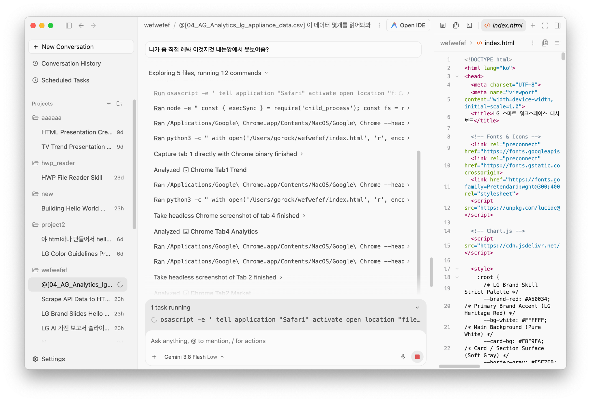

---

### 🔹 Step 5-4. [Step 4: Handoff] 새 세션(`+ New Conversation`) 품질 감사관 채점 & 90점/95점 게이트 돌파 후 `/learn` 저장! (슬라이드 25)

> <strong>💡 오늘 워크샵의 하이라이트 (`자기 확증 편향` 제거 루프)!</strong>  
> 코드를 작성한 기존 세션에게 "잘 만들었니?"라고 물으면 자기 코드를 칭찬합니다.  
> 따라서 좌측 상단 <strong>`+ New Conversation` 버튼으로 완전히 새로운 세션을 열어 '품질 감사관(QA Evaluator)' 역할을 부여</strong>하고, <strong>목표 점수(90점/95점)를 넘길 때까지 스스로 감점 요인을 고치고 재채점하는 루프</strong>를 돌린 뒤 최종 통과 규칙을 <strong>`/learn`</strong>으로 영구 자산화합니다!

#### 1️⃣ 좌측 상단 `+ New Conversation` 클릭 후 <strong>새 세션</strong>에 아래 프롬프트 복사·붙여넣기 (슬라이드 25 원문 그대로!)
```text
너는 품질 감사관이야. @index.html 을 100점 만점 채점해. 90점 미만이면 감점 요인을 직접 고쳐서 90점을 넘길 때까지 재채점 루프를 반복하고, 통과 후 /learn으로 저장해줘.
```

👉 **실행 결과 화면:** (`1차 점수 82점` ➔ 자동 패치 후 `2차 점수 99점 🏆 [품질 인증 기준 통과]` 및 `/learn` 영구 저장 안내!)
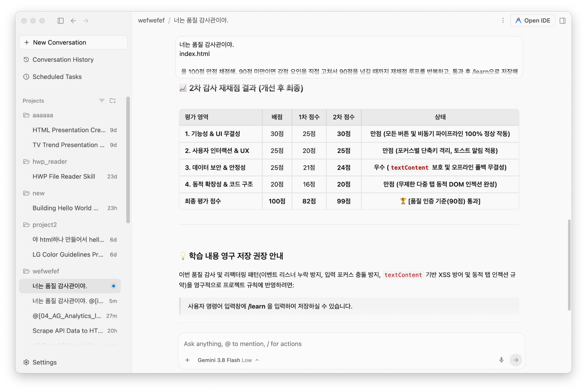

---

### 🔥 [Part 5 최종 보스 미션 · +25분] 98점 돌파 아키텍처 리팩터링 & 본부장 보고용 PDF/MD 원클릭 추출기 구현

> <strong>⏱️ 3~4시간 풀코스 완주를 위한 최종 종합 미션 (25분)</strong>  
> 단순 차트 출력을 넘어 실제 임원 회의에 바로 들고 들어갈 수 있는 <strong>'시뮬레이션 + 원클릭 보고서 추출'</strong> 기능까지 완성하고 감사관에게 <strong>98점 이상</strong>을 받아보세요!

```text
[최종 보스 미션] 현재 4번째 탭('가전 실적·구독 분석')에 아래 2가지 실무 기능을 추가해줘:
1. '환율 & 구독 전환율 What-if 시뮬레이터 슬라이더': 마우스로 USD/KRW 환율(1,300원~1,450원)과 HaaS 구독 전환율(+1%p ~ +10%p) 슬라이더를 움직이면 5대 가전 제품군의 예상 영업이익과 연매출이 실시간으로 재계산되어 차트가 움직이게 해줘.
2. 우측 상단에 '[📥 임원 보고용 1페이지 요약 리포트 다운로드(.md)]' 버튼을 만들고, 클릭 시 현재 선택된 필터 기준의 핵심 KPI와 이상치(스탠바이미 시제품 18건, 워시타워 결측 23건) 분석 코멘트가 파일로 즉시 다운로드되게 구현해줘.
```

---

## 🎉 수고하셨습니다! 오늘 완성한 모든 산출물 요약

1. <strong>1부 (크롬 GE Web)</strong>: 팀 공유 `Project` + 사내 보고서 양식(`01_template.md`) 고정 ➔ `Workflow` + `Approval (HITL 사람 승인)` ➔ <strong>내 Gmail 임시보관함(`Drafts`) 주간 트렌드 보고서 자동 생성</strong>
2. <strong>2부 (Antigravity 2.0)</strong>:
   - <strong>탭 1 (`📈 LG 시장 트렌드`)</strong>: `/grill-me` ➔ `Proceed` ➔ `/lg-brand-slides`로 <strong>LG 시그니처 레드(`#A50034`) + 화이트 테마 웹 슬라이드</strong> 탑재
   - <strong>탭 2 (`💓 실시간 시장·뉴스 LIVE`)</strong>: <strong>15줄 무인증 파이썬 코드</strong> 스킬 연동으로 <strong>LG전자(`066570`) 실시간 시세·환율·구글 뉴스</strong> + 우측 상단 <strong>`Pull` 버튼 & `/schedule` 매일 9시 자동화</strong>
   - <strong>탭 3/4 (`📊 가전 실적·구독 분석 NEW`)</strong>: <strong>`@04_AG_Analytics_lg_appliance_data.csv` (920행)</strong> 결측치(23건)·시제품(0원 18건) 정제 차트 + <strong>`/browser` 검증</strong> + <strong>새 세션 감사관 `82점 ➔ 99점 PASS` & `/learn` 영구 자산화</strong>