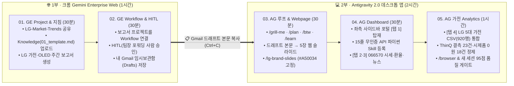

# 🚀 LG Electronics · Gemini Enterprise & Antigravity 2.0 실무 핸즈온 마스터 가이드

> **교육 시간**: 총 3시간 (`1부 크롬 Gemini Enterprise Web 1시간` + `2부 Antigravity 2.0 데스크톱 앱 2시간`)  
> **교안 슬라이드 (Google Slides)**: [전체 슬라이드 덱 열기](https://docs.google.com/presentation/d/1IYXVTVUEw_TKte4I1Ff31scmNEY7ueXCZ2i8AKiZWog/edit)  
> **실습 파일 패키지 (Google Drive)**: [전체 실습 파일 폴더 열기 (9종)](https://drive.google.com/drive/folders/1dxqldyrsQ7oSRi-d1ieRdDVJmTmQ0r2V)

---

## 📌 1. 전체 5단계 누적 빌드업 로드맵 (At a Glance)

본 과정은 3시간 동안 **단 하나의 마스터 산출물(`LG 주간 트렌드 보고서` ➔ `5장 발표용 웹 슬라이드` ➔ `4개 사이드 탭 통합 업무 포털`)**을 끊김 없이 누적 발전시키는 엔드투엔드(End-to-End) 실습입니다.



| 파트 | 사용 환경 | 시간 | 핵심 실습 주제 (슬라이드 1~26번 요약) | 활용 기능 · 스킬 & 실습 파일 |
| :--- | :--- | :---: | :--- | :--- |
| **01. GE Project & 지침** | 크롬 GE Web (3~5p) | 30분 | 팀 프로젝트(`LG-Market-Trends`) 생성·공유(`Invite+`) 및 `Project Knowledge` 양식·맞춤 지침(`Instructions`) 기반 트렌드 보고서 생성 | `Project Knowledge` · `Instructions` · [01_template.md](https://drive.google.com/file/d/18GlJiQ9yfxsg8XslXuLPShPLw90j9kKh/view) · `Gemini 3.8 Flash` |
| **02. GE Workflow** | 크롬 GE Web (6~9p) | 30분 | 트렌드 보고 프로젝트를 자동화 `Workflow`로 연결(`Step Output` 변수 전달) 및 `HITL` 사람 승인 후 내 `Gmail 임시보관함(Drafts)` 생성·복사 | `GE Workflow Builder` · `HITL Approval` · `Gmail Drafts` |
| **03. AG 루프 & Webpage** | Antigravity 2.0 (10~14p) | 30분 | 4대 표준 루프(`/grill-me` · `/plan` · `/btw` · `/learn`) 체득 후 1부 드래프트 본문을 5장 발표용 웹 슬라이드로 변환 & `#A50034` 브랜드 고정 | `/grill-me` · `/plan` · `/btw` · `/learn` · [02_hello_world_slides.html](https://drive.google.com/file/d/1EGbGAi5WbVfWdT0xCylY9shLwbnDkTJ_/view) · [02_lg_brand_slides_SKILL.md](https://drive.google.com/file/d/1eoWK1zd_kwYtvB4funCu-MtEUuiXrVVq/view) |
| **04. AG Dashboard** | Antigravity 2.0 (15~18p) | 30분 | 좌측 사이드바 포털 `[1번 탭]`에 트렌드 웹 탑재 + **15줄 무인증 파이썬 코드**를 `/lg-live-market` 스킬로 등록해 `[2·3번 탭]` 시세·환율·뉴스 연동 | [03_fetch_lg_live_market.py](https://drive.google.com/file/d/1Xo6xV4P35Xqmr5ZywSiDaegLO_eWOmpE/view) · [03_lg_live_market_SKILL.md](https://drive.google.com/file/d/1G36G8AmpS3bGf8Sg7ibd9oQP7Eak6UqL/view) · `/schedule` |
| **05. AG 가전 Analytics** | Antigravity 2.0 (19~25p) | 1시간 | 기존 포털에 `[4번 탭: LG 5대 가전 실적·구독]` 블렌딩(`ThinQ 결측 23건`·`시제품 0원 18건` 정제) ➔ `/browser` 녹화 ➔ **새 세션(`+ New Chat`) 95점 품질 게이트** | [04_lg_appliance_data.csv](https://drive.google.com/file/d/16dif2NiQpcK0FVjut9RXA5i1yKOyKfB_/view) · [04_design_guidelines.md](https://drive.google.com/file/d/1RGdXSM5s6AhTYfHVnexHeBkkkzeUDR92/view) · `/browser` · `+ New Chat` |

---

## 📦 2. 실습 파일 패키지 다운로드 (총 9종)

실습 시작 전 아래 [Google Drive 실습 파일 패키지 폴더](https://drive.google.com/drive/folders/1dxqldyrsQ7oSRi-d1ieRdDVJmTmQ0r2V)에서 파일을 로컬 작업 폴더(`C:\Users\LG\Projects\lg-work-portal\`)에 다운로드해 주세요.

1. 📘 **[00_LG_Workshop_Full_HandsOn_Guide.md](https://drive.google.com/file/d/1t0HW6ngR8rUianS4E8UJqu_sXapYUNv-/view)** : 전체 실습 튜토리얼 마크다운 원본
2. 📄 **[01_GE_Workflow_lg_weekly_report_template.md](https://drive.google.com/file/d/18GlJiQ9yfxsg8XslXuLPShPLw90j9kKh/view)** : Part 1~2 사내 주간 트렌드 보고서 표준 양식 (`Project Knowledge` 업로드용)
3. 🖥️ **[02_AG_Webpage_hello_world_slides.html](https://drive.google.com/file/d/1EGbGAi5WbVfWdT0xCylY9shLwbnDkTJ_/view)** : Part 3 방향키(`←`/`→`) 5장 웹 프레젠테이션 스타터 파일
4. 🎨 **[02_AG_Webpage_lg_brand_slides_SKILL.md](https://drive.google.com/file/d/1eoWK1zd_kwYtvB4funCu-MtEUuiXrVVq/view)** : Part 3 LG 시그니처 레드(`#A50034`) 고정용 `SKILL.md`
5. 🐍 **[03_AG_Dashboard_fetch_lg_live_market.py](https://drive.google.com/file/d/1Xo6xV4P35Xqmr5ZywSiDaegLO_eWOmpE/view)** : Part 4 API 키가 필요 없는 **15줄 무인증 공개 API(LG전자 066570 시세·환율·뉴스) 파이썬 코드**
6. 🧩 **[03_AG_Dashboard_lg_live_market_SKILL.md](https://drive.google.com/file/d/1G36G8AmpS3bGf8Sg7ibd9oQP7Eak6UqL/view)** : Part 4 `/lg-live-market` 파이썬 스킬 정의서
7. 📊 **[04_AG_Analytics_lg_appliance_data.csv](https://drive.google.com/file/d/16dif2NiQpcK0FVjut9RXA5i1yKOyKfB_/view)** : Part 5 LG 5대 주력 기기군(`OLED evo`, `워시타워`, `디오스`, `휘센·HVAC`, `스탠바이미`) **920행 데이터셋** (`ThinQ 결측 23건` · `시제품 매출 0원 18건` · `80점 미만 경고 31건` 포함)
8. 📐 **[04_AG_Analytics_design_guidelines.md](https://drive.google.com/file/d/1RGdXSM5s6AhTYfHVnexHeBkkkzeUDR92/view)** : Part 5 4탭 포털 통합 디자인 및 가전 데이터 정제 규칙 (`.agents/rules/`)
9. 🏆 **[05_Instructor_Solution_app.py](https://drive.google.com/file/d/17c6WVeBZoNguQapNktHs8j2pPzo_ZMqH/view)** : Part 3~5 전체 기능이 하나로 합쳐진 강사용/참조용 완성본 코드

---

## 🌐 Part 1. GE - Project & Knowledge (맞춤 지침) (30분 · 크롬 GE Web)

### Step 1-1. 새 프로젝트(Project) 생성 및 팀원 공유하기 (슬라이드 4)
1. 크롬에서 **Gemini Enterprise** 접속 ➔ 좌측 **`Project` ➔ `[+ New Project]`** 클릭
2. 우측 상단 **`Invite+`**를 눌러 프로젝트 이름 입력 및 팀원 공유 (`Editor` 권한)
3. 좌측 사이드 **`Team`** 탭에서 추가된 팀원 확인 후 우측 상단 모델 **`Gemini 3.8 Flash`** 선택

**📋 프로젝트 소개 문구 (복사해서 입력)**:
```text
이 프로젝트는 우리 팀이 매주 LG 가전 및 올레드 에보(OLED evo) 글로벌 시장 트렌드를 조사하고 임원 보고서를 작성하는 전용 공간이야.
```
> [!NOTE]
> **※ 유의사항**: 팀원 초대 시 권한을 **`Editor`**로 부여해야 `Knowledge` 양식을 함께 관리할 수 있습니다.

---

### Step 1-2. 프로젝트 Knowledge(양식) & 맞춤 지침(Instructions) 등록 (슬라이드 5)
1. 드라이브 폴더에서 [`01_GE_Workflow_lg_weekly_report_template.md`](https://drive.google.com/file/d/18GlJiQ9yfxsg8XslXuLPShPLw90j9kKh/view) 파일 확인
2. 프로젝트 **`[Knowledge(지식 소스)]`**에 양식 파일을 업로드하고, **`[Instructions(맞춤 지침)]`**에 LG 공식 표기 기준 등록 (`① 최상단 3줄 핵심 요약 필수`, `② 'LG 올레드 에보(LG OLED evo)' 국/영문 병기`)

**📋 양식 참조 및 지침 설정 프롬프트 (복사해서 입력)**:
```text
첨부한 '01_lg_weekly_report_template.md' 양식을 이 프로젝트의 기본 보고서 Knowledge로 참조해줘.
앞으로 모든 보고서는 맞춤 지침에 따라 최상단 [3줄 핵심 요약]과 [제품군별 비교표] 양식을 자동으로 따르도록 설정해줘.
```

**📋 주간 트렌드 보고서 생성 프롬프트 (복사해서 입력)**:
```text
최근 1개월간 LG전자 AI 가전(공감지능 워시타워·디오스) 및 프리미엄 OLED TV(OLED evo), 냉난방공조(HVAC) 글로벌 시장 트렌드를 조사해서 프로젝트 Knowledge에 등록된 주간 보고서 양식대로 출력해줘.
```
> [!TIP]
> **※ 유의사항**: `Knowledge`에 템플릿 파일 업로드가 완료(체크 표시)된 후 프롬프트를 실행해야 양식이 정확히 반영됩니다.

---

## ⚡ Part 2. GE - Workflow & HITL 사람 승인 자동화 (30분 · 크롬 GE Web)

### Step 2-1. 트렌드 조사 + 사내 템플릿 포맷팅을 자동화 Workflow로 구성 (슬라이드 7)
1. 좌측 **`New Agent` ➔ `Workflow`** 선택
2. **Step 1 노드**에 앞서 만든 `'LG-Market-Trends 주간 보고서 생성'` 작업 연결
3. **Step 2 노드**에 `'Gmail 초안 생성 및 팀장님 포워딩'` 액션 추가

> [!IMPORTANT]
> **※ 워크플로우 구성 및 변수 전달 유의사항**:
> * **`Step Output`에 변수를 설정**해주어 deterministic 하게 `content` 내용을 다음 노드로 전달하세요.
> * Step 1 노드에 앞서 생성한 `'LG-Market-Trends'` 프로젝트가 정확히 연결되었는지 확인하세요.

---

### Step 2-2. HITL (Human-in-the-Loop) — 상사 메일 포워딩 여부 최종 판단 (슬라이드 8)
1. 워크플로우가 보고서 초안을 완성한 뒤 **`[HITL 승인 대기(Approval)]`** 상태에서 자동 일시 정지되도록 구성
2. 사람이 직접 수치 출처와 민감 표현을 검토하여 **`[승인(Approved)]`** 클릭 시에만 메일 단계로 진행

> [!WARNING]
> **※ HITL 승인 및 메일 발송 설정 유의사항**:
> * 설정 시에는 **자신의 수신자 이메일 주소 및 메일 제목**을 명확히 지정해주어야 합니다.
> * **`HITL` 승인 옵션**이 켜져 있어야 메일이 즉시 발송되지 않고 사람 검토 팝업이 먼저 표시됩니다.

---

### Step 2-3. 내 Gmail 드래프트 확인 & 본문 복사하기 (Part 3 전달 브릿지 · 슬라이드 9)
1. `HITL` 승인 직후 내 **Gmail `[임시보관함(Drafts)]`** 탭을 열어 생성된 주간 보고서 메일 확인
2. 메일 본문(3줄 경영진 요약 + 제품군 비교 표)을 마우스로 드래그해 **전체 복사(`Ctrl+C`)**

**📋 Gmail 임시보관함 저장 지시 프롬프트**:
```text
방금 HITL 승인한 LG 제품 시장 트렌드 최종 보고서를 내 Gmail 임시보관함(Draft)에 저장해줘.
• 제목: [보고] 주간 LG 주력 제품(AI 가전·OLED evo) 글로벌 시장 트렌드 및 인사이트
```

---

## 💻 Part 3. Antigravity 입문 — 4대 루프 & Single Webpage (30분 · 데스크톱 앱)

### Step 3-1. Antigravity 2.0 화면 구성 & 4대 슬래시 커맨드 워밍업 (슬라이드 11)
1. **Antigravity 2.0** 실행 ➔ 로컬 작업 폴더(`C:\Users\LG\Projects\lg-work-portal`) 열기
2. 코딩 없이 자연어로 에이전트를 제어하는 **4대 표준 루프 커맨드** 익히기:
   * **`/grill-me`** (역질문 구체화) ➔ **`/plan`** (구현 계획서 검토·`Proceed` 승인)
   * **`/btw`** (작업 중 문맥 오염 없는 사이드 질문) ➔ **`/learn`** (반복 지시사항을 영구 규칙으로 저장)

**📋 표준 루프(`/grill-me` · `/plan`) 워밍업 프롬프트**:
```text
[1] /grill-me 방금 GE에서 조사한 LG AI 가전 트렌드 보고서를 임원 발표용 Single Webpage 슬라이드로 만들고 싶어.
[2] /plan 방금 답변한 구성대로 5장짜리 웹 슬라이드 구현 계획서(Implementation Plan)부터 보여줘.
```
> [!NOTE]
> **※ 유의사항**: `/plan` 실행 후 우측 패널에 계획서가 나타나면 반드시 **`[Proceed]`** 버튼을 눌러야 구현이 시작됩니다.

---

### Step 3-2. Part 2 트렌드 보고서를 5장 발표용 웹 슬라이드(HTML)로 변환 (슬라이드 12)
1. 드라이브의 [`02_AG_Webpage_hello_world_slides.html`](https://drive.google.com/file/d/1EGbGAi5WbVfWdT0xCylY9shLwbnDkTJ_/view)로 방향키(`←`/`→`) 웹 슬라이드 기본 동작 확인
2. Antigravity 채팅창에 아래 프롬프트와 함께 **Part 2(Gmail 드래프트)에서 복사해 둔 보고서 본문을 붙여넣기(`Ctrl+V`)**
3. 생성된 `index.html`을 더블클릭해 크롬에서 5장 발표 슬라이드로 확인

**📋 웹 슬라이드 제작 프롬프트**:
```text
좌우 방향키(←, →)로 넘길 수 있는 Single Page HTML(index.html) 프레젠테이션에, 아까 Part 2에서 만든 '2026 LG AI 가전 및 OLED 글로벌 트렌드 & 마켓 인사이트' 5장 분량 내용을 넣어서 만들어줘:

[여기에 Part 2 Gmail 드래프트에서 복사한 보고서 본문 붙여넣기(Ctrl+V)]
```

---

### Step 3-3 & 3-4. 브랜드 컬러(`#A50034`) Skill 적용 & `/learn` 영구 규칙화 (슬라이드 13~14)
1. 드라이브의 [`02_AG_Webpage_lg_brand_slides_SKILL.md`](https://drive.google.com/file/d/1eoWK1zd_kwYtvB4funCu-MtEUuiXrVVq/view)를 프로젝트 `.agents/skills/lg-brand-slides/SKILL.md`에 저장
2. **`/lg-brand-slides`** 스킬을 호출해 LG 브랜드 컬러(`#A50034`) 고정 후, 경쟁사 비교표/탭 전환 추가 및 **`/learn`** 실행

**📋 브랜드 컬러(`#A50034`) 스킬 호출 및 고도화 프롬프트**:
```text
[1] /lg-brand-slides 스킬을 적용해서 지금 웹 프레젠테이션의 색감(Hex)을 LG 브랜드 컬러(#A50034 포인트 & 화이트/그레이 배경)로 고정하여 다시 제작해줘.
[2] 브랜드 컬러(#A50034 Hex)를 유지하면서, 4번째 슬라이드에 '당사(LG전자) vs 주요 경쟁사 AI 가전 핵심 경쟁력 비교표'와 '북미/유럽 탭 전환 버튼'을 추가해줘.
[3] /learn 앞으로 모든 웹 슬라이드는 상단 진행바(Progress Bar)와 LG 브랜드 컬러(#A50034)를 기본 적용하도록 규칙에 저장해줘.
```

---

## 📊 Part 4. Antigravity - 나만의 Dashboard & 15줄 무인증 API Skill (30분)

### Step 4-1. `/grill-me`로 사이드 탭 대시보드 설계 & 1번 메뉴에 트렌드 탑재 (슬라이드 16)
1. **`/grill-me`**를 사용해 자주 쓰는 업무들을 왼쪽 사이드 탭(`Side Tab`)에 차례차례 쌓아가는 대시보드 설계
2. 첫 번째 사이드바 메뉴(`1. LG 시장 트렌드`)에 방금 Part 3에서 완성한 5장짜리 웹 프레젠테이션 탑재

**📋 사이드바 포털 구축 프롬프트**:
```text
[1] /grill-me 평소 자주 쓰는 업무들을 왼쪽 사이드 탭에 차례차례 추가하는 나만의 대시보드를 만들고 싶어.
[2] 사이드바 1번 메뉴를 'LG 시장 트렌드'로 만들고, 방금 Part 3에서 만든 5장 웹 슬라이드 화면을 그대로 탑재해줘.
```
> [!TIP]
> **※ 유의사항**: 사내망에서 `Flask` 설치가 제한될 경우 단일 `HTML/JS` 탭 구조(`dashboard.html`) 또는 파이썬 내장 `http.server`로 생성하도록 지시할 수 있습니다.

---

### Step 4-2. 15줄 무인증 공개 API 파이썬 코드 ➔ Skill 등록 및 실시간 연동 (슬라이드 17)
1. 실습 폴더의 **15줄 무인증 파이썬 코드**([`03_AG_Dashboard_fetch_lg_live_market.py`](https://drive.google.com/file/d/1Xo6xV4P35Xqmr5ZywSiDaegLO_eWOmpE/view)) 확인
2. Antigravity에 해당 코드를 `.agents/skills/lg-live-market/` 경로의 스킬([`SKILL.md`](https://drive.google.com/file/d/1G36G8AmpS3bGf8Sg7ibd9oQP7Eak6UqL/view))로 등록하도록 지시
3. 등록된 **`/lg-live-market`** 스킬을 호출해 **`[2번 탭: LG전자(066570) 주가·환율]`**과 **`[3번 탭: 구글 뉴스 RSS]`** 연결

**🐍 15줄 무인증 실시간 시세·환율·뉴스 파이썬 코드 (`fetch_lg_live_market.py`)**:
```python
import urllib.request, urllib.parse, json, xml.etree.ElementTree as ET

def fetch_lg_live_dashboard_data(stock_code="066570", keyword="LG전자 AI 가전"):
    headers = {"User-Agent": "Mozilla/5.0"}
    # 1. [No-Key] 네이버 금융 LG전자(066570) 실시간 주가·등락률 JSON
    req = urllib.request.Request(f"https://m.stock.naver.com/api/stock/{stock_code}/basic", headers=headers)
    stock = json.loads(urllib.request.urlopen(req, timeout=5).read().decode("utf-8"))
    # 2. [No-Key] Frankfurter(ECB) 실시간 USD/KRW · EUR 글로벌 환율 JSON
    fx = json.loads(urllib.request.urlopen("https://api.frankfurter.dev/v1/latest?base=USD&symbols=KRW,EUR,JPY", timeout=5).read().decode("utf-8"))
    # 3. [No-Key] Google News RSS 실시간 'LG전자 AI 가전' 최신 뉴스 5건
    rss_url = f"https://news.google.com/rss/search?q={urllib.parse.quote(keyword)}&hl=ko&gl=KR&ceid=KR:ko"
    root = ET.fromstring(urllib.request.urlopen(rss_url, timeout=5).read())
    news = [{"title": item.findtext("title"), "pubDate": item.findtext("pubDate"), "link": item.findtext("link")} for item in root.findall(".//item")[:5]]
    return {"stock_name": stock.get("stockName", "LG전자"), "close_price": stock.get("closePrice"), "fluctuation_rate": stock.get("fluctuationsRatio"), "usd_krw": fx["rates"]["KRW"], "latest_news": news}
```

**📋 파이썬 스킬(`/lg-live-market`) 등록 및 실행 프롬프트**:
```text
[1] 첨부한 '03_AG_Dashboard_fetch_lg_live_market.py'(15줄)를 .agents/skills/lg-live-market/ 스킬(SKILL.md)로 등록해줘.
[2] /lg-live-market 스킬을 실행해 2번 탭(066570 주가·환율)과 3번 탭(구글 뉴스 5건)에 연결해줘.
```

---

### Step 4-3. 데일리 트렌드/뉴스 Pull 버튼 & `/schedule` 자동화 (슬라이드 18)
```text
[1] 대시보드 우측 상단에 '[오늘의 LG 트렌드 & 뉴스 Pull]' 버튼을 만들어서 클릭 시 최신 데이터로 갱신되게 해줘.
[2] /schedule 매일 오전 9시에 로컬 대시보드의 시세·환율 및 뉴스 데이터를 자동으로 최신 업데이트해줘.
```

---

## 📈 Part 5. Antigravity - LG 가전 제품군 데이터 Analytics (1시간)

### Step 5-0. LG 가전·TV 데이터셋(920행) & 디자인 규칙 준비 (슬라이드 20)
* **데이터 파일**: [`04_AG_Analytics_lg_appliance_data.csv`](https://drive.google.com/file/d/16dif2NiQpcK0FVjut9RXA5i1yKOyKfB_/view) (`OLED evo`, `WashTower`, `DIOS`, `Whisen & HVAC`, `StanbyME` 920행)
  * **실무 함정 3종 (검증 포인트)**:
    1. **ThinQ 만족도 결측치 (`NaN` 정확히 23건)** — `WashTower & Tromm (리빙가전)`
    2. **스탠바이미 시제품 매출 0원 (`revenue_krw = 0` 정확히 18건)** — `StanbyME & Care (신가전·시제품)` (마진율 계산 시 `0 나눗셈` 유발)
    3. **ThinQ 80점 미만 품질 경고군 (`정확히 31건`)** — `Whisen & HVAC (에어솔루션)` (`#A50034` 경고 배지 대상)
* **디자인 규칙**: [`04_AG_Analytics_design_guidelines.md`](https://drive.google.com/file/d/1RGdXSM5s6AhTYfHVnexHeBkkkzeUDR92/view) (`.agents/rules/` 배치)

---

### Step 5-1. [Explore] `@멘션`으로 LG 가전 CSV 결측·시제품 진단 (슬라이드 21)
```text
@04_AG_Analytics_lg_appliance_data.csv 이 LG 가전·TV 데이터의 제품군별(OLED evo, 워시타워, 디오스, HVAC, 스탠바이미) 결측치(ThinQ 점수 빈 값)와 마진 계산 시 주의할 이상치(스탠바이미 시제품 매출 0원)를 먼저 진단해줘. 아직 코드는 짜지 마.
```
> [!IMPORTANT]
> **※ 유의사항**: 프롬프트 끝에 **`'아직 코드는 짜지 마'`**를 명시해야 구현 전 데이터 품질 진단 리포트(결측 23건·시제품 0원 18건·80점 미만 31건)를 먼저 받아볼 수 있습니다.

---

### Step 5-2. [Plan] 기존 탭(1~3) 보존 & 4번째 `[LG 가전 실적]` 탭 블렌딩 계획 (슬라이드 22)
```text
[1] /grill-me 기존 대시보드 1~3번 탭은 그대로 유지하고, 4번째 사이드 탭으로 @04_AG_Analytics_lg_appliance_data.csv 기반 'LG 가전 제품군 실적·구독 Analytics'를 추가하고 싶어.
[2] /plan 스탠바이미 시제품(매출 0원) 분리 처리와 제품군·권역별 필터가 포함된 계획서를 작성해줘.
```

---

### Step 5-3. [Execute] `[LG 가전 제품군 실적·구독]` 4번째 탭 통합 구현 (슬라이드 23)
```text
승인된 계획서와 @04_AG_Analytics_design_guidelines.md 규칙에 맞춰 4번째 [LG 가전 제품군 실적·구독 Analytics] 탭(OLED evo·워시타워·디오스·HVAC 차트 및 ThinQ 80점 미만 경고 배지) 구현을 완료하고 로컬 서버(8080)를 실행해줘.
```

---

### Step 5-4. [Verify] `/browser`로 가전 제품군 필터(OLED evo · 스탠바이미) 자율 검증 (슬라이드 24)
```text
/browser 로컬 대시보드(http://localhost:8080)에 접속해서 1~4번 사이드 탭 전환과 제품군 필터('OLED evo', 'StanbyME 시제품') 클릭 시 콘솔 에러나 0 나눗셈 오류가 없는지 E2E 검증하고 녹화 영상을 남겨줘.
```

---

### Step 5-5. [Handoff] 새 세션 분리(`+ New Chat`) 교차 검증 & 95점 품질 게이트 루프 (슬라이드 25)
제작 세션의 **'자기 확증 편향(Self-Bias)'**을 없애기 위해 **`[+ New Chat]`으로 새 대화창**을 열고, 독립 품질 감사관 시각에서 **95점 품질 게이트(Quality Gate)**를 넘길 때까지 스스로 수정·재채점을 반복하도록 지시합니다.

**📋 `[+ New Chat]` 새 세션 입력 프롬프트**:
```text
너는 독립 품질 감사관이야. @dashboard.html을 @04_AG_Analytics_design_guidelines.md 기준으로 100점 만점(데이터 정합성 40점 · 브랜드 디자인 30점 · 필터 사용성 30점) 채점해줘.
95점 미만이면 감점 요인을 직접 고쳐서 95점을 넘길 때까지 재채점 루프를 반복하고, 통과 후 /learn으로 저장해줘.
```

---

## 🌐 3. 이 문서를 GitHub Pages 웹사이트로 3분 만에 배포하는 방법

현재 생성된 `README.md`와 인터랙티브 뷰어(`index.html` — Docsify 기반 좌측 목차·프롬프트 원클릭 복사 지원)가 포함된 **[`LG_Workshop_GitHub_Pages_Bundle.zip`](https://drive.google.com/drive/folders/1dxqldyrsQ7oSRi-d1ieRdDVJmTmQ0r2V)**을 사용하면 별도 빌드 설정 없이 **3분 만에 깔끔한 GitHub Pages 문서 사이트**가 열립니다.

1. **GitHub 새 저장소(Repository) 생성**:
   * GitHub 우측 상단 **`[+]` ➔ `[New repository]`** 클릭
   * Repository name 입력 (예: `lg-gemini-antigravity-workshop`), **Public** 선택 후 **`[Create repository]`** 클릭
2. **파일 업로드**:
   * **`[uploading an existing file]`** 클릭 ➔ 압축 해제한 번들 폴더 내 파일들(`README.md`, `index.html`, `.nojekyll`, `files/` 폴더)을 드래그 앤 드롭 후 **`[Commit changes]`** 클릭
3. **GitHub Pages 활성화 (1분 소요)**:
   * 저장소 상단 **`[Settings]` 탭 ➔ 좌측 메뉴 `[Pages]`** 클릭
   * **Build and deployment ➔ Branch**에서 **`main`** 및 **`/ (root)`** 선택 후 **`[Save]`** 클릭
   * 약 1분 뒤 상단에 생성된 `https://<본인GitHub아이디>.github.io/lg-gemini-antigravity-workshop/` 링크로 접속하면 **좌측 목차 네비게이션 + 프롬프트 원클릭 복사 버튼이 달린 실습 포털 사이트**가 즉시 구동됩니다!
