# 🚀 LG Electronics · Gemini Enterprise & Antigravity 2.0 실무 핸즈온 마스터 가이드

> **한눈에 보는 실습 포털 (`Visual Step-by-Step Guide`)**  
> 본 가이드는 **슬라이드 원본 장표(`Slide 01 ~ 27`)**와 **실제 화면 UI 스크린샷(클릭 위치·빨간 박스 하이라이트 포함)**, 그리고 **복사해서 바로 붙여넣는 프롬프트·코드**를 한 화면에서 직관적으로 보고 따라할 수 있도록 구성된 **시각화 실습 교안**입니다.
>
> * 📊 **라이브 교안 슬라이드 (Google Slides)**: [전체 슬라이드 덱 열기](https://docs.google.com/presentation/d/1IYXVTVUEw_TKte4I1Ff31scmNEY7ueXCZ2i8AKiZWog/edit)
> * 📂 **실습 파일 패키지 폴더 (Google Drive)**: [실습 파일 전체 다운로드](https://drive.google.com/drive/folders/1dxqldyrsQ7oSRi-d1ieRdDVJmTmQ0r2V)

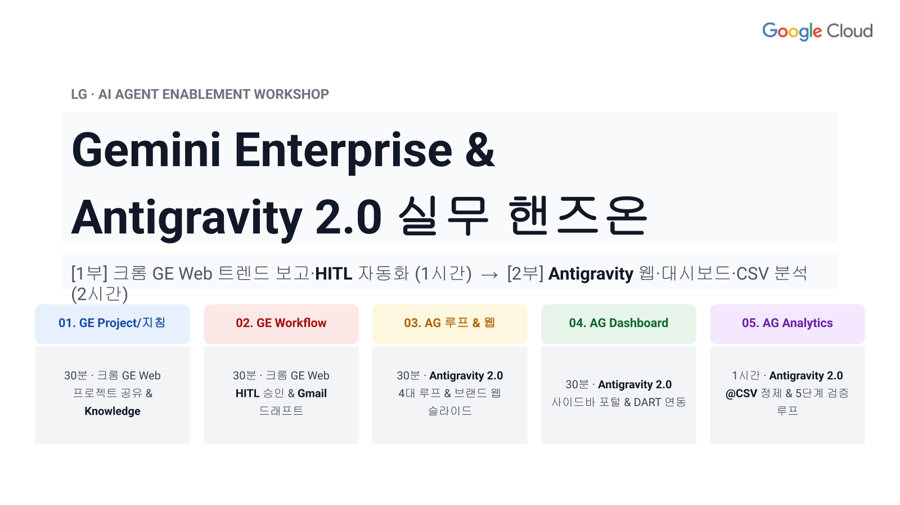

---

## 🗺️ 0. 오늘 함께 완성할 5단계 누적 빌드업 로드맵 (총 3시간)

앞 1시간(**1부**)은 **크롬 브라우저(`Gemini Enterprise Web` + `Gmail`)**만 사용하고, 뒤 2시간(**2부**)은 **데스크톱 앱(`Antigravity 2.0`)**만 사용하여 **단 하나의 마스터 결과물(`트렌드 보고서` ➔ `5장 웹 슬라이드` ➔ `4개 사이드 탭 통합 포털`)**을 끝까지 완성합니다.

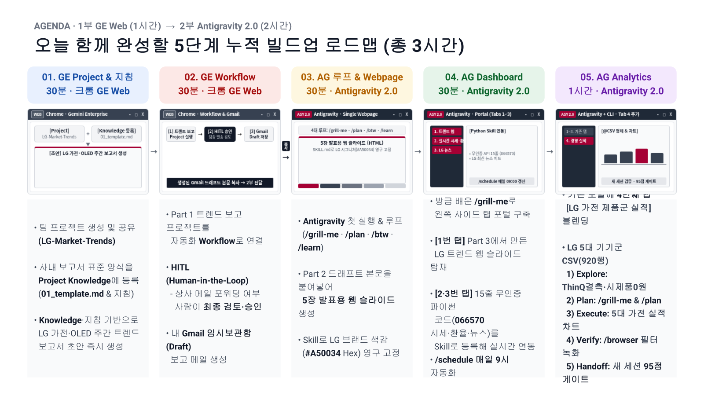


| 단계 | 소요 시간 | 실습 환경 | 내가 직접 만드는 결과물 | 핵심 기술 포인트 |
| :--- | :---: | :--- | :--- | :--- |
| **Part 1. GE Project & 지침** | 30분 | 🌐 크롬 GE Web | **LG AI 가전·OLED 주간 트렌드 보고서 초안** | `Project` 공유(`Invite+`) + `Knowledge`(`01_template.md`) & `Instructions` |
| **Part 2. GE Workflow** | 30분 | 🌐 크롬 GE Web | **내 Gmail 임시보관함(Drafts)에 저장된 보고 메일** | `Workflow` 노드 연결(`Step Output`) + **`HITL` 사람 승인 게이트** |
| **Part 3. AG 루프 & Webpage** | 30분 | 💻 Antigravity 2.0 | **LG 브랜드(`#A50034`) 고정 5장 발표용 웹 슬라이드** | 4대 커맨드(`/grill-me`·`/plan`·`/btw`·`/learn`) + `/lg-brand-slides` `SKILL.md` |
| **Part 4. AG Dashboard** | 30분 | 💻 Antigravity 2.0 | **좌측 사이드바 포털 (탭 1: 트렌드 웹 / 탭 2·3: 시세·환율·뉴스)** | **15줄 무인증 API 파이썬 코드** ➔ `/lg-live-market` 스킬 등록 & `/schedule` |
| **Part 5. AG 가전 Analytics** | 1시간 | 💻 Antigravity 2.0 | **4번째 `[LG 5대 가전 실적·구독]` 탭 통합 & 95점 품질 검증** | `@04_lg_appliance_data.csv`(920행) 정제 + `/browser` + **새 세션 95점 게이트** |

---

## 📦 실습 전 준비: 9개 실습 파일 한눈에 받기

리포지토리 내 [`./files/`](./files/) 폴더(또는 [Google Drive 폴더](https://drive.google.com/drive/folders/1dxqldyrsQ7oSRi-d1ieRdDVJmTmQ0r2V))에 모든 실습 파일이 들어 있습니다.

| 번호 | 파일명 (클릭 시 다운로드/열기) | 사용 파트 | 용도 및 핵심 내용 |
| :---: | :--- | :---: | :--- |
| **01** | [`01_GE_Workflow_lg_weekly_report_template.md`](./files/01_GE_Workflow_lg_weekly_report_template.md) | **Part 1~2** | GE `Project Knowledge`에 업로드할 사내 주간 보고서 표준 양식 |
| **02** | [`02_AG_Webpage_hello_world_slides.html`](./files/02_AG_Webpage_hello_world_slides.html) | **Part 3** | 좌우 방향키(`←`/`→`)로 넘기는 5장 발표용 웹 슬라이드 스타터 파일 |
| **03** | [`02_AG_Webpage_lg_brand_slides_SKILL.md`](./files/02_AG_Webpage_lg_brand_slides_SKILL.md) | **Part 3** | LG 시그니처 레드(`#A50034`) 테마를 영구 고정하는 `SKILL.md` |
| **04** | [`03_AG_Dashboard_fetch_lg_live_market.py`](./files/03_AG_Dashboard_fetch_lg_live_market.py) | **Part 4** | **API 키·`pip` 불필요!** 15줄 무인증 실시간 시세(`066570`)·환율·뉴스 파이썬 코드 |
| **05** | [`03_AG_Dashboard_lg_live_market_SKILL.md`](./files/03_AG_Dashboard_lg_live_market_SKILL.md) | **Part 4** | 15줄 파이썬 코드를 Antigravity `/lg-live-market` 스킬로 등록하는 정의서 |
| **06** | [`04_AG_Analytics_lg_appliance_data.csv`](./files/04_AG_Analytics_lg_appliance_data.csv) | **Part 5** | LG 5대 주력 기기(`OLED evo`·`워시타워`·`디오스`·`HVAC`·`스탠바이미`) **920행 데이터** |
| **07** | [`04_AG_Analytics_design_guidelines.md`](./files/04_AG_Analytics_design_guidelines.md) | **Part 5** | 4탭 통합 대시보드 디자인 및 가전 데이터 정제 규칙 (`.agents/rules/`) |
| **08** | [`05_Instructor_Solution_app.py`](./files/05_Instructor_Solution_app.py) | **통합 완성본** | Part 3~5 전체 기능이 하나로 합쳐진 강사용/참조용 올인원 실행 스크립트 |

---

# 🌐 [1부 · 크롬 브라우저] Part 1. GE - Project & Knowledge (맞춤 지침) (30분)

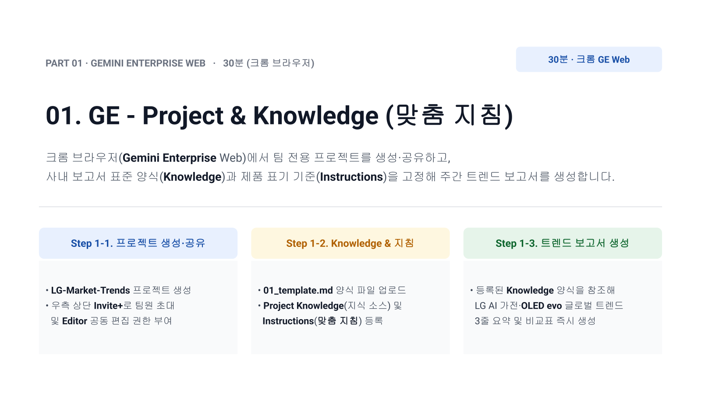

---

### 🔹 Step 1-1. 새 프로젝트(Project) 생성 및 팀원 공유하기 (슬라이드 4)

> **🎯 왜 이 단계를 하나요?**  
> 개인 채팅창이 아니라 **팀 공유 프로젝트(`Project`)**를 만들어 두면, 내가 올린 사내 보고서 양식(`Knowledge`)과 표기 지침(`Instructions`)이 초대된 팀원 모두에게 동일하게 적용됩니다.

#### 🖼️ 슬라이드 장표 & 실제 UI 화면 미리보기
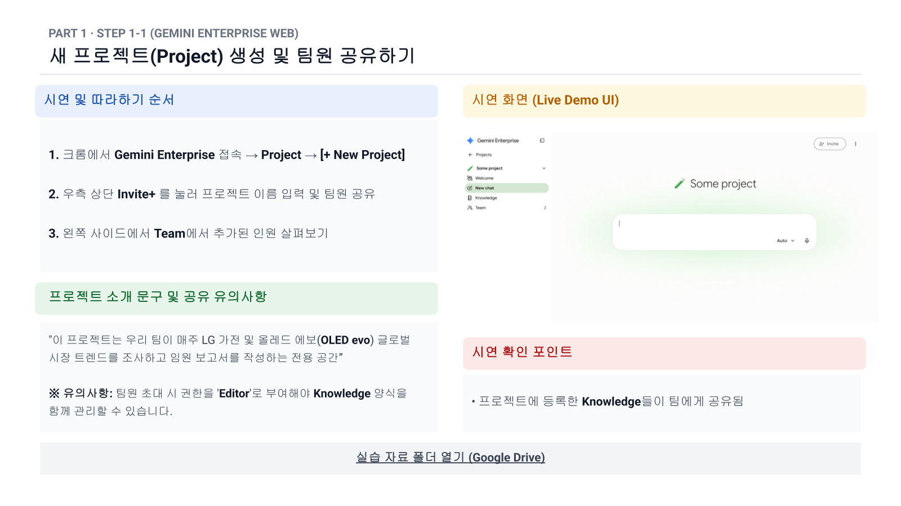


#### 🖱️ 화면 따라하기 순서
1. 크롬에서 **Gemini Enterprise** 접속 ➔ 좌측 메뉴 **`Project` ➔ `[+ New Project]`** 클릭
2. 우측 상단 **`Invite+`** 버튼을 눌러 프로젝트 이름 입력 및 팀원 공유 (**`Editor`** 권한 부여)
3. 좌측 사이드 **`Team`** 메뉴에서 추가된 팀원 숫자를 확인하고 모델 **`Gemini 3.8 Flash`** 선택

#### 📋 프로젝트 설명 입력 문구 (우측 복사 버튼 클릭)
```text
이 프로젝트는 우리 팀이 매주 LG 가전 및 올레드 에보(OLED evo) 글로벌 시장 트렌드를 조사하고 임원 보고서를 작성하는 전용 공간이야.
```

> [!NOTE]
> **※ 유의사항**: 팀원 초대 시 권한을 **`Editor`**로 부여해야 `Knowledge` 양식을 함께 관리할 수 있습니다.

---

### 🔹 Step 1-2. 프로젝트 Knowledge(양식) & 맞춤 지침(Instructions) 등록 (슬라이드 5)

> **🎯 왜 이 단계를 하나요?**  
> 매번 긴 프롬프트로 보고서 목차를 설명할 필요 없이, [`01_GE_Workflow_lg_weekly_report_template.md`](./files/01_GE_Workflow_lg_weekly_report_template.md) 파일을 **`Knowledge(지식 소스)`**에 올려두면 언제 누가 질문하든 동일한 임원 보고서 포맷으로 출력됩니다.

#### 🖼️ 슬라이드 장표 & 실제 UI 화면 미리보기
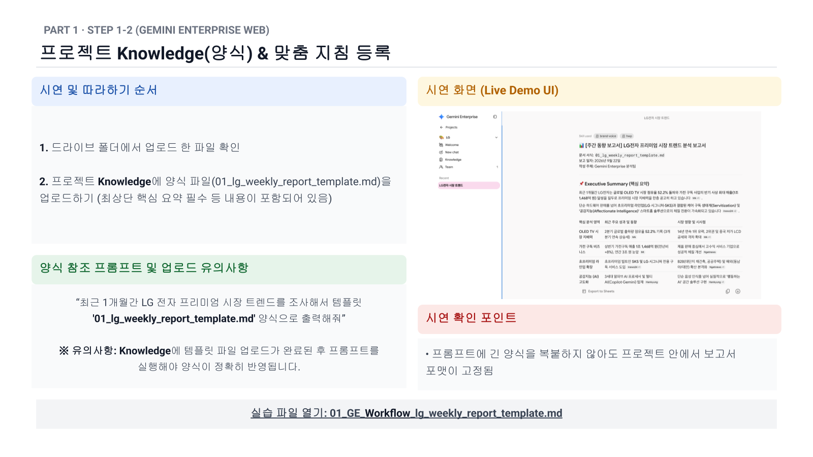


#### 🖱️ 화면 따라하기 순서
1. 실습 파일 [`01_GE_Workflow_lg_weekly_report_template.md`](./files/01_GE_Workflow_lg_weekly_report_template.md) 준비
2. 프로젝트 좌측 **`[Knowledge(지식 소스)]`**에 양식 파일을 업로드하고, **`[Instructions(맞춤 지침)]`**에 LG 공식 표기 기준 등록 (`① 최상단 3줄 핵심 요약 필수`, `② 'LG 올레드 에보(LG OLED evo)' 국/영문 병기`)
3. 채팅창에 아래 트렌드 조사 프롬프트 입력 후 결과 확인

#### 📋 맞춤 지침(Instructions) 설정 문구
```text
첨부한 '01_lg_weekly_report_template.md' 양식을 이 프로젝트의 기본 보고서 Knowledge로 참조해줘.
앞으로 모든 보고서는 맞춤 지침에 따라 최상단 [3줄 핵심 요약]과 [제품군별 비교표] 양식을 자동으로 따르도록 설정해줘.
```

#### 📋 주간 트렌드 보고서 생성 프롬프트
```text
최근 1개월간 LG전자 AI 가전(공감지능 워시타워·디오스) 및 프리미엄 OLED TV(OLED evo), 냉난방공조(HVAC) 글로벌 시장 트렌드를 조사해서 프로젝트 Knowledge에 등록된 주간 보고서 양식대로 출력해줘.
```

---

# ⚡ [1부 · 크롬 브라우저] Part 2. GE - Workflow & HITL 사람 승인 자동화 (30분)

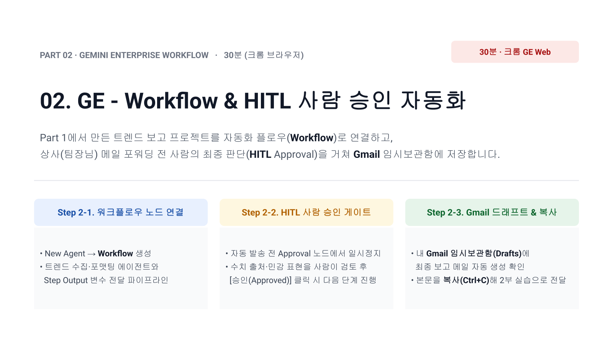

---

### 🔹 Step 2-1. 트렌드 조사 + 사내 템플릿 포맷팅을 자동화 Workflow로 구성하기 (슬라이드 7)

> **🎯 왜 이 단계를 하나요?**  
> 매주 월요일 반복되는 `'시장 조사 ➔ 양식 변환 ➔ 보고 메일 작성'` 과정을 노코드 **비주얼 워크플로우(`Workflow`)** 파이프라인으로 묶어 원클릭 자동화합니다.

#### 🖼️ 슬라이드 장표 & 실제 UI 화면 미리보기
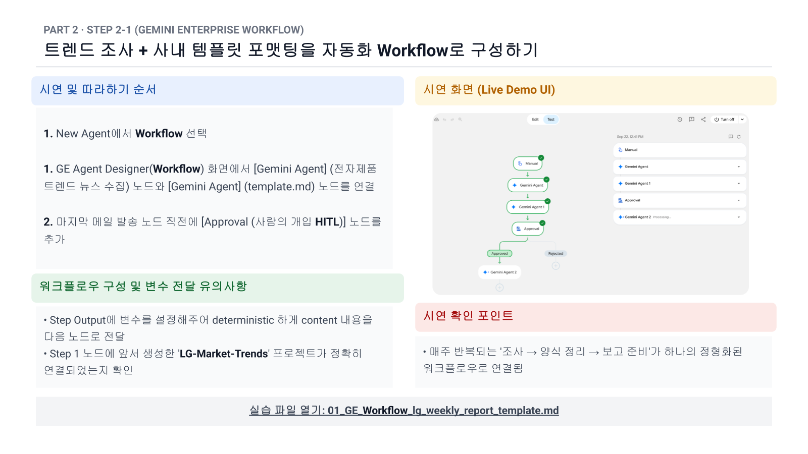


#### 🖱️ 화면 따라하기 순서
1. 좌측 메뉴 **`New Agent` ➔ `Workflow`** 선택
2. **Step 1 노드**: 글로벌 LG AI 가전·OLED 트렌드 수집 및 보고서 양식 포맷팅 에이전트 설정
3. **변수 전달(`Step Output`)**: `Step Output`에 변수를 지정해 첫 번째 노드의 보고서 `content`가 다음 승인/메일 노드로 deterministic 하게 전달되도록 연결

---

### 🔹 Step 2-2. HITL (Human-in-the-Loop) — 상사 메일 포워딩 여부 최종 판단 (슬라이드 8)

> **🎯 왜 이 단계를 하나요?**  
> AI가 작성한 보고서를 검증 없이 바로 팀장님께 발송하면 할루시네이션 위험이 있습니다. **`Approval(사람 승인)` 게이트**를 끼워 넣어 사람이 최종 검토 후 **`[승인(Approved)]`**을 눌렀을 때만 메일이 생성되도록 안전장치를 겁니다.

#### 🖼️ 슬라이드 장표 & 실제 UI 화면 미리보기
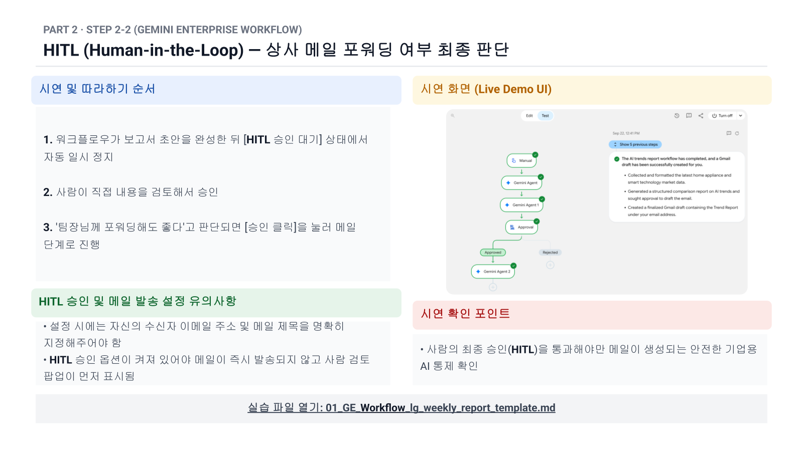


#### 🖱️ 화면 따라하기 순서
1. 워크플로우가 보고서 초안을 완성한 뒤 **`[HITL 승인 대기(Approval)]`** 노드에서 자동 일시 정지됨을 확인
2. 우측 실행 창에서 생성된 보고서 요약과 수치를 사람이 직접 검토
3. `'팀장님께 포워딩해도 좋다'`고 판단되면 **`[Approved (승인)]`** 클릭하여 Gmail 생성 단계로 진행

> [!WARNING]
> **※ HITL 승인 및 메일 발송 설정 유의사항**:
> * 설정 시에는 **자신의 수신자 이메일 주소 및 메일 제목**을 명확히 지정해주어야 합니다.
> * `HITL` 승인 옵션이 켜져 있어야 메일이 즉시 발송되지 않고 사람 검토 팝업이 먼저 표시됩니다.

---

### 🔹 Step 2-3. 내 Gmail 드래프트 확인 & 본문 복사하기 (Part 3 전달 브릿지 · 슬라이드 9)

> **🎯 왜 이 단계를 하나요?**  
> 1부(크롬 GE Web)에서 완성된 **LG 주간 트렌드 보고서 메일 본문을 복사(`Ctrl+C`)**해 2부(Antigravity 데스크톱 앱)의 첫 실습 재료로 그대로 넘겨줍니다.

#### 🖼️ 슬라이드 장표 & 실제 UI 화면 미리보기
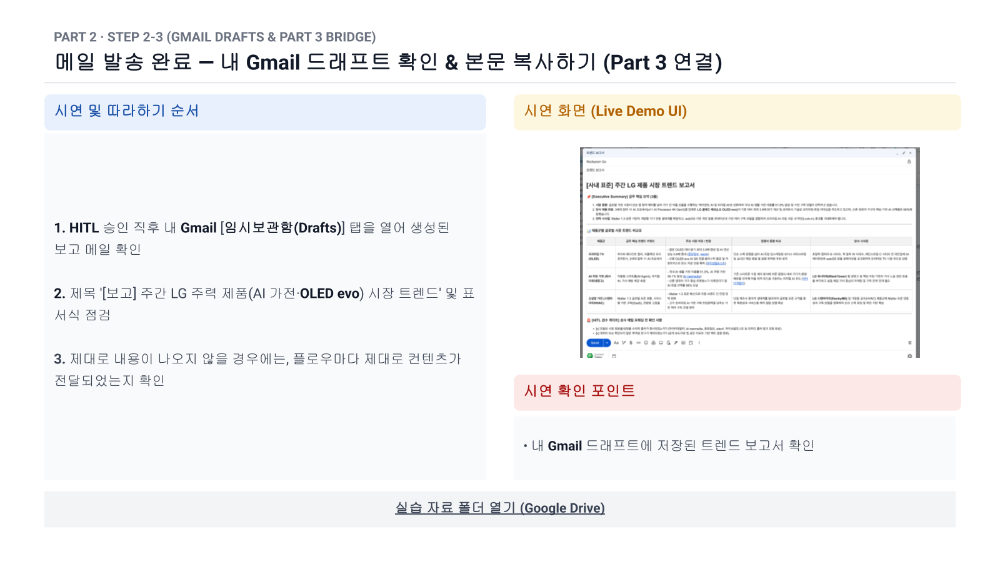


#### 🖱️ 화면 따라하기 순서
1. `HITL` 승인 직후 내 **Gmail `[임시보관함(Drafts)]`** 탭을 열어 생성된 주간 보고서 메일 확인
2. 메일 본문(3줄 경영진 요약 + 제품군 비교 표)을 마우스로 드래그해 **전체 복사(`Ctrl+C`)**해 둠

---

# 💻 [2부 · 데스크톱 앱] Part 3. Antigravity 입문 — 4대 루프 & Single Webpage (30분)

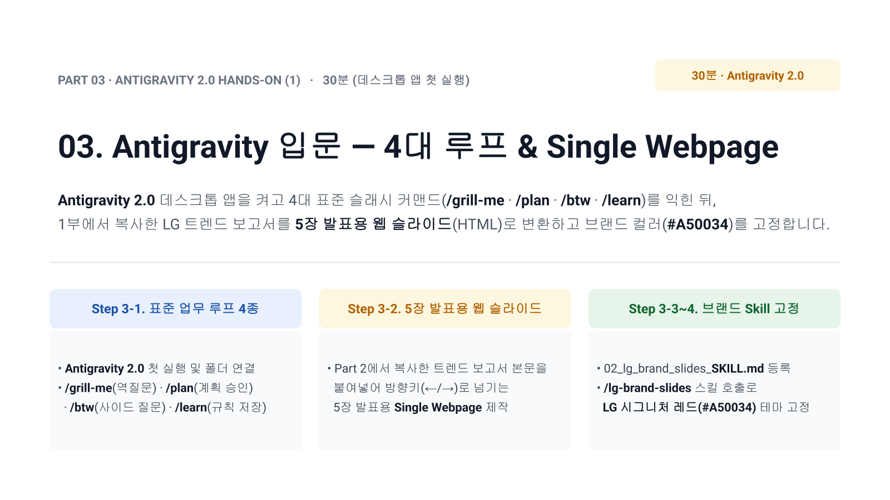

---

### 🔹 Step 3-0. Antigravity 2.0 첫 실행 & 세팅 점검하기 (슬라이드 11)

> **🎯 왜 이 단계를 하나요?**  
> Antigravity 2.0 실습을 시작하기 전에 에이전트가 로컬 파일 생성·터미널 실행·브라우저 제어를 수행할 수 있도록 **필수 권한(Permissions)이 `Disabled` 되어 있지 않은지 먼저 점검**합니다.

#### 🖼️ 슬라이드 장표 & 실제 세팅 화면 미리보기
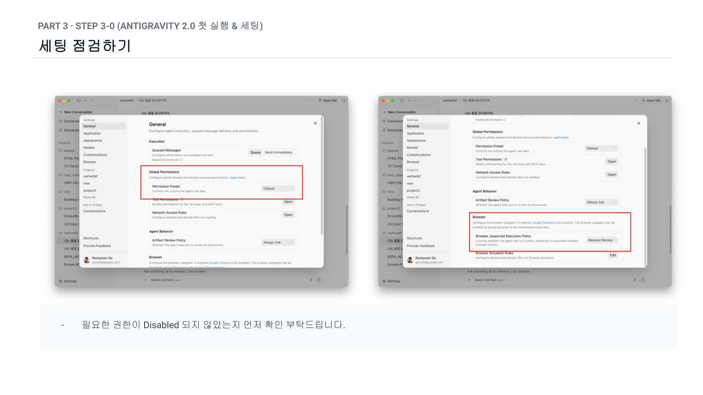
| 🔍 UI 화면 캡처 (1/2) | 🔍 UI 화면 캡처 (2/2) |
| :---: | :---: |
|  |  |


#### 🖱️ 체크 포인트
* Antigravity 2.0 설정 화면에서 **필요한 권한(File / Terminal / Browser Tools)이 `Disabled` 되어 있지 않고 활성화(`Enabled` / `Auto`)** 되어 있는지 확인합니다.

---

### 🔹 Step 3-1. Antigravity 2.0 화면 구성 & 4대 슬래시 커맨드(`/grill-me` · `/plan` · `/btw` · `/learn`) (슬라이드 12)

> **🎯 왜 이 단계를 하나요?**  
> 코딩을 전혀 몰라도 **`/grill-me` ➔ `/plan` ➔ `/btw` ➔ `/learn`** 4가지 슬래시 커맨드만 알면 에이전트에게 요구사항을 구체화시키고 계획서를 검토한 뒤 안전하게 결과물을 만들 수 있습니다.

#### 🖼️ 슬라이드 장표 & 실제 UI 화면 미리보기 (3단계 확대 캡처)
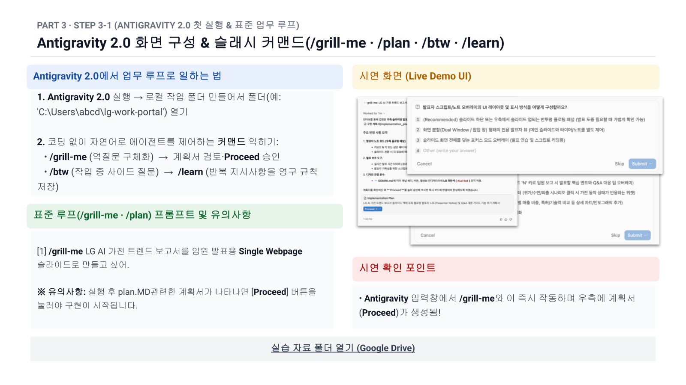
| 🔍 UI 화면 캡처 (1/3) | 🔍 UI 화면 캡처 (2/3) | 🔍 UI 화면 캡처 (3/3) |
| :---: | :---: | :---: |
|  |  |  |


#### 📋 표준 루프(`/grill-me` · `/plan`) 워밍업 프롬프트
```text
[1] /grill-me 방금 GE에서 조사한 LG AI 가전 트렌드 보고서를 임원 발표용 Single Webpage 슬라이드로 만들고 싶어.
[2] /plan 방금 답변한 구성대로 5장짜리 웹 슬라이드 구현 계획서(Implementation Plan)부터 보여줘.
```
> [!NOTE]
> **※ 유의사항**: `/plan` 실행 후 우측 패널에 계획서가 나타나면 반드시 **`[Proceed]`** 버튼을 눌러야 구현이 시작됩니다.

---

### 🔹 Step 3-2. 발표용 웹사이트 시연 & Part 2 트렌드 보고서를 5장 웹 슬라이드로 변환 (슬라이드 13)

> **🎯 왜 이 단계를 하나요?**  
> 파워포인트 없이도 크롬 브라우저에서 좌우 방향키(`←`/`→`)로 넘기며 발표할 수 있는 **반응형 5장 웹 프레젠테이션(`index.html`)**을 1분 만에 생성합니다.

#### 🖼️ 슬라이드 장표 & 실제 UI 화면 미리보기
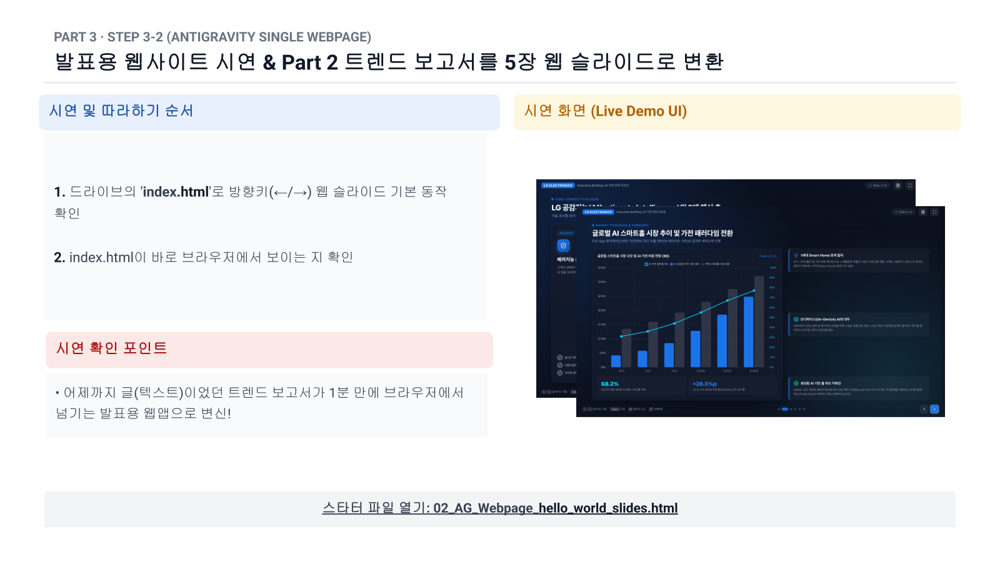
| 🔍 UI 화면 캡처 (1/2) | 🔍 UI 화면 캡처 (2/2) |
| :---: | :---: |
|  |  |


#### 📋 웹 슬라이드 제작 프롬프트 (Part 2 드래프트 본문 붙여넣기)
```text
좌우 방향키(←, →)로 넘길 수 있는 Single Page HTML(index.html) 프레젠테이션에, 아까 Part 2에서 만든 '2026 LG AI 가전 및 OLED 글로벌 트렌드 & 마켓 인사이트' 5장 분량 내용을 넣어서 만들어줘:

[여기에 Part 2 Gmail 드래프트에서 복사한 보고서 본문 붙여넣기(Ctrl+V)]
```

---

### 🔹 Step 3-3 & 3-4. 참여자 자유 구성 실습 (`/learn`) & LG 브랜드 색감(`#A50034`) Skill 고정 (슬라이드 14~15)

> **🎯 왜 이 단계를 하나요?**  
> 생성할 때마다 알록달록 바뀌는 AI 디자인을 **LG전자 공식 브랜드 시그니처 레드(`#A50034`)와 깔끔한 화이트·그레이 테마로 영구 고정**하는 [`02_AG_Webpage_lg_brand_slides_SKILL.md`](./files/02_AG_Webpage_lg_brand_slides_SKILL.md) 스킬을 적용합니다.

#### 🖼️ 슬라이드 14~15 장표 & 실제 UI 화면 미리보기
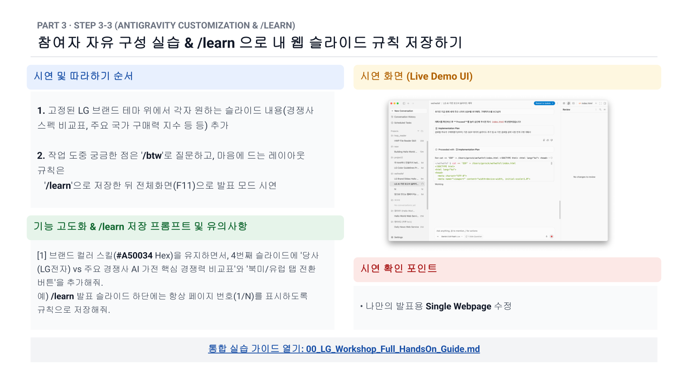


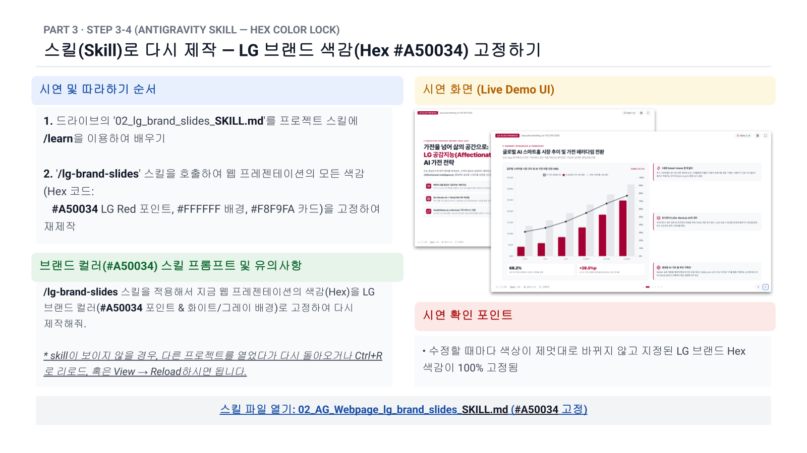
| 🔍 UI 화면 캡처 (1/2) | 🔍 UI 화면 캡처 (2/2) |
| :---: | :---: |
|  |  |


#### 📋 브랜드 컬러(`#A50034`) 스킬 호출 및 `/learn` 저장 프롬프트
```text
[1] /lg-brand-slides 스킬을 적용해서 지금 웹 프레젠테이션의 색감(Hex)을 LG 브랜드 컬러(#A50034 포인트 & 화이트/그레이 배경)로 고정하여 다시 제작해줘.
[2] 브랜드 컬러(#A50034 Hex)를 유지하면서, 4번째 슬라이드에 '당사(LG전자) vs 주요 경쟁사 AI 가전 핵심 경쟁력 비교표'와 '북미/유럽 탭 전환 버튼'을 추가해줘.
[3] /learn 앞으로 모든 웹 슬라이드는 상단 진행바(Progress Bar)와 LG 브랜드 컬러(#A50034)를 기본 적용하도록 규칙에 저장해줘.
```

---

# 📊 [2부 · 데스크톱 앱] Part 4. Antigravity - 나만의 Dashboard & 15줄 무인증 API 스킬 (30분)

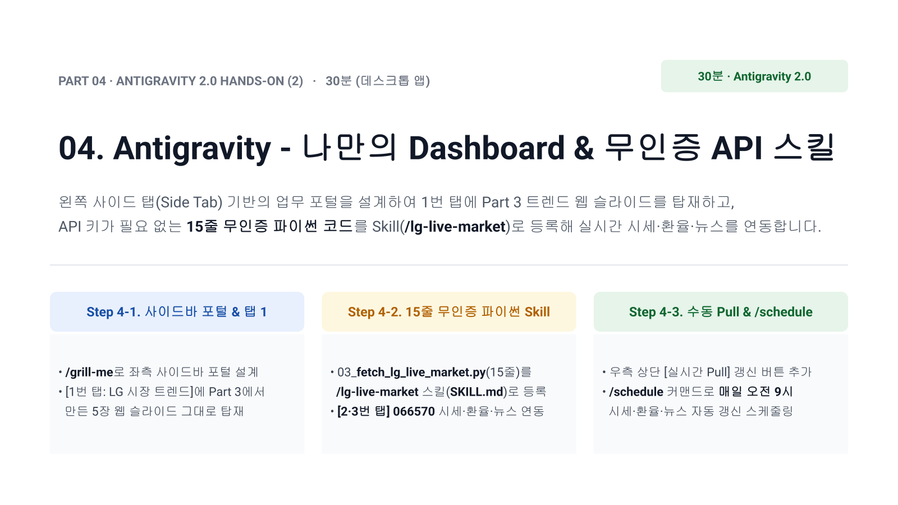

---

### 🔹 Step 4-1. `/grill-me`로 사이드 탭 대시보드 설계 & 1번 메뉴에 트렌드 탑재 (슬라이드 17)

> **🎯 왜 이 단계를 하나요?**  
> 흩어져 있던 업무 화면들을 **왼쪽 사이드 탭(`Side Tab`) 기반 통합 업무 포털**로 묶고, **1번 탭**에 방금 Part 3에서 만든 5장 트렌드 웹 슬라이드를 그대로 탑재합니다.

#### 🖼️ 슬라이드 장표 & 실제 UI 화면 미리보기
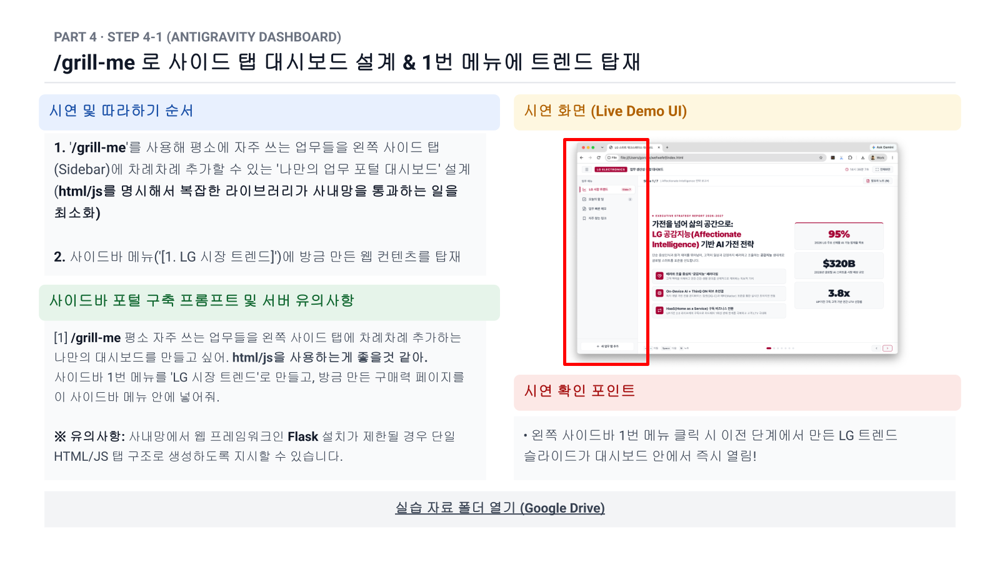


#### 📋 사이드바 포털 구축 프롬프트
```text
[1] /grill-me 평소 자주 쓰는 업무들을 왼쪽 사이드 탭에 차례차례 추가하는 나만의 대시보드를 만들고 싶어.
[2] 사이드바 1번 메뉴를 'LG 시장 트렌드'로 만들고, 방금 Part 3에서 만든 5장 웹 슬라이드 화면을 그대로 탑재해줘.
```

---

### 🔹 Step 4-2. 15줄 무인증 파이썬 코드 ➔ `/lg-live-market` Skill 등록 및 실시간 연동 (슬라이드 18)

> **🎯 왜 이 단계를 하나요?**  
> 복잡한 API Key 발급이나 `pip` 패키지 설치 없이도, **파이썬 기본 내장 모듈(`urllib`) 15줄 코드([`03_AG_Dashboard_fetch_lg_live_market.py`](./files/03_AG_Dashboard_fetch_lg_live_market.py))**를 **Antigravity 스킬(`/lg-live-market`)**로 등록해 **LG전자(`066570`) 실시간 주가, 글로벌 환율(`USD/KRW`), 구글 뉴스 RSS**를 대시보드 2·3번 탭에 즉시 꽂아 넣습니다.

#### 🖼️ 슬라이드 장표 & 실제 UI 화면 미리보기
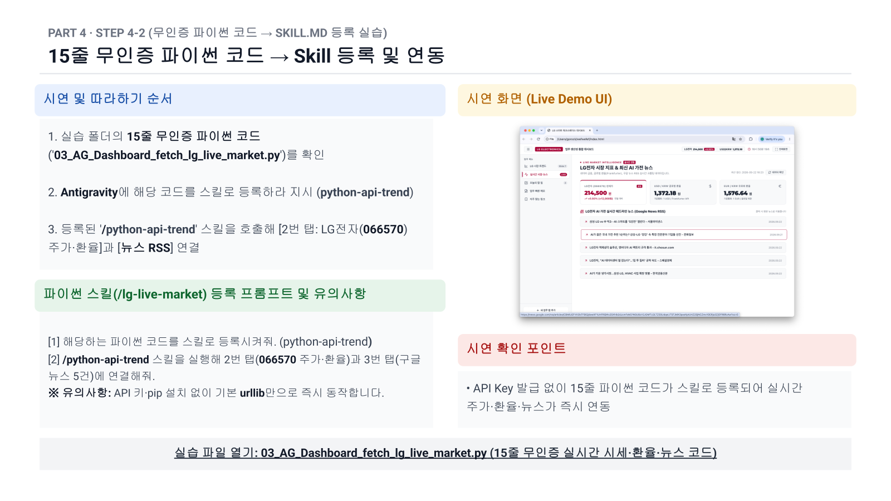


#### 🐍 15줄 무인증 공개 API 파이썬 코드 (`03_AG_Dashboard_fetch_lg_live_market.py`)
```python
import urllib.request, urllib.parse, json, xml.etree.ElementTree as ET

def fetch_lg_live_dashboard_data(stock_code="066570", keyword="LG전자 AI 가전"):
    headers = {"User-Agent": "Mozilla/5.0"}
    # 1. [No-Key] 네이버 금융 LG전자(066570) 실시간 주가·등락률 JSON
    req = urllib.request.Request(f"https://m.stock.naver.com/api/stock/{stock_code}/basic", headers=headers)
    stock = json.loads(urllib.request.urlopen(req, timeout=5).read().decode("utf-8"))
    # 2. [No-Key] Frankfurter(ECB) 실시간 USD/KRW · EUR 글로벌 환율 JSON
    fx = json.loads(urllib.request.urlopen("https://api.frankfurter.dev/v1/latest?base=USD&symbols=KRW,EUR,JPY", timeout=5).read().decode("utf-8"))
    # 3. [No-Key] Google News RSS 실시간 'LG전자 AI 가전' 최신 뉴스 5건
    rss_url = f"https://news.google.com/rss/search?q={urllib.parse.quote(keyword)}&hl=ko&gl=KR&ceid=KR:ko"
    root = ET.fromstring(urllib.request.urlopen(rss_url, timeout=5).read())
    news = [{"title": item.findtext("title"), "pubDate": item.findtext("pubDate"), "link": item.findtext("link")} for item in root.findall(".//item")[:5]]
    return {"stock_name": stock.get("stockName", "LG전자"), "close_price": stock.get("closePrice"), "fluctuation_rate": stock.get("fluctuationsRatio"), "usd_krw": fx["rates"]["KRW"], "latest_news": news}
```

#### 📋 파이썬 스킬(`/lg-live-market`) 등록 및 실행 프롬프트
```text
[1] 첨부한 '03_AG_Dashboard_fetch_lg_live_market.py'(15줄)를 .agents/skills/lg-live-market/ 스킬(SKILL.md)로 등록해줘.
[2] /lg-live-market 스킬을 실행해 2번 탭(066570 주가·환율)과 3번 탭(구글 뉴스 5건)에 연결해줘.
```

---

### 🔹 Step 4-3. 데일리 트렌드/뉴스 Pull 버튼 & `/schedule` 매일 9시 자동화 (슬라이드 19)

#### 🖼️ 슬라이드 장표 & 실제 UI 화면 미리보기
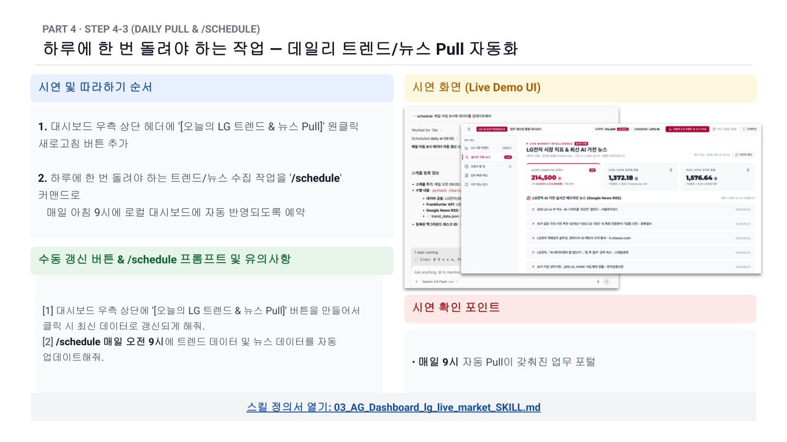
| 🔍 UI 화면 캡처 (1/2) | 🔍 UI 화면 캡처 (2/2) |
| :---: | :---: |
|  |  |


#### 📋 수동 갱신 버튼 & `/schedule` 자동화 프롬프트
```text
[1] 대시보드 우측 상단에 '[오늘의 LG 트렌드 & 뉴스 Pull]' 버튼을 만들어서 클릭 시 최신 데이터로 갱신되게 해줘.
[2] /schedule 매일 오전 9시에 /lg-live-market 스킬을 자동 실행해 대시보드의 시세·환율 및 뉴스 데이터를 최신 상태로 업데이트해줘.
```

---

# 📈 [2부 · 데스크톱 앱] Part 5. Antigravity - LG 가전 제품군 데이터 Analytics (1시간)

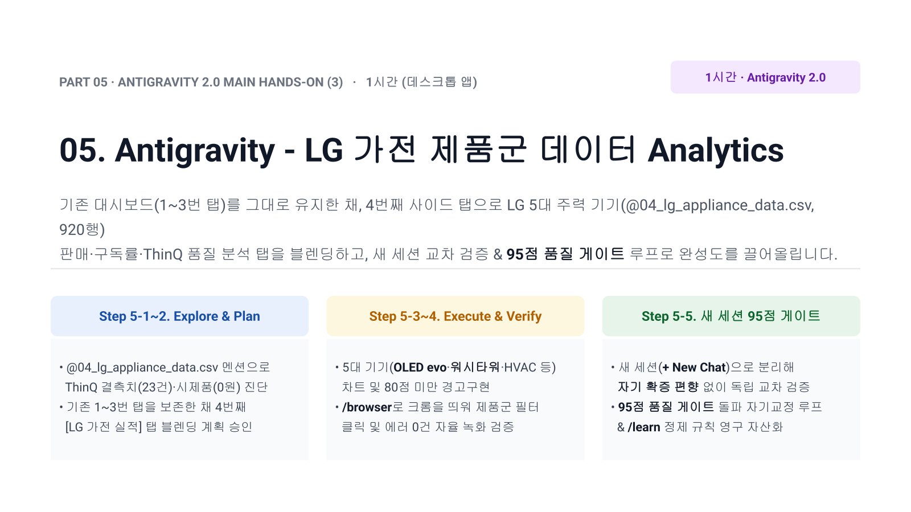

---

### 🔹 Step 5-0. LG 가전·TV 데이터셋(920행) & 디자인 규칙 준비 (슬라이드 21)

> **🎯 데이터셋에 심어둔 3가지 실무 함정 ([`04_AG_Analytics_lg_appliance_data.csv`](./files/04_AG_Analytics_lg_appliance_data.csv))**  
> 1. **ThinQ 만족도 빈 값 (결측치 `정확히 23건`)**: `WashTower & Tromm (리빙가전)` ➔ 제품군별 중앙값(Median) 보간 필요  
> 2. **스탠바이미 시제품 매출 0원 (`revenue_krw = 0` `정확히 18건`)**: `StanbyME & Care (신가전·시제품)` ➔ 마진율 계산 시 **`0 나눗셈(ZeroDivisionError)`** 유발! 분리 집계 필수  
> 3. **ThinQ 80점 미만 품질 경고군 (`정확히 31건`)**: `Whisen & HVAC (에어솔루션)` ➔ 대시보드 내 **`#A50034` 경고 배지** 하이라이트

#### 🖼️ 슬라이드 장표 & 데이터셋 화면 미리보기
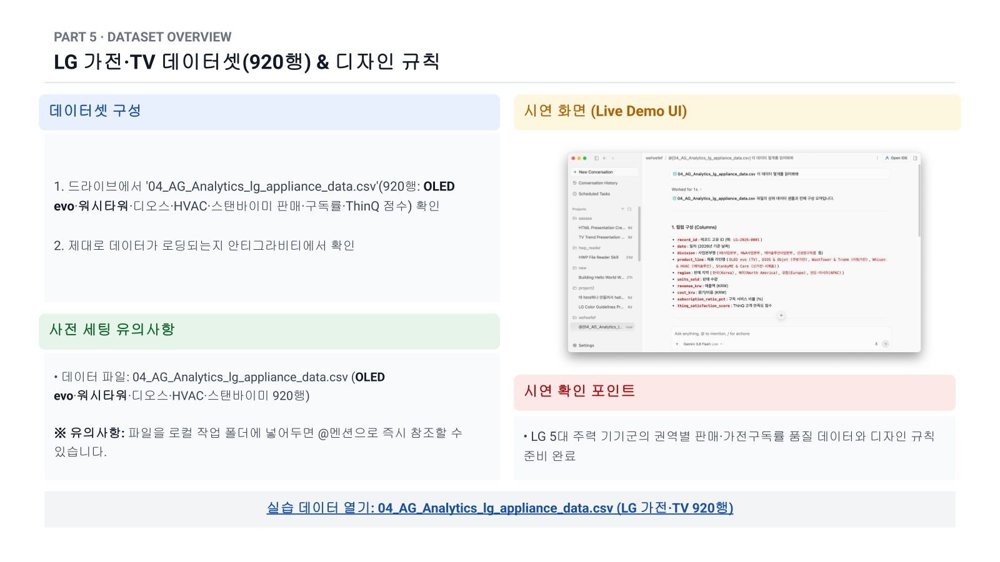


---

### 🔹 Step 5-1. [Explore] `@멘션`으로 LG 가전 CSV 결측·시제품 진단 (슬라이드 22)

#### 🖼️ 슬라이드 장표 & 진단 리포트 화면 미리보기
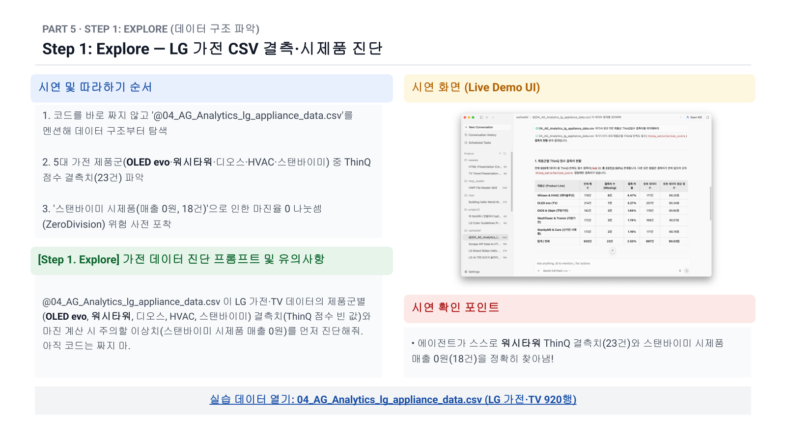


#### 📋 `[Step 1. Explore]` 데이터 진단 프롬프트
```text
@04_AG_Analytics_lg_appliance_data.csv 이 LG 가전·TV 데이터의 제품군별(OLED evo, 워시타워, 디오스, HVAC, 스탠바이미) 결측치(ThinQ 점수 빈 값)와 마진 계산 시 주의할 이상치(스탠바이미 시제품 매출 0원)를 먼저 진단해줘. 아직 코드는 짜지 마.
```

---

### 🔹 Step 5-2. [Plan & Execute] 기존 탭(1~3) 보존 & 4번째 `[LG 가전 실적]` 탭 통합 구현 (슬라이드 23)

#### 🖼️ 슬라이드 장표 & 4탭 통합 대시보드 화면 미리보기
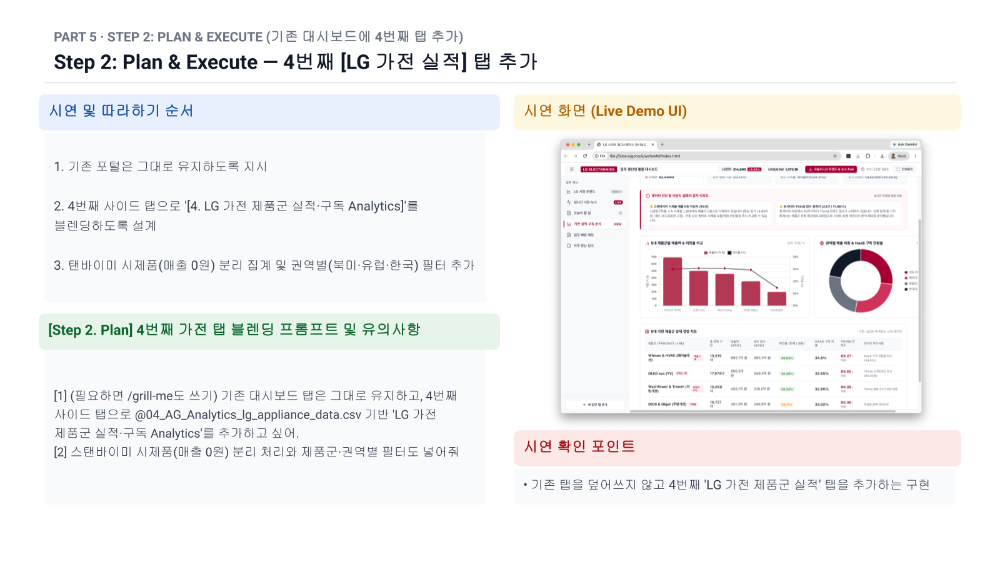


#### 📋 `[Step 2. Plan & Execute]` 4번째 가전 탭 블렌딩 프롬프트
```text
[1] /grill-me 기존 대시보드 1~3번 탭(트렌드 웹, 066570 시세·환율, 뉴스)은 그대로 유지하고, 4번째 사이드 탭으로 @04_AG_Analytics_lg_appliance_data.csv 기반 'LG 가전 제품군 실적·구독 Analytics'를 추가하고 싶어.
[2] /plan 스탠바이미 시제품(매출 0원 18건) 분리 처리, 워시타워 ThinQ 결측치(23건) 중앙값 보간, 그리고 @04_AG_Analytics_design_guidelines.md 규칙(#A50034 강조색)을 적용해 4번째 탭을 구현해줘.
```

---

### 🔹 Step 5-3. [Verify] `/browser`로 가전 제품군 필터 크롬 자율 검증 (슬라이드 24)

#### 🖼️ 슬라이드 장표 & `/browser` 자율 검증 화면 미리보기
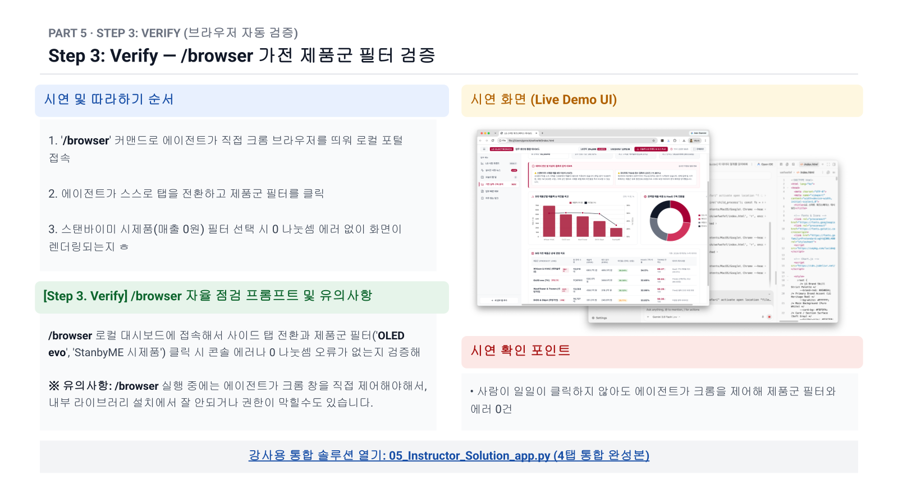
| 🔍 UI 화면 캡처 (1/2) | 🔍 UI 화면 캡처 (2/2) |
| :---: | :---: |
|  |  |


#### 📋 `[Step 3. Verify]` `/browser` 자율 점검 프롬프트
```text
/browser 로컬 대시보드(http://localhost:8080)에 접속해서 1~4번 사이드 탭 전환과 제품군 필터('OLED evo', 'StanbyME 시제품') 클릭 시 콘솔 에러나 0 나눗셈 오류가 없는지 E2E 검증하고 녹화 영상을 남겨줘.
```

---

### 🔹 Step 5-4. [Handoff] 새 세션 분리(`+ New Chat`) 교차 검증 & 95점 품질 게이트 루프 (슬라이드 25)

> **🎯 왜 새 세션(`+ New Chat`)으로 분리해서 95점 품질 게이트를 돌리나요?**  
> 대시보드를 직접 만든 기존 세션에게 *"잘 됐지?"*라고 물으면 스스로를 칭찬하는 **자기 확증 편향(Self-Bias)**이 발생합니다. **`[+ New Chat]`으로 백지상태의 새 대화창**을 열어 독립 감사관 역할을 부여하고, **100점 만점 중 95점을 넘길 때까지 스스로 결함을 고치고 재채점하는 반복 루프**를 돌리면 실무 납품 수준의 품질이 완성됩니다.

#### 🖼️ 슬라이드 장표 & 95점 품질 게이트(84점 ➔ 97점 통과) 화면 미리보기
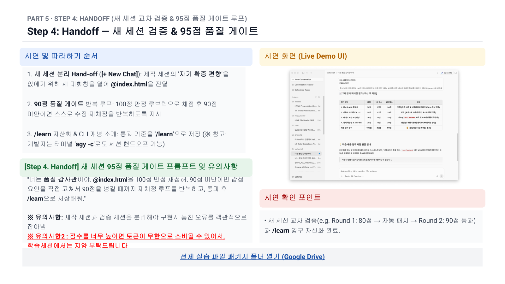


#### 📋 `[+ New Chat]` 새 세션 입력 프롬프트 (95점 품질 게이트 루프)
```text
너는 독립 품질 감사관이야. @dashboard.html을 @04_AG_Analytics_design_guidelines.md 기준으로 100점 만점(데이터 정합성 40점 · 브랜드 디자인 30점 · 필터 사용성 30점) 채점해줘.
95점 미만이면 감점 요인을 직접 고쳐서 95점을 넘길 때까지 재채점 루프를 반복하고, 통과 후 /learn으로 저장해줘.
```

---

# 🏆 Wrap-Up · 최종 완성 대시보드 점검 & 전체 과정 요약 (슬라이드 26~27)

### 🔹 최종 완성 산출물 화면 점검 (슬라이드 26)
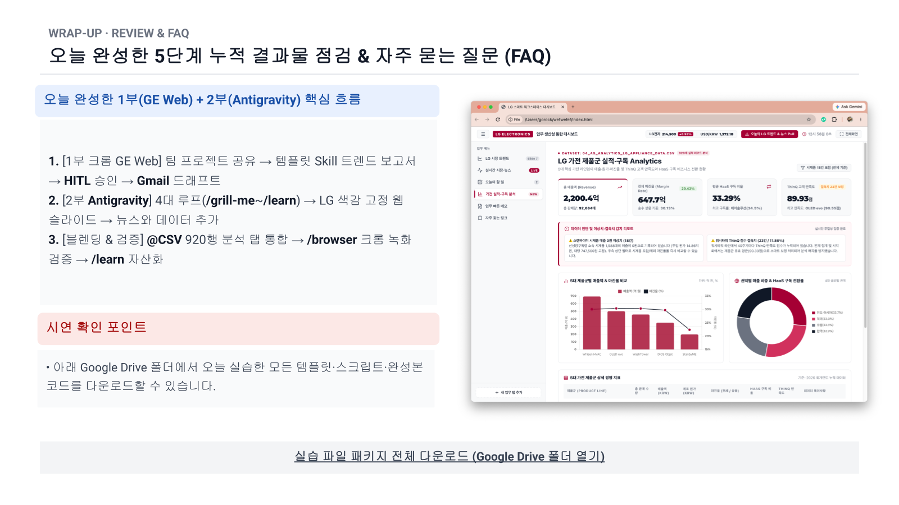


---

### 🔹 전체 과정 한눈에 보기 요약 테이블 (슬라이드 27)
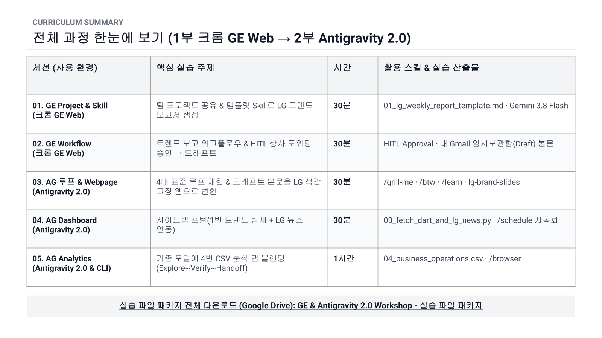
