# 🚀 LG Electronics · Gemini Enterprise & Antigravity 2.0 실무 핸즈온 가이드

> <strong>Step-by-Step 실습 가이드</strong>  
> 각 단계마다 <strong>① 화면에서 어디를 보는지</strong> ➔ <strong>② 무엇을 복사해 입력하는지</strong> ➔ <strong>③ 어떤 결과 화면이 나오는지</strong> 순서대로 따라오시면 됩니다.

---

## 🗺️ 0. 오늘 함께 완성할 5단계 누적 빌드업 로드맵 (총 3시간)

<strong>1부(크롬 웹, 1시간)</strong>에서는 주간 보고서를 자동 작성해 지메일 임시보관함에 넣고, <strong>2부(Antigravity 앱, 2시간)</strong>에서는 웹페이지(`index.html`) 하나에 <strong>[탭 1: 발표 슬라이드] ➔ [탭 2: 실시간 주가·뉴스] ➔ [탭 3: 가전 실적 차트]</strong>를 차례대로 붙여 나만의 업무 포털을 완성합니다.

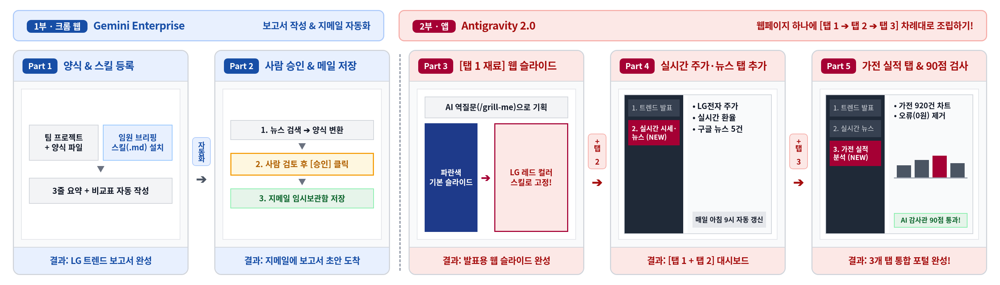

| 파트 (시간) | 실습 환경 | 내가 직접 만드는 누적 산출물 |
| :--- | :---: | :--- |
| <strong>Part 1 (30분)</strong> | 🌐 크롬 GE Web | <strong>[주간 동향 보고서] LG전자 프리미엄 시장 트렌드 분석 & `.md` 스킬 브리핑</strong> |
| <strong>Part 2 (30분)</strong> | 🌐 크롬 GE Web | <strong>내 Gmail 임시보관함(`Drafts`)에 저장된 사내 표준 보고 메일</strong> |
| <strong>Part 3 (30분)</strong> | 💻 Antigravity 2.0 | <strong>LG 브랜드 컬러(`#A50034` 레드 + 화이트) 고정 웹 슬라이드(`index.html`)</strong> |
| <strong>Part 4 (30분)</strong> | 💻 Antigravity 2.0 | <strong>좌측 사이드 탭 업무 포털 (`탭 1: 트렌드 슬라이드` + `탭 2: 실시간 시세·뉴스`)</strong> |
| <strong>Part 5 (1시간)</strong> | 💻 Antigravity 2.0 | <strong>`탭 3: 가전 실적·구독 분석` 블렌딩 + `/browser` 검증 + `90점 품질 게이트`</strong> |

---

## 📦 실습 전 준비: 실습 파일 한 번에 다운로드 (`LG_Workshop_Files.zip`)

> <strong>📥 번거롭게 하나씩 받지 마세요!</strong> 아래 버튼을 누르면 오늘 실습에 쓰이는 <strong>6개 파일 전체가 압축된 `LG_Workshop_Files.zip`</strong>이 내 PC로 즉시 다운로드됩니다. 다운로드 후 압축을 풀어 작업 폴더(예: `lg-work-portal`)에 넣어두세요.
>
> 👉 <a href="./LG_Workshop_Files.zip" download="LG_Workshop_Files.zip"><strong>[📥 실습 파일 6종 전체 ZIP 한 번에 다운로드 (LG_Workshop_Files.zip)]</strong></a>

<details class="file-list-details">
<summary><strong>📂 개별 실습 파일 6종 상세 설명 및 개별 다운로드 보기 (클릭하여 펼치기)</strong></summary>

| 번호 | 파일명 (클릭 시 열기) | 사용 파트 | 파일 역할 및 핵심 내용 |
| :---: | :--- | :---: | :--- |
| <strong>01-A</strong> | [`01_GE_Workflow_lg_weekly_report_template.txt`](./files/01_GE_Workflow_lg_weekly_report_template.txt) | <strong>Part 1</strong> | 크롬 GE `Project Knowledge`에 업로드할 <strong>사내 주간 트렌드 보고서 표준 서식 (`.txt`)</strong> |
| <strong>01-B</strong> | [`01_GE_Skill_lg_executive_briefing_SKILL.md`](./files/01_GE_Skill_lg_executive_briefing_SKILL.md) | <strong>Part 1</strong> | 크롬 GE `Skills` ➔ `Upload skill`에 업로드해 `/lg-executive-briefing`으로 호출하는 <strong>임원 브리핑 스킬 (`.md`)</strong> |
| <strong>01-C</strong> | [`01_GE_Workflow_lg_weekly_report_template.md`](./files/01_GE_Workflow_lg_weekly_report_template.md) | <strong>Part 2</strong> | 크롬 GE `Workflow` 노드의 `Files`에 첨부파일로 넣을 <strong>사내 주간 트렌드 보고서 마크다운 템플릿 (`.md`)</strong> |
| <strong>02</strong> | [`02_AG_Webpage_lg_brand_slides_SKILL.md`](./files/02_AG_Webpage_lg_brand_slides_SKILL.md) | <strong>Part 3</strong> | 매번 랜덤으로 나오는 슬라이드 색감을 <strong>LG 시그니처 레드(`#A50034`) + 화이트 배경</strong>으로 고정하는 스킬 |
| <strong>03</strong> | [`03_AG_Dashboard_fetch_lg_live_market.py`](./files/03_AG_Dashboard_fetch_lg_live_market.py) | <strong>Part 4</strong> | LG전자(`066570`) 현재가·환율·구글 뉴스 실시간 수집 코드 |
| <strong>04</strong> | [`04_AG_Analytics_lg_appliance_data.csv`](./files/04_AG_Analytics_lg_appliance_data.csv) | <strong>Part 5</strong> | 5대 가전(`OLED evo`·`워시타워`·`디오스`·`HVAC`·`스탠바이미`) <strong>920행 실적·구독·ThinQ 데이터</strong> |

</details>

---

# 🌐 [1부 · 크롬 브라우저] Part 1. GE - Project · Knowledge & Skill (`.md` 설치)
### 🔹 Step 1-1. 새 프로젝트(`Project`) 생성 및 팀원 공유하기

> <strong>🎯 핵심 포인트:</strong> 팀 전용 <strong>`Project`</strong>를 만들고 팀원을 초대하면, 내가 올린 보고서 양식을 팀원 모두가 똑같이 쓸 수 있습니다.

1. 크롬에서 <strong>Gemini Enterprise</strong> 접속 ➔ 좌측 메뉴 <strong>`Projects` ➔ `[+ New Project]`</strong> 클릭
2. 프로젝트 이름(예: `LG` 또는 `LG-Market-Trends`)과 간단한 <strong>`Description`(설명)</strong>을 적당히 입력하고, 우측 상단 <strong>`Invite+`</strong> 버튼을 눌러 팀원 이메일 추가 (권한: <strong>`Editor`</strong>)
3. 좌측 사이드바 <strong>`Team`</strong> 메뉴에서 초대된 팀원이 정상 추가되었는지 확인

👉 **화면 확인 포인트:** (`우측 상단 Invite 버튼 & 좌측 Knowledge / Team 메뉴`)


---

### 🔹 Step 1-2. 프로젝트 `Knowledge`(양식 파일) 등록 & 주간 트렌드 보고서 생성

> <strong>🎯 핵심 포인트:</strong> <strong>`Knowledge`</strong>에 보고서 양식 파일(`.txt`)을 한 번만 올려두면, 매번 길게 지시하지 않아도 알아서 회사 양식대로 보고서를 써줍니다.

1. 좌측 사이드바 <strong>`Knowledge`</strong> 메뉴 ➔ 우측 <strong>`Upload` (`Add`)</strong> 클릭 ➔ <strong>`Upload files`</strong>에서 실습 파일 <strong>[`01_GE_Workflow_lg_weekly_report_template.txt`](./files/01_GE_Workflow_lg_weekly_report_template.txt)</strong>를 추가하고 <strong>`Description`(설명)</strong>도 적당히 입력해 저장 *(또는 `Paste text`로 내용 붙여넣기)*
2. 업로드가 완료되면 <strong>`New chat`</strong>을 눌러 아래 프롬프트를 그대로 복사해 입력합니다:

```text
최근 1개월간 LG 전자 프리미엄 시장 트렌드를 조사해서 프로젝트 Knowledge에 등록된 주간 트렌드 보고서 템플릿 양식으로 출력해줘
```

👉 **실행 결과 화면:** (`01_GE_Workflow_lg_weekly_report_template.txt` 서식이 자동 반영된 보고서)


---

### 🔹 Step 1-3. [GE Skill 실습] `.md` 파일(또는 `.zip`) 업로드로 나만의 Skill 설치 & `/lg-executive-briefing` 호출하기

> <strong>🎯 `Knowledge` vs `Skills` 한 줄 차이:</strong>  
> * <strong>`Knowledge`</strong>: 이 프로젝트 안에서만 참고하는 배경 자료  
> * <strong>`Skills`</strong>: 내 계정에 설치해 두고 <strong>어느 채팅창에서든 `/스킬이름` 한 줄로 바로 불러 쓰는 나만의 단축키</strong>

<details class="file-list-details">
<summary><strong>📄 (참고) 실습 스킬 파일 내용 미리보기 (`01_GE_Skill_lg_executive_briefing_SKILL.md` — 클릭하여 펼치기)</strong></summary>

```markdown
---
name: lg-executive-briefing
description: "LG전자 가전 및 TV 시장 뉴스를 임원 보고용 3줄 핵심 요약, 당사 vs 경쟁사 비교표, 출처 검증 포맷으로 즉시 변환하는 스킬"
---

# LG전자 임원 보고용 시장 트렌드 브리핑 스킬 (lg-executive-briefing)

사용자가 제품군이나 시장 트렌드 주제를 입력하면, 항상 아래 3단 표준 구조로만 간결하고 명확하게 보고서를 작성하세요.

## 1. 📌 [Executive Summary] 경영진 3줄 핵심 요약
- 결론부터 두괄식으로 3줄 이내로 핵심 시장 변화와 당사 시사점을 요약합니다.
- 모든 제품명은 'LG 올레드 에보(LG OLED evo)', 'LG 워시타워(WashTower)'처럼 국문과 영문을 첫 등장 시 병기합니다.

## 2. 📊 당사 vs 주요 경쟁사 핵심 트렌드 비교표
반드시 아래 마크다운 표 컬럼을 유지하여 작성하세요:
| 제품군 | 글로벌 시장 핵심 동향 (수치 포함) | 주요 경쟁사 동향 | LG전자 차별화 포인트 및 전략 | 인라인 출처 ([매체명, 날짜]) |

## 3. 💡 실무 액션 아이템 (Next Steps)
- 현업 부서(상품기획·마케팅·영업)에서 즉시 검토해야 할 후속 조치 2가지를 체크리스트(`- [ ]`) 형태로 제시합니다.
```

</details>

#### 1️⃣ `Skills` ➔ `+ (Add skill)` ➔ `Upload skill`에서 `.md` 파일 업로드하기
1. 좌측 메뉴에서 <strong>`📄 Skills`</strong>를 클릭합니다.
2. 상단 <strong>`+` (`Add skill`)</strong> 버튼(또는 초기 화면의 `Upload skill` 버튼)을 누르고 메뉴에서 <strong>`⬆️ Upload skill`</strong>을 선택합니다.
3. **`Import skill`** 팝업창(`Supports .md and .zip files`)에서 **`Browse files`**를 눌러 실습 파일 <strong>[`01_GE_Skill_lg_executive_briefing_SKILL.md`](./files/01_GE_Skill_lg_executive_briefing_SKILL.md)</strong>를 선택한 뒤 파란색 <strong>`Import`</strong> 버튼을 클릭합니다. *(여러 참조 파일이 포함된 스킬은 `SKILL.md`가 들어있는 `.zip` 파일로도 동일하게 업로드할 수 있습니다.)*

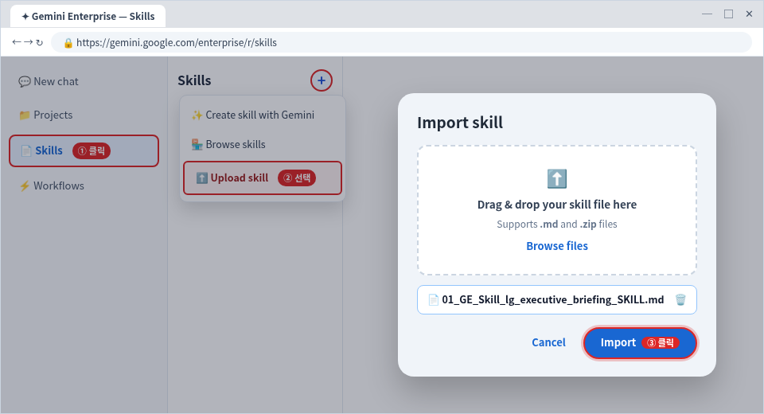

#### 2️⃣ 설치된 `lg-executive-briefing` 스킬 확인 & `New chat` 클릭
* 업로드 즉시 좌측 `Enabled` 목록에 <strong>`📄 lg-executive-briefing`</strong>이 등록되고 트리거 명령어(<strong>`/lg-executive-briefing`</strong>)가 생성됩니다. 우측 상단의 파란색 <strong>`✏️ New chat`</strong> 버튼을 클릭합니다. *(옆의 `Share` 버튼으로 조직 내 동료에게 스킬을 공유할 수도 있습니다.)*


#### 3️⃣ 채팅창에서 `/lg-executive-briefing` 스킬 칩으로 1줄 브리핑 실행하기
* 채팅 입력창에 **`/lg-executive-briefing`** 칩이 자동 삽입된 상태에서(또는 일반 채팅창에서 `/`를 쳐서 스킬 선택 후), 아래 한 줄만 입력해 실행합니다:

```text
/lg-executive-briefing 북미 프리미엄 OLED TV 및 AI 워시타워 최근 시장 트렌드 브리핑해줘.
```

👉 **실행 결과 화면:** (긴 양식 설명 없이도 스킬에 정의된 `[1. 경영진 3줄 요약 ➔ 2. 당사 vs 경쟁사 비교표 ➔ 3. 실무 액션 아이템]` 3단 구조로 즉시 출력!)


---

### 🔥 [Part 1 심화 미션 · OPTIONAL] 내 부서 맞춤 보고서 양식 & 나만의 `.md` 스킬 커스텀 개조하기

> <strong>💡 실무 확장 미션 (현업 응용)</strong>  
> 기본 보고서와 스킬 설치를 마쳤다면, 실제 내 부서 현업 보고서에 바로 적용할 수 있도록 아래 2가지 커스텀 미션을 직접 수행해 보세요.

1. <strong>미션 A (`Knowledge` 양식 개조)</strong>: `01_GE_Workflow_lg_weekly_report_template.txt` 파일의 2번 표 컬럼에 <strong>`[당사 대응 우선순위 ( 상 / 중 / 하 )]`</strong>와 <strong>`[예상 소요 예산/일정]`</strong> 컬럼을 직접 추가해 재업로드한 뒤 결과가 어떻게 바뀌는지 비교해 보세요.
2. <strong>미션 B (나만의 `.md` 스킬 직접 만들어 업로드하기)</strong>: `01_GE_Skill_lg_executive_briefing_SKILL.md` 파일을 메모장으로 열어 `name: lg-cfo-risk-review`로 바꾸고, 지침에 <strong>"CFO(재무 최고책임자) 관점에서 수익성·원가·관세 리스크를 최우선으로 비판적으로 서술할 것"</strong>을 추가해 두 번째 스킬로 업로드(`Upload skill`)한 뒤 `/lg-cfo-risk-review`로 호출해 보세요!

---

# ⚡ [1부 · 크롬 브라우저] Part 2. GE Workflow & HITL 사람 승인 자동화
### 🔹 Step 2-1. 트렌드 조사 + 양식 포맷팅(`.md` 첨부) + 사람 승인(`Approval`)을 Workflow로 연결하기

> <strong>🎯 핵심 포인트:</strong> <strong>[뉴스 검색 ➔ 보고서 양식 변환 ➔ 사람 승인 ➔ 지메일 저장]</strong>을 한 번에 이어주는 자동화 파이프라인입니다. 앞 단계 결과를 빠짐없이 넘겨주기 위해 출력 변수(`content`) 하나로 연결합니다.

* **전체 연결 흐름 (5단계 노드)**:
  - <strong>`Manual` (시작 트리거)</strong> ➔ <strong>`Gemini Agent` (트렌드 뉴스 수집 · `content` 출력)</strong> ➔ <strong>`Gemini Agent 1` (`01_GE_Workflow_lg_weekly_report_template.md` 첨부 양식 포맷팅 · `content` 출력)</strong> ➔ <strong>`Approval` (사람의 개입 HITL)</strong> ➔ <strong>`Gemini Agent 2` (Gmail 드래프트 생성)</strong>

---

#### 0️⃣ 워크플로우 생성 시작 — `Build manually` (수동 빌더 진입)
1. 좌측 메뉴에서 <strong>`New Agent` ➔ `Workflow`</strong>를 클릭합니다.
2. **"Let's build your workflow"** 시작 화면 우측 하단의 <strong>`🔧 Build manually`</strong> 버튼을 클릭해 캔버스 편집기를 엽니다.

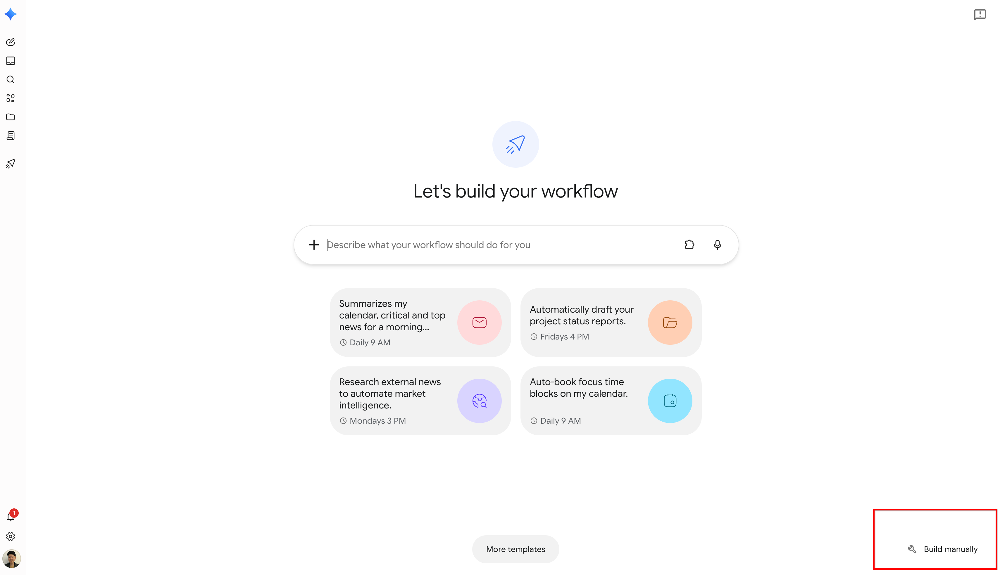

---

#### ① `1. Manual` — 시작 트리거 노드 확인
* **루트 트리거 확인**: 캔버스 상단에 기본 생성된 <strong>`1 Manual`</strong> 노드를 클릭하고 우측 패널의 `Trigger type`이 <strong>`Manual`</strong>(수동 실행)로 되어 있는지 확인합니다. *(별도의 `Input fields`는 추가하지 않습니다.)*


---

#### ② `2. Gemini Agent` — 1단계: 트렌드 뉴스 수집 & `Structured output`(`content`) 설정
1. **노드 추가 및 프롬프트 입력**: `Manual` 노드 아래 <strong>`+ Add step`</strong> 클릭 ➔ 첫 번째 <strong>`Gemini Agent`</strong>를 추가합니다. 우측 패널 <strong>`Connected apps`</strong>에 <strong>`Google Search` (G 아이콘)</strong>가 켜져 있는지 확인하고, <strong>`Instructions`</strong> 칸에 아래 프롬프트를 입력합니다:

```text
최근 1개월간 LG전자 프리미엄 AI 가전(OLED evo, 워시타워, 디오스, HVAC, 스탠바이미) 및 글로벌 경쟁사 시장 트렌드 뉴스를 조사해서 핵심 요약, 제품군별 시장 동향·수치, 출처 링크([매체명, 날짜])를 상세히 정리해줘.
```

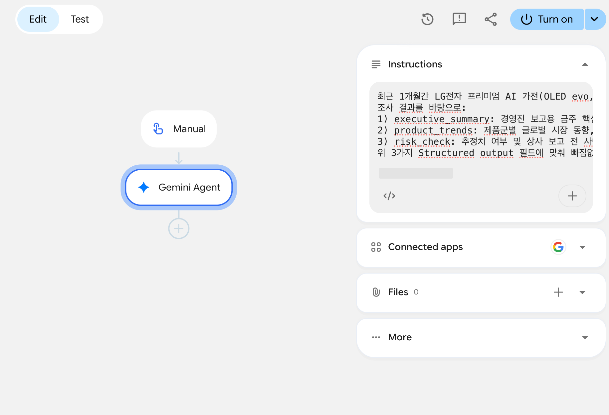

2. **`More` ➔ `Output`을 `Structured output`으로 변경**: 우측 패널 맨 아래 <strong>`More`</strong>를 클릭해 펼친 뒤, <strong>`Output`</strong> 드롭다운(`Plain text`)을 눌러 <strong>`Structured output` (정형화된 서식 출력)</strong>을 선택합니다.


3. **`Output Format`에 `content` (`Text`) 단일 변수 등록**: <strong>`+ Define output schema` (출력 변수 정의)</strong>를 클릭해 팝업창을 열고, 필드명 <strong>`content`</strong> (타입: <strong>`Text`</strong>)를 입력한 뒤 우측 하단 <strong>`Apply Schema`</strong>를 클릭합니다. (설정이 완료되면 우측 패널 Output 아래에 `= content` 칩이 표시됩니다.)


---

#### ③ `3. Gemini Agent 1` — 2단계: `01_GE_Workflow_lg_weekly_report_template.md` 양식 첨부 & `content` 변수 전달
1. **이전 단계 `content` 변수 불러오기 (`+` ➔ `{} Variables`)**: 첫 번째 `Gemini Agent` 아래 <strong>`+ Add step`</strong>을 눌러 두 번째 에이전트(<strong>`Gemini Agent 1`</strong>)를 추가합니다. 우측 <strong>`Instructions`</strong> 입력창 우측 하단의 <strong>`+` 아이콘</strong>을 클릭하고 <strong>`{} Variables`</strong>를 선택합니다.

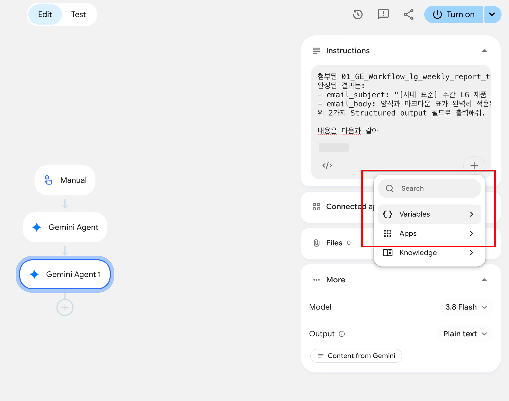

2. **`2 ✨ Gemini Agent: content` 클릭 및 지시문 작성**: 변수 목록에서 앞 단계의 출력 변수인 <strong>`2 ✨ Gemini Agent: content` (`Text`)</strong>를 클릭해 삽입하고, 아래와 같이 첨부된 `.md` 템플릿 파일로 변환하는 프롬프트를 작성합니다:

```text
[= Gemini Agent: content]
첨부된 사내 표준 보고서 양식(01_GE_Workflow_lg_weekly_report_template.md)에 맞춰 위 트렌드 조사 내용을 주간 LG 제품 시장 트렌드 보고서 전문으로 포맷팅해줘.
```

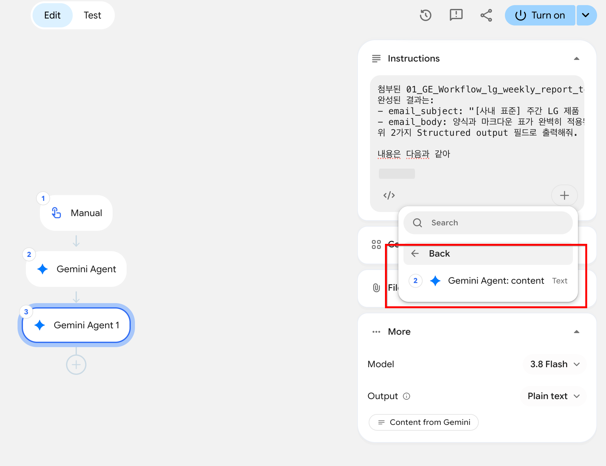

3. **`Files`에 사내 표준 양식 마크다운 파일(`.md`) 첨부**: 우측 패널 중앙의 <strong>`Files 0`</strong> 옆 <strong>`+` 버튼 (`Ground the agent in your data`)</strong>을 클릭하여 실습 폴더의 마크다운 템플릿 파일 **[`01_GE_Workflow_lg_weekly_report_template.md`](./files/01_GE_Workflow_lg_weekly_report_template.md)**를 첨부파일로 넣습니다.


4. **`Files 1` 첨부 확인 & `Structured output` (`= content`) 설정**: 템플릿 `.md` 파일이 첨부되어 <strong>`Files 1`</strong>로 바뀐 것을 확인하고, 1단계와 동일하게 하단 <strong>`More` ➔ `Output` ➔ `Structured output`</strong>을 선택해 <strong>`content` (`Text`)</strong> 단일 변수를 등록합니다.

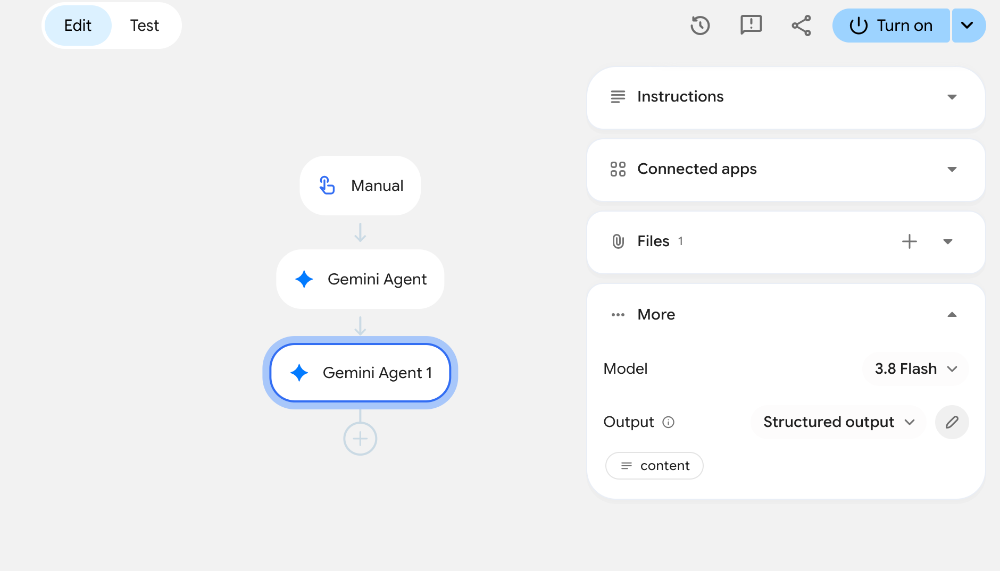

---

#### ④ `4. Approval` — 3단계: `HITL (Human-in-the-Loop)` 사람 검토·승인 게이트
1. **`Human in the Loop` ➔ `Approval` 노드 추가**: `Gemini Agent 1` 아래 <strong>`+ Add step`</strong>을 클릭한 뒤, 우측 패널에서 <strong>`Human in the Loop`</strong> 카테고리를 펼치고 <strong>`Approval`</strong>을 선택합니다. (캔버스에 초록색 `Approved` / 회색 `Rejected` 갈림길이 자동 생성됩니다.)


2. **`Approval` ➔ `Message`에 `3 ✨ Gemini Agent 1: content` 변수 삽입**: 우측 패널 <strong>`Message`</strong> 입력칸 우측 하단의 <strong>`+` 아이콘 ➔ `{} Variables`</strong>를 누르고, 포맷팅이 완료된 보고서 변수인 <strong>`3 ✨ Gemini Agent 1: content` (`Text`)</strong>를 클릭합니다.

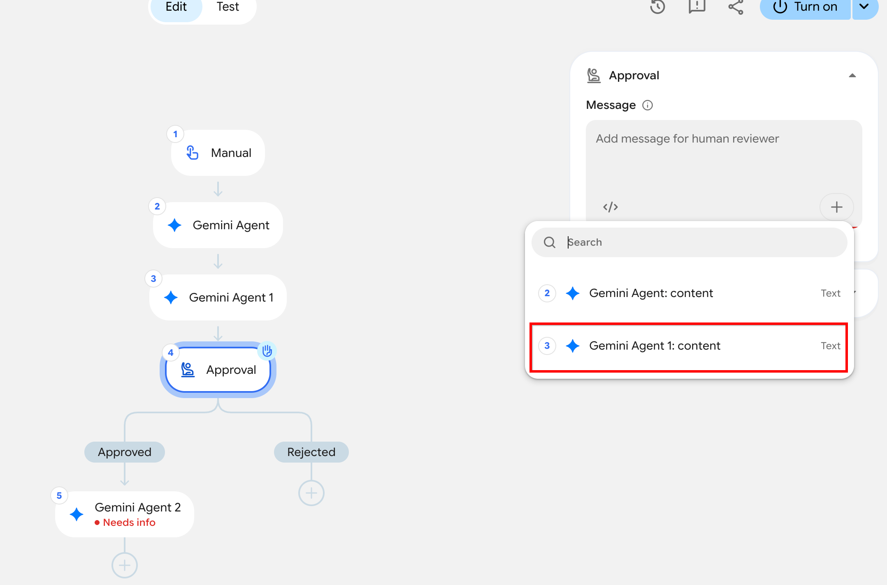

3. **결재 요청 문구 작성**: 삽입된 <strong>`= Gemini Agent 1: content`</strong> 칩 아래에 아래와 같이 결재 확인 문구를 입력합니다:

```text
[= Gemini Agent 1: content]
결재하시겠습니까?
```

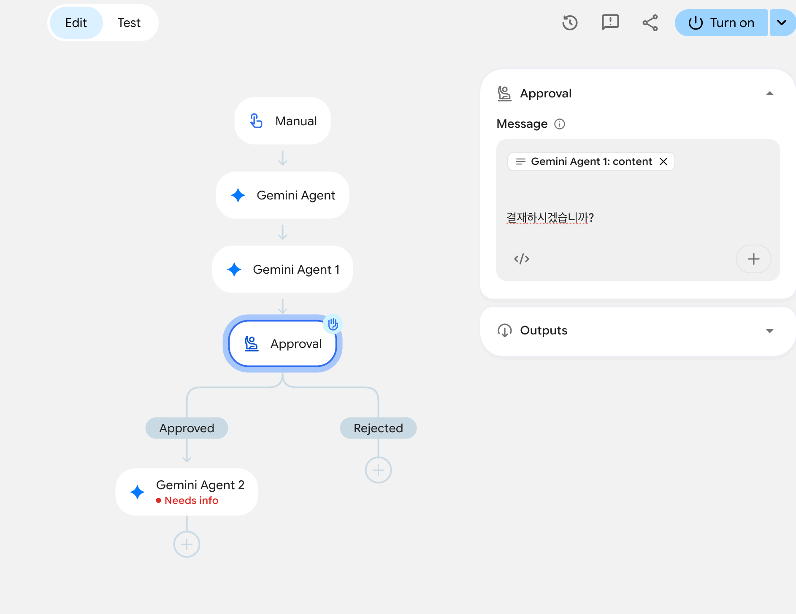

---

#### ⑤ `5. Gemini Agent 2` — 4단계: 승인(`Approved`) 시 내 Gmail 임시보관함 드래프트 생성
1. **`Approved` 분기 아래에 `Gemini Agent 2` 추가 & `content` 변수 삽입**: 캔버스의 초록색 <strong>`Approved`</strong> 경로 아래 <strong>`+` 버튼</strong>을 눌러 <strong>`Gemini Agent 2`</strong>를 추가합니다. 우측 <strong>`Instructions`</strong> 칸에서 <strong>`+` ➔ `{} Variables` ➔ `3 ✨ Gemini Agent 1: content` (`Text`)</strong>를 클릭해 승인된 보고서 본문을 불러옵니다.

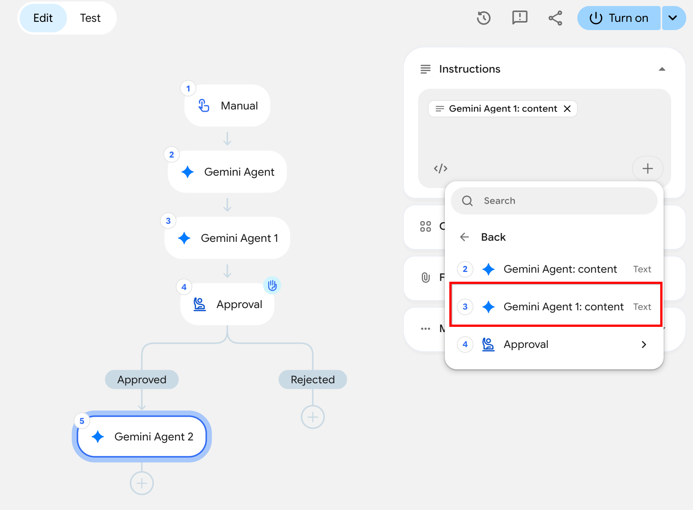

2. **`Connected apps`에서 `Mail` (Gmail) 권한 연결(Auth) 및 토글 켜기**: 우측 패널의 <strong>`Connected apps`</strong>를 클릭해 펼친 뒤, <strong>`Mail` (Gmail 아이콘)</strong> 우측 토글 스위치를 <strong>ON (파란색)</strong>으로 켭니다.
   * 💡 **최초 1회 연동 시 (`Mail`이 목록에 안 보이거나 `Connect` 버튼이 뜨는 경우)**: 아직 Gmail 권한(OAuth)을 연결하지 않은 계정은 기본 요약 목록에서 숨겨져 있습니다. 우측 상단의 <strong>`View all`</strong>을 클릭 ➔ `Mail` 우측의 <strong>`[Connect]`</strong>(또는 `Authorize`) 버튼 클릭 ➔ 구글 계정 권한 승인 팝업창에서 내 계정 선택 후 <strong>`Allow`(허용)</strong>를 누르면 버튼이 **토글 스위치**로 바뀌며, 이때 스위치를 **ON**으로 켜주면 됩니다.

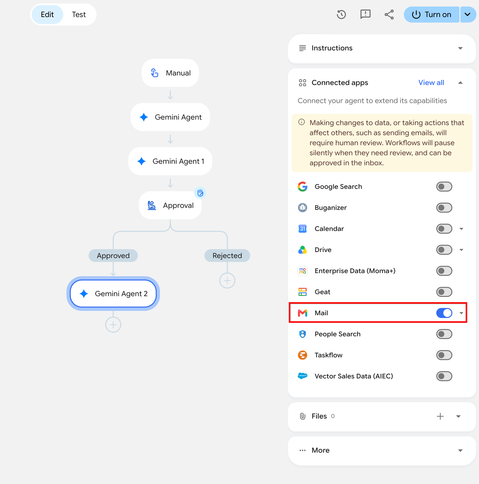

3. **Gmail 드래프트 생성 프롬프트 완성**: `Instructions`의 <strong>`= Gemini Agent 1: content`</strong> 칩 뒤에 아래 지시문을 입력합니다 (최종 단계이므로 `Output`은 기본 `Plain text` 그대로 둡니다):

```text
[= Gemini Agent 1: content]
해당 내용으로 메일 드래프트를 써놔
```


---

#### ⑥ 워크플로우 활성화(`Turn on`) 및 테스트(`Test`) 실행
* 5개 노드(`Manual` ➔ `Gemini Agent` ➔ `Gemini Agent 1` ➔ `Approval` ➔ `Gemini Agent 2`) 설정이 모두 끝났다면, 화면 우측 상단의 파란색 <strong>`Turn on`</strong> 버튼을 눌러 워크플로우를 활성화하고 좌측 상단의 <strong>`Test`</strong> 탭을 눌러 실행을 시작합니다!


---

### 🔹 Step 2-2. `HITL (Human-in-the-Loop)` — 상사 메일 포워딩 전 사람이 검토·승인하기

> <strong>🎯 핵심 포인트:</strong> AI가 틀린 내용을 마음대로 보내지 못하도록 잠시 멈추고, <strong>사람이 눈으로 확인해 `[Approved]`(승인)를 눌렀을 때만</strong> 지메일에 저장되게 합니다.

1. 상단 <strong>`Test`</strong> 탭에서 워크플로우를 실행하면, 보고서 초안 생성 직후 <strong>`Approval`</strong> 단계에서 자동 대기 상태가 됩니다.
2. 생성된 보고서의 수치 출처와 내용을 검토한 뒤 <strong>`[Approved]`</strong>를 클릭합니다.
3. 우측 패널에 초록색 체크와 함께 <strong>`The AI trends report workflow has completed, and a Gmail draft has been successfully created for you.`</strong> 완료 메시지가 뜨는지 확인합니다.

👉 **화면 확인 포인트:** (`Approval` 통과 후 Gmail Draft 생성 완료 메시지)
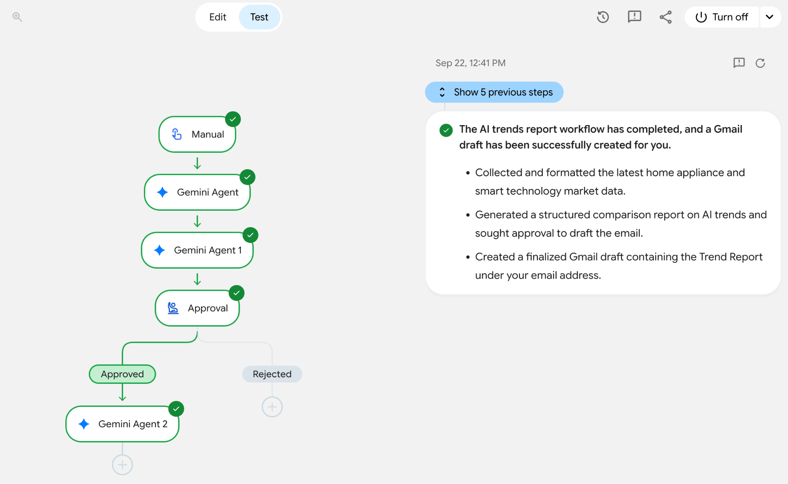

---

### 🔹 Step 2-3. 내 Gmail `[임시보관함(Drafts)]`에 생성된 사내 표준 보고 메일 최종 확인하기

1. 내 <strong>Gmail</strong>을 열고 좌측 <strong>`임시보관함(Drafts)`</strong> 탭을 클릭합니다.
2. 방금 워크플로우가 만들어 놓은 <strong>`[사내 표준] 주간 LG 제품 시장 트렌드 보고서`</strong> 메일을 엽니다.
3. 상단 `📌 [Executive Summary] 금주 핵심 요약 (3줄)`과 하단 `📊 제품군별 글로벌 시장 트렌드 비교표` 서식이 깔끔하게 들어왔는지 확인합니다.

👉 **화면 확인 포인트:** (내 Gmail 임시보관함에 생성된 `[사내 표준] 주간 LG 제품 시장 트렌드 보고서`)


---

### 🔥 [Part 2 심화 미션 · OPTIONAL] `Rejected` (반려) 분기 처리 & 다중 수신자 조건부 라우팅

> <strong>💡 실무 확장 미션 (조건부 분기 심화)</strong>  
> 기본 승인(`Approved`) 흐름을 확인했다면, 실제 현업 자동화에서 자주 쓰이는 반려(`Rejected`) 루프와 다중 수신자 분기를 직접 구성해 보세요.

1. <strong>미션 A (`Rejected` 반려 루프 테스트)</strong>: `Test` 실행 시 일부러 <strong>`[Rejected]`(반려)</strong> 버튼을 눌러보고, 반려 시 <strong>"출처가 불명확한 수치를 제외하고 재작성해 다시 승인을 요청하라"</strong>는 피드백 노드를 `Rejected` 갈림길 아래에 추가해 보세요.
2. <strong>미션 B (임원용 3줄 요약 vs 실무진용 상세본 동시 생성)</strong>: `Approval` 통과 후 노드를 2개로 분기하여, 하나는 <strong>팀장님용 핵심 3줄 요약 메일 초안</strong>, 다른 하나는 <strong>팀원 공유용 전체 비교표 메일 초안</strong>으로 각각 Gmail 임시보관함에 생성되도록 확장해 보세요.

---

# 💻 [2부 · 데스크톱 앱] Part 3. Antigravity 입문 — 4대 루프 & LG 브랜드 웹 슬라이드
### 🔹 Step 3-0. [필수] 실습 시작 전 `Settings (⚙️)` 권한 점검하기

> <strong>⚠️ Antigravity 첫 실행 시 기본 권한 설정을 먼저 확인하세요!</strong>  
> 에이전트가 작업 폴더에 파일을 생성하고, 구현 계획서(`Implementation Plan`) 승인 후 코딩하며, `/browser`로 크롬 화면을 제어할 수 있도록 좌측 하단 <strong>`⚙️ Settings` ➔ `General`</strong>의 3가지 설정값을 확인합니다.

#### 1️⃣ `Settings ➔ General` 상단 확인: `Permission Preset` & `Artifact Review Policy`
* 좌측 하단 <strong>`⚙️ Settings`</strong> 클릭 ➔ <strong>`General`</strong> 탭에서 <strong>`Permission Preset: Default`</strong> (또는 `Turbo`), <strong>`Artifact Review Policy: Always Ask`</strong> 상태를 확인합니다. *(참고: `Tool Permissions`와 `Network Access Rules` 우측의 `Open`은 세부 규칙 편집 창을 여는 버튼입니다.)*

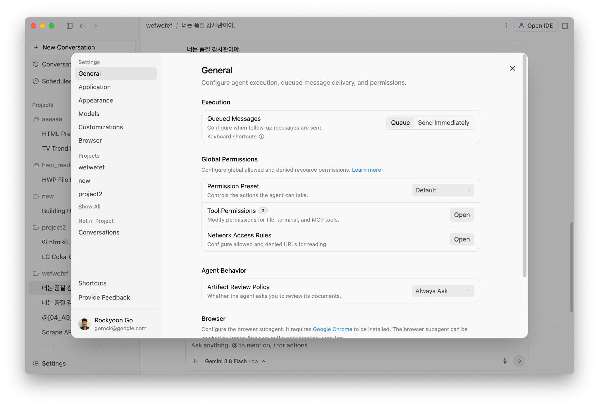

#### 2️⃣ `Settings ➔ General` 아래로 스크롤: `Browser Javascript Execution Policy` 확인
* 같은 창에서 아래로 스크롤하여 <strong>`Browser`</strong> 항목의 <strong>`Browser Javascript Execution Policy`</strong>가 `Disabled`(차단)가 아닌 <strong>`Request Review`</strong>(또는 `Always Proceed`)로 설정되어 있는지 확인합니다.


---

### 🔹 Step 3-1. `/grill-me` 역질문 인터뷰 & 구현 계획 승인하기

> <strong>🎯 핵심 포인트:</strong> 프롬프트를 길게 고민할 필요 없이 <strong>`/grill-me`</strong> 한 줄만 치면, <strong>AI가 먼저 질문을 던져 기획을 잡아주고 승인 즉시 코딩을 시작</strong>합니다.

#### 1️⃣ 작업 폴더 열기 & `/grill-me` 스킬 칩 선택 후 프롬프트 입력
로컬 작업 폴더(예: `C:/Users/abcd/lg-work-portal`)를 열고, 채팅 입력창에 먼저 **`/grill-me`를 타이핑한 뒤 `[Tab]` 키를 눌러 스킬 칩을 띄우고**, 이어서 아래 프롬프트 문장을 복사해 붙여넣습니다:

```text
/grill-me LG AI 가전 트렌드 보고서를 임원 발표용 Single Webpage 슬라이드로 만들고 싶어.
```

#### 2️⃣ 에이전트의 역질문에 답변하기 (객관식 카드 `Submit ↵` 또는 채팅 답변)
`/grill-me`를 실행하면 에이전트가 <strong>우선순위 기능</strong>과 <strong>발표자 노트 레이아웃 방식</strong> 등을 물어봅니다. 아래 화면처럼 객관식 카드가 뜨면 원하는 항목(예: `1번 Recommended`)을 선택하고 우측 하단 파란색 <strong>`Submit ↵`</strong> 버튼을 누릅니다. *(만약 카드 대신 일반 채팅 문장으로 물어보면 채팅창에 원하는 방향을 짧게 답해주면 됩니다.)*


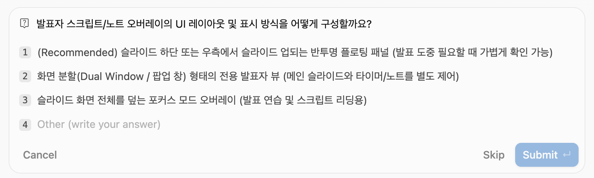

#### 3️⃣ 구현 계획(`Implementation Plan`) 확인 및 진행 승인 (`[Proceed ⌘↩]` 또는 채팅 답변)
질문에 답하고 나면 에이전트가 구현 계획을 정리해 보여줍니다.
* 아래 화면처럼 **`Implementation Plan` 카드와 파란색 `[Proceed ⌘↩]` 버튼이 뜨면 `[Proceed ⌘↩]` 버튼을 클릭**합니다.
* 만약 버튼 대신 **채팅 문장으로 진행 여부를 물어보면 `"응, 이대로 만들어줘"`라고 입력**해 실제 `index.html` 코드 생성을 시작합니다.

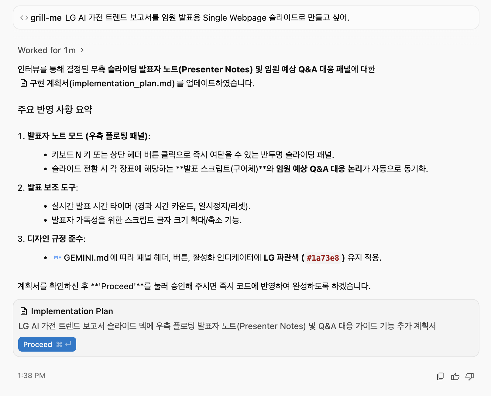

---

### 🔹 Step 3-2. 생성된 발표용 웹 슬라이드(`index.html`) 브라우저 시연 & 방향키(`←`/`→`) 확인

1. 에이전트가 생성한 `index.html`을 브라우저에서 엽니다.
2. 키보드 <strong>좌우 방향키(`←` / `→`)</strong> 또는 `Space` 키로 슬라이드를 넘겨보고, `N` 키(발표자 노트)와 `F` 키(전체화면)를 눌러봅니다.
3. *(확인 포인트: 아래 두 화면처럼 슬라이드 구조와 차트는 멋지게 나왔지만, <strong>아직 LG 브랜드 컬러 스킬을 입히기 전이라 색감이 매번 랜덤으로 생성</strong>됩니다. 아래 예시 스크린샷에서는 다크 블루(`#1a73e8`)로 나왔지만, 직접 실행해 보시면 다크 모드·블루·퍼플 등 여러 색상이 랜덤하게 나올 수 있습니다!)*

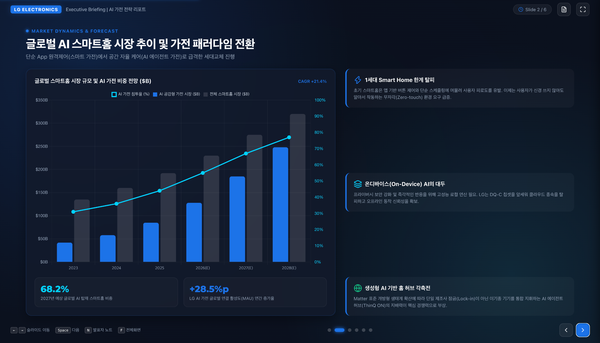

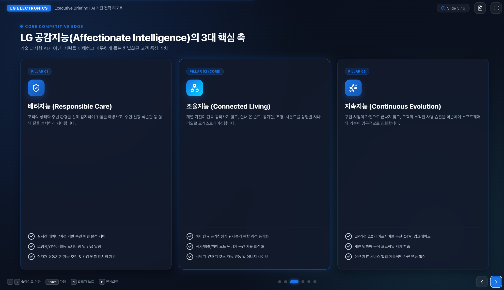

---

### 🔹 Step 3-3. 참여자 자유 구성 추가(`/plan`) & `/btw` · `/learn`으로 내 슬라이드 규칙 저장하기

#### 1️⃣ `/plan`으로 원하는 장표 내용 자유롭게 추가하기
내가 보고서에 더 넣고 싶은 데이터(예: 주요 국가 구매력 지수 GDP 비교, 당사 vs 경쟁사 스펙 비교표 등)를 채팅창에 **`/plan` 타이핑 후 `[Tab]` 키**를 눌러 추가 지시합니다(계획서 카드가 뜨면 <strong>`Proceed`</strong>를 누르거나 진행을 승인합니다). 작업 도중 궁금한 점은 하단 <strong>`/btw` (`Side Question`)</strong>로 흐름을 끊지 않고 물어보고, 마음에 드는 규칙은 채팅창에 **`/learn` 타이핑 후 `[Tab]` 키**를 눌러 저장합니다:

```text
/plan 추가로 지금 현재 세계 주요 나라의 GDP(구매력지수 PPP 기준) 비교 슬라이드를 추가해줘.
```

```text
/learn 발표 슬라이드 하단에는 항상 페이지 번호(1/N)와 단축키 안내(방향키 이동, N 발표자 노트)를 표시하도록 규칙으로 저장해줘.
```

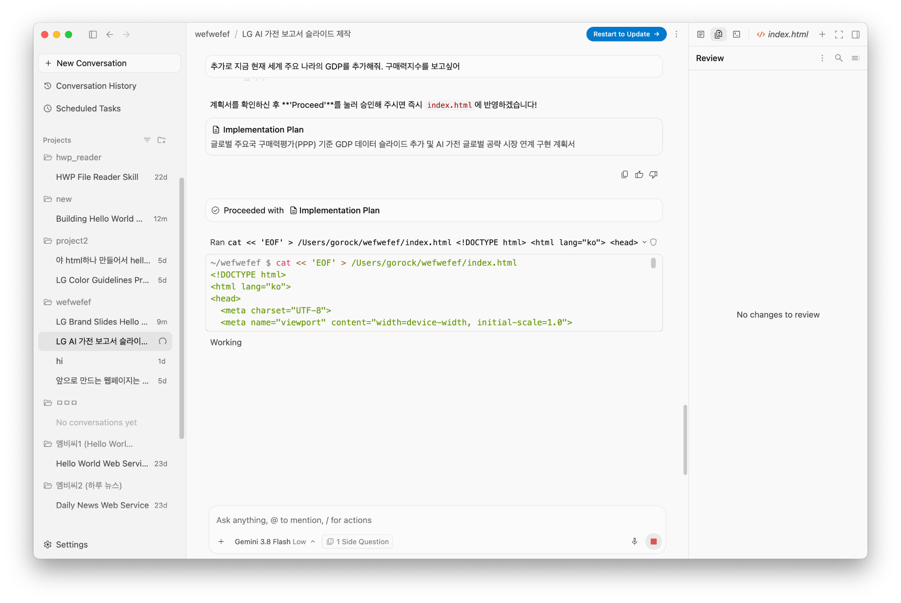

---

### 🔹 Step 3-4. `/lg-brand-slides` 스킬 적용 — LG 브랜드 색감(`Hex #A50034` 레드 & 화이트) 영구 고정!

> <strong>🎯 핵심 포인트:</strong> 수정할 때마다 슬라이드 색깔이 제멋대로 바뀌지 않도록, <strong>`/lg-brand-slides` 스킬을 등록해 LG 레드(`#A50034`)와 화이트 배경으로 한 번에 고정</strong>합니다.

#### 1️⃣ [1단계: 스킬 등록] 프로젝트 폴더에 `02_AG_Webpage_lg_brand_slides_SKILL.md` 파일 넣고 스킬로 등록하기
먼저 다운로드한 <strong>[`02_AG_Webpage_lg_brand_slides_SKILL.md`](./files/02_AG_Webpage_lg_brand_slides_SKILL.md)</strong> 파일을 **현재 열려 있는 Antigravity 프로젝트 폴더(예: `lg-work-portal`) 안에 복사해 넣어야** `@멘션`으로 불러올 수 있습니다(폴더 안에 파일이 없다면 먼저 파일을 넣어주세요). 준비되었다면 아래 프롬프트를 입력해 프로젝트 스킬로 등록합니다. *(스킬 등록 후 슬래시 목록에 안 보일 때는 `Ctrl + R` 또는 `View ➔ Reload`)*

```text
@02_AG_Webpage_lg_brand_slides_SKILL.md 이 파일을 프로젝트 스킬(lg-brand-slides)로 등록해줘.
```

#### 2️⃣ [2단계: `/lg-brand-slides` 스킬 실행] 채팅창에 `/lg-brand-slides` + `[Tab]` 선택 후 아래 프롬프트 복사·붙여넣기
스킬 등록이 완료되면 채팅창에 **`/lg-brand-slides`를 타이핑한 뒤 `[Tab]` 키로 스킬 칩을 선택**하고, 이어서 아래 프롬프트 문장을 복사해 붙여넣습니다:

```text
/lg-brand-slides 스킬을 적용해서 지금 웹 프레젠테이션의 색감(Hex)을 LG 브랜드 컬러(#A50034 포인트 & 화이트/그레이 배경)로 고정하여 다시 제작해줘.
```

👉 **실행 결과 화면:** (랜덤 색감(예시 스샷: 다크 블루)이었던 슬라이드가 화이트 + LG 시그니처 레드 `#A50034`로 100% 변환된 모습!)


---

### 🔥 [Part 3 심화 미션 · OPTIONAL] 인터랙티브 시뮬레이터 위젯 & 발표자 Q&A 패널 직접 탑재하기

> <strong>💡 실무 확장 미션 (인터랙티브 웹 슬라이드 심화)</strong>  
> 정적인 텍스트 슬라이드를 넘어, 웹페이지(`HTML/JS`)만의 강점인 <strong>'클릭하면 움직이는 인터랙티브 시뮬레이터 위젯'</strong>과 발표자 Q&A 패널을 추가해 보세요.

```text
현재 웹 슬라이드(index.html)의 3번째 장표에 버튼을 클릭하면 [귀가 모드] / [취침 모드] / [외출 절전 모드]에 따라 에어컨·워시타워·조명의 예상 전력 절감량(kWh)과 작동 상태가 실시간 애니메이션으로 바뀌는 인터랙티브 시뮬레이터 위젯을 넣어줘. 그리고 키보드 'N' 키를 누르면 우측에서 임원 예상 송곳 질문 3가지와 모범 답변 스크립트가 슬라이딩 패널로 열리게 해줘.
```

---

# 📊 [2부 · 데스크톱 앱] Part 4. 나만의 사이드 탭 Dashboard & 실시간 시세·뉴스 스킬 연동
### 🔹 Step 4-1. `/grill-me`로 왼쪽 사이드 탭 업무 포털 설계 & `1번 메뉴(LG 시장 트렌드)`에 슬라이드 탑재

> <strong>🎯 핵심 포인트:</strong> 왼쪽에 메뉴바를 만들고, <strong>방금 만든 웹 슬라이드를 `1번 메뉴(LG 시장 트렌드)` 안에 쏙 넣습니다.</strong>

#### 1️⃣ 채팅창에 `/grill-me` + `[Tab]` 선택 후 아래 프롬프트 복사·붙여넣기
```text
/grill-me 평소 자주 쓰는 업무들을 왼쪽 사이드 탭에 차례차례 추가하는 나만의 대시보드를 만들고 싶어. html/js을 사용하는게 좋을것 같아. 사이드바 1번 메뉴를 'LG 시장 트렌드'로 만들고, 방금 만든 웹 슬라이드 페이지를 이 사이드바 메뉴 안에 넣어줘.
```

👉 **실행 결과 화면:** (`업무 메뉴` 좌측 사이드바 `1. LG 시장 트렌드` 탭 안에 웹 슬라이드가 탑재된 포털!)
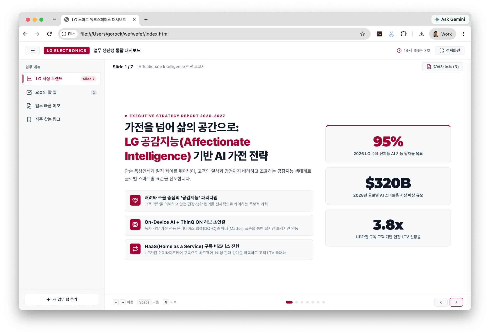

---

### 🔹 Step 4-2. 실시간 데이터 수집 스킬 등록 & `실시간 시장·뉴스 LIVE` 탭 연동

> <strong>🎯 핵심 포인트:</strong> 준비된 파이썬 파일([`03_AG_Dashboard_fetch_lg_live_market.py`](./files/03_AG_Dashboard_fetch_lg_live_market.py))을 스킬로 등록해 <strong>① LG전자 주가, ② 실시간 환율, ③ 구글 뉴스 5건</strong>을 <strong>2번 탭(`실시간 시장·뉴스 LIVE`)</strong>에 바로 띄웁니다.

<details class="file-list-details">
<summary><strong>🐍 (참고) 실시간 시장·뉴스 수집 코드 내용 펼쳐보기 (`03_AG_Dashboard_fetch_lg_live_market.py` — 클릭하여 펼치기)</strong></summary>

```python
import urllib.request, urllib.parse, json, ssl, xml.etree.ElementTree as ET

def _get(url):
    ctx = ssl._create_unverified_context()
    req = urllib.request.Request(url, headers={"User-Agent": "Mozilla/5.0"})
    return urllib.request.urlopen(req, timeout=5, context=ctx).read()

def fetch_lg_live_dashboard_data(stock_code="066570", keyword="LG전자 AI 가전"):
    # 1. 네이버 금융 LG전자(066570) 실시간 주가·등락률 조회
    stock = json.loads(_get(f"https://m.stock.naver.com/api/stock/{stock_code}/basic").decode("utf-8"))
    # 2. 글로벌 실시간 환율(USD/KRW, EUR, JPY) 조회
    fx = json.loads(_get("https://api.frankfurter.dev/v1/latest?base=USD&symbols=KRW,EUR,JPY").decode("utf-8"))
    # 3. 구글 뉴스 실시간 'LG전자 AI 가전' 최신 헤드라인 5건 조회
    rss_url = f"https://news.google.com/rss/search?q={urllib.parse.quote(keyword)}&hl=ko&gl=KR&ceid=KR:ko"
    root = ET.fromstring(_get(rss_url))
    news = [{"title": item.findtext("title"), "pubDate": item.findtext("pubDate"), "link": item.findtext("link")} for item in root.findall(".//item")[:5]]
    return {"stock_name": stock.get("stockName", "LG전자"), "close_price": stock.get("closePrice"), "fluctuation_rate": stock.get("fluctuationsRatio"), "usd_krw": fx["rates"]["KRW"], "latest_news": news}
```

</details>

#### 1️⃣ [1단계: 스킬 등록] 프로젝트 폴더에 `03_AG_Dashboard_fetch_lg_live_market.py` 파일 넣고 스킬로 등록하기
먼저 <strong>[`03_AG_Dashboard_fetch_lg_live_market.py`](./files/03_AG_Dashboard_fetch_lg_live_market.py)</strong> 파일이 **현재 프로젝트 폴더(`lg-work-portal`) 안에 들어있는지 확인**(없다면 폴더 안에 파일을 복사해 추가)한 뒤, 아래 프롬프트를 입력해 `python-api-trend` 스킬로 등록합니다:

```text
@03_AG_Dashboard_fetch_lg_live_market.py 해당하는 파이썬 코드를 스킬로 등록시켜줘. (python-api-trend)
```

#### 2️⃣ [2단계: `/python-api-trend` 실행] 채팅창에 `/python-api-trend` + `[Tab]` 선택 후 아래 프롬프트 복사·붙여넣기
```text
/python-api-trend 스킬을 실행해 사이드바 '실시간 시장·뉴스(LIVE)' 탭에 LG전자(066570) 실시간 주가·환율(USD/KRW, EUR/KRW)과 구글 뉴스 헤드라인 5건(클릭 시 원문 이동)을 연결해줘.
```

👉 **실행 결과 화면:** (`실시간 시장·뉴스 LIVE` 탭 — LG전자 `214,500원 +5.93%`, 환율 `1,372.18원`, 실시간 뉴스 5건)
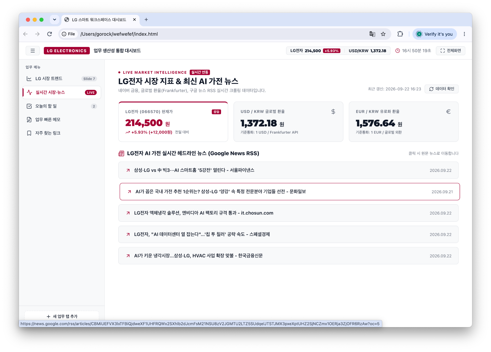

---

### 🔹 Step 4-3. 우측 상단 `[오늘의 LG 트렌드 & 뉴스 Pull]` 버튼 & `/schedule` 매일 아침 9시 자동화

#### 1️⃣ [1단계: 수동 갱신 버튼 추가] 채팅창에 아래 프롬프트 복사·붙여넣기
```text
대시보드 우측 상단에 '[오늘의 LG 트렌드 & 뉴스 Pull]' 버튼을 만들어서 클릭 시 최신 데이터로 갱신되게 해줘.
```

#### 2️⃣ [2단계: `/schedule` 자동화 등록] 채팅창에 `/schedule` + `[Tab]` 선택 후 아래 프롬프트 복사·붙여넣기
```text
/schedule 매일 오전 9시에 트렌드 데이터 및 뉴스 데이터를 자동 업데이트해줘.
```

#### 3️⃣ 결과 화면 ①: 우측 상단 헤더에 빨간색 `[📥 오늘의 LG 트렌드 & 뉴스 Pull]` 원클릭 갱신 버튼 장착!


#### 4️⃣ 결과 화면 ②: `/schedule` 명령어로 매일 아침 9시(`0 9 * * *`) 자동 갱신 스케줄(`1 task running`) 등록 완료!
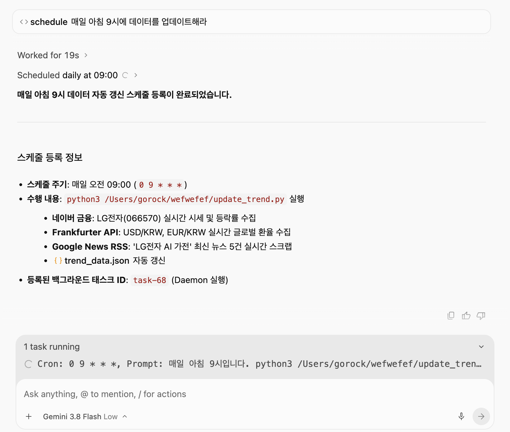

---

### 🔥 [Part 4 심화 미션 · OPTIONAL] 경쟁사(삼성·글로벌 가전) 동시 비교 티커 & 나만의 3번째 업무 탭 추가하기

> <strong>💡 실무 확장 미션 (멀티 종목 & 키워드 전환 심화)</strong>  
> 실시간 데이터 수집 스크립트(`03_AG_Dashboard_fetch_lg_live_market.py`)를 확장하여 경쟁사 동시 비교 티커와 토픽 전환 기능을 추가해 보세요.

```text
/python-api-trend 방금 등록한 스킬 스크립트를 확장해서:
1. LG전자(066570)뿐만 아니라 주요 비교 종목(예: LG이노텍 011070, 삼성전자 005930)의 실시간 등락률을 나란히 비교하는 '경쟁사 주가 멀티 티커'를 상단 헤더에 추가해줘.
2. 구글 뉴스 검색 키워드를 버튼 클릭 한 번으로 ['LG전자 AI 가전' / 'OLED TV 점유율' / '유럽 HVAC 히트펌프'] 3가지 토픽으로 즉시 전환해서 볼 수 있게 탭 2 화면을 업그레이드해줘.
```

---

# 📈 [2부 · 데스크톱 앱] Part 5. LG 5대 가전 920행 데이터 Analytics & 90점 품질 게이트
### 🔹 Step 5-0. 데이터셋(`04_AG_Analytics_lg_appliance_data.csv`, 920행) 로딩 및 컬럼 확인

#### 1️⃣ 로컬 폴더에 `04_AG_Analytics_lg_appliance_data.csv` 넣고 `@멘션`으로 읽어오기
먼저 프로젝트 폴더(`lg-work-portal`) 안에 <strong>[`04_AG_Analytics_lg_appliance_data.csv`](./files/04_AG_Analytics_lg_appliance_data.csv)</strong> 파일이 들어있는지 확인한 뒤, 채팅창에 **`@04_AG_Analytics_lg_appliance_data.csv`를 타이핑 후 `[Tab]`으로 선택**하고 아래 문장을 입력해 5대 주력 가전(`OLED evo`, `DIOS & Objet`, `WashTower & Tromm`, `Whisen & HVAC`, `StanbyME & Care`) 920행 데이터 구조가 정상 인식되는지 확인합니다:

```text
@04_AG_Analytics_lg_appliance_data.csv 이 데이터 몇개를 읽어봐봐
```


---

### 🔹 Step 5-1. [Step 1: Explore] 코딩 전 `ThinQ 점수 결측치(23건)` & `스탠바이미 시제품 매출 0원(18건)` 먼저 진단하기

> <strong>🎯 핵심 포인트:</strong> 데이터를 바로 차트로 그리면 <strong>빈칸(23건)</strong>이나 <strong>매출 0원짜리 시제품(18건)</strong> 때문에 평균 수치가 완전히 틀어집니다. 그래서 코딩 전에 <strong>숨은 오류 데이터부터 먼저 찾아냅니다.</strong>

#### 1️⃣ 채팅창에 아래 프롬프트 복사·붙여넣기
```text
@04_AG_Analytics_lg_appliance_data.csv 이 LG 가전·TV 데이터의 제품군별(OLED evo, 워시타워, 디오스, HVAC, 스탠바이미) 결측치(ThinQ 점수 빈 값)와 마진 계산 시 주의할 이상치(스탠바이미 시제품 매출 0원)를 먼저 진단해줘. 아직 코드는 짜지 마.
```

👉 **실행 결과 화면:** (전체 920건 중 `thinq_satisfaction_score` 결측치 <strong>총 23건(2.50%)</strong> 제품군별 정밀 포착!)
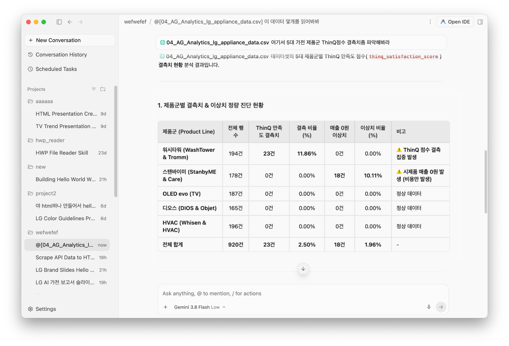

---

### 🔹 Step 5-2. [Step 2: Plan & Execute] 기존 대시보드에 새 탭 `[가전 실적·구독 분석 NEW]` 블렌딩하기

> <strong>🎯 핵심 포인트:</strong> 앞에서 만든 1·2번 탭은 그대로 두고, <strong>3번 탭(`📊 가전 실적·구독 분석 NEW`)을 새로 추가해 시제품(0원) 제외 버튼과 실적 차트를 붙입니다.</strong>

#### 1️⃣ [1단계: 3번 사이드 탭 추가] 채팅창에 아래 프롬프트 복사·붙여넣기
```text
기존 대시보드 탭은 그대로 유지하고, 새 사이드 탭으로 @04_AG_Analytics_lg_appliance_data.csv 기반 'LG 가전 제품군 실적·구독 Analytics'를 추가하고 싶어. (별도 서버 없이 index.html 파일만 열어도 바로 차트가 보이도록 데이터를 HTML 파일 안에 직접 포함해 줘.)
```

#### 2️⃣ [2단계: 이상치 필터 & 상세 차트 구성] 이어서 아래 프롬프트 복사·붙여넣기
```text
스탠바이미 시제품(매출 0원, 18건) 분리 처리(포함/제외 토글 필터)와 워시타워 ThinQ 결측치(23건) 스마트 보정 리포트, 제품군별 매출·마진율 차트 및 권역별 HaaS 구독 전환율 차트도 넣어줘.
```

👉 **실행 결과 화면:** (상단 4대 KPI 카드 + `시제품 18건 포함/제외` 필터 + 이상치·결측치 리포트 + 차트 2종 완성!)
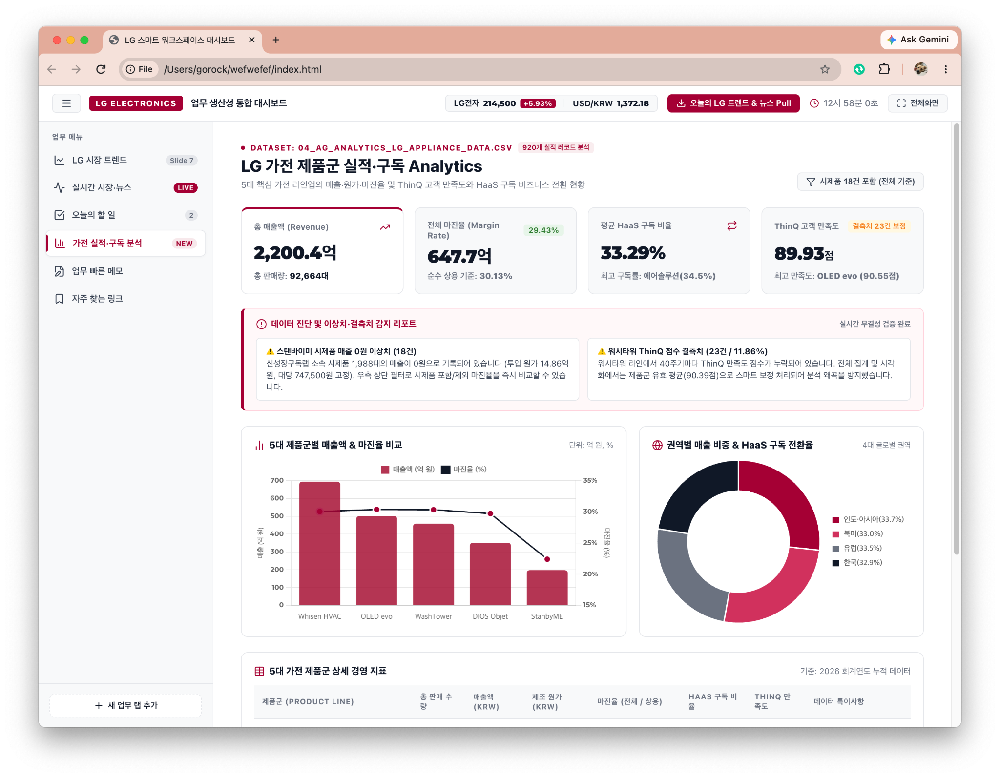

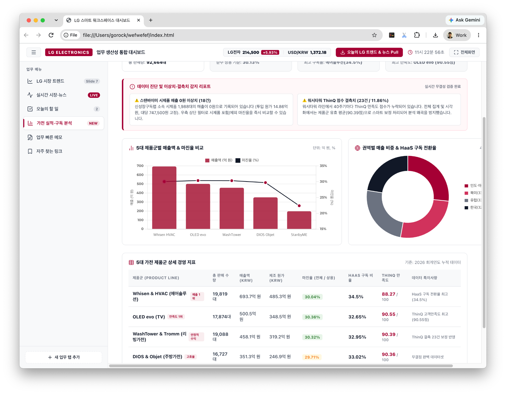

---

### 🔹 Step 5-3. [Step 3: Verify] `/browser`로 에이전트가 직접 크롬을 띄워 탭 전환·필터 검증하기

> <strong>🎯 핵심 포인트:</strong> 사람이 일일이 눌러보는 대신, <strong>`/browser` 명령어로 AI가 직접 크롬을 띄워 탭과 필터가 잘 작동하는지 스스로 눌러보게 합니다.</strong>

#### 1️⃣ 채팅창에 `/browser` + `[Tab]` 선택 후 아래 프롬프트 복사·붙여넣기
```text
/browser 로컬 대시보드에 접속해서 사이드 탭 전환과 제품군 필터('OLED evo', 'StanbyME 시제품') 클릭 시 콘솔 에러나 0 나눗셈 오류가 없는지 검증해
```

👉 **화면 확인 포인트:** (에이전트가 스스로 Chrome을 실행해 각 사이드 탭을 캡처·분석하는 과정)
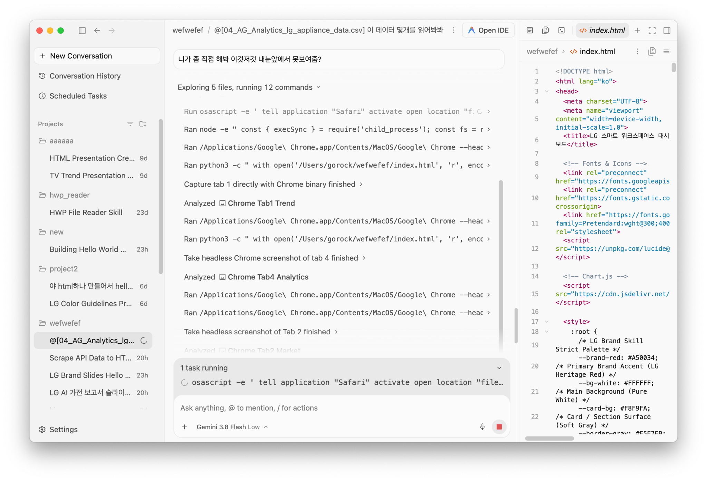

---

### 🔹 Step 5-4. [Step 4: Handoff] 새 세션(`+ New Conversation`) 품질 감사관 채점 & `90점` 게이트 돌파 후 `/learn` 저장!

> <strong>🎯 핵심 포인트:</strong> 코드를 짠 AI에게 "잘했니?"라고 물으면 무조건 잘했다고 답합니다. 그래서 <strong>`+ New Conversation`으로 새 채팅창을 열어 깐깐한 '품질 감사관'을 시키고, `90점`을 넘길 때까지 스스로 고치게 한 뒤 `/learn`으로 저장</strong>합니다.  
> *(💡 99점을 목표로 하면 사소한 수정만 무한 반복하느라 시간이 다 가기 때문에, 실무에서는 **90점**을 통과 기준선으로 잡는 것이 가장 좋습니다.)*

#### 1️⃣ 좌측 상단 `+ New Conversation` 클릭 후 <strong>새 세션</strong>에 아래 프롬프트 복사·붙여넣기
```text
너는 품질 감사관이야. @index.html 을 100점 만점 채점해. 90점 미만이면 감점 요인을 직접 고쳐서 90점을 넘길 때까지 재채점 루프를 반복하고, 통과 후 /learn으로 저장해줘.
```

👉 **실행 결과 화면:** (`1차 점수 82점` ➔ 자동 패치 후 `90점 품질 게이트 통과 🏆` 및 `/learn` 영구 저장 안내!)


---

### 🔥 [Part 5 최종 보스 미션 · OPTIONAL] What-if 시뮬레이터 슬라이더 & 본부장 보고용 PDF/MD 원클릭 추출기 구현

> <strong>💡 실무 확장 미션 (What-if 시뮬레이터 & 원클릭 리포트 추출)</strong>  
> 단순 차트 출력을 넘어 실제 임원 회의에서 바로 활용할 수 있는 <strong>'환율·구독 전환율 시뮬레이션 슬라이더 + 원클릭 요약 리포트 추출'</strong> 기능을 구현해 보세요.

```text
현재 '가전 실적·구독 분석' 탭에 아래 2가지 실무 기능을 추가해줘:
1. '환율 & 구독 전환율 What-if 시뮬레이터 슬라이더': 마우스로 USD/KRW 환율(1,300원~1,450원)과 HaaS 구독 전환율(+1%p ~ +10%p) 슬라이더를 움직이면 5대 가전 제품군의 예상 영업이익과 연매출이 실시간으로 재계산되어 차트가 움직이게 해줘.
2. 우측 상단에 '[📥 임원 보고용 1페이지 요약 리포트 다운로드(.md)]' 버튼을 만들고, 클릭 시 현재 선택된 필터 기준의 핵심 KPI와 이상치(스탠바이미 시제품 18건, 워시타워 결측 23건) 분석 코멘트가 파일로 즉시 다운로드되게 구현해줘.
```

---

## 🎉 수고하셨습니다! 오늘 완성한 모든 산출물 요약

1. <strong>1부 (크롬 GE Web)</strong>: 팀 공유 `Project` + 사내 보고서 양식(`01_GE_Workflow_lg_weekly_report_template.txt`) + `.md` 스킬(`Upload skill`) ➔ `Workflow` (`01_GE_Workflow_lg_weekly_report_template.md` 첨부) + `Approval (HITL 사람 승인)` ➔ <strong>내 Gmail 임시보관함(`Drafts`) 주간 트렌드 보고서 자동 생성</strong>
2. <strong>2부 (Antigravity 2.0)</strong>:
   - <strong>탭 1 (`📈 LG 시장 트렌드`)</strong>: `/grill-me` ➔ `Proceed` ➔ `/lg-brand-slides`로 <strong>LG 시그니처 레드(`#A50034`) + 화이트 테마 웹 슬라이드</strong> 탑재
   - <strong>탭 2 (`💓 실시간 시장·뉴스 LIVE`)</strong>: <strong>실시간 데이터 수집 스킬</strong> 연동으로 <strong>LG전자(`066570`) 실시간 시세·환율·구글 뉴스</strong> + 우측 상단 <strong>`Pull` 버튼 & `/schedule` 매일 9시 자동화</strong>
   - <strong>탭 3 (`📊 가전 실적·구독 분석 NEW`)</strong>: <strong>`@04_AG_Analytics_lg_appliance_data.csv` (920행)</strong> 결측치(23건)·시제품(0원 18건) 정제 차트 + <strong>`/browser` 검증</strong> + <strong>새 세션 감사관 `90점 품질 게이트 PASS` & `/learn` 영구 자산화</strong>